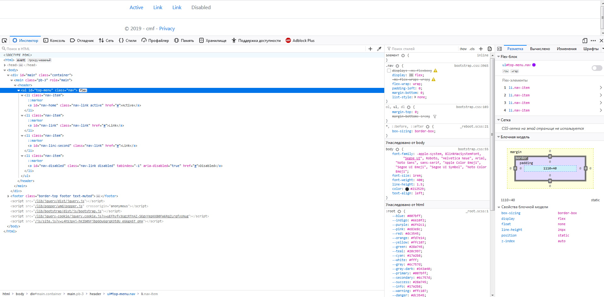
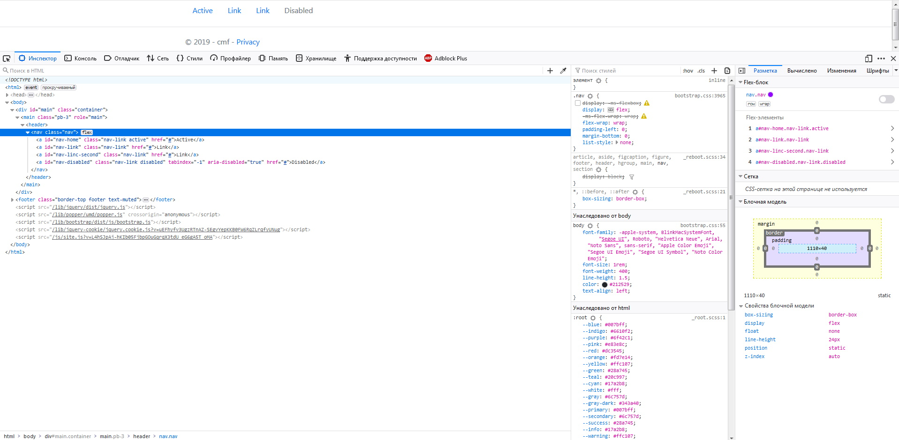

## [Base nav](https://getbootstrap.com/docs/4.3/components/navs/#base-nav)
Базовая навигация
```cshtml
@using BootstrapViewComponentsRazorLibrary.Service.bootstrap
@using BootstrapViewComponentsRazorLibrary.Components.bootstrap.nav
@{
  NavReferenceBehaviorManager nav = new NavReferenceBehaviorManager("top-menu", BootstrapViewComponentsRazorLibrary.Models.bootstrap.NavOrientationsEnum.HorizontallyLeftAligned);
  nav.AddNav("Active", "nav-home", "#").IsActive = true;
  nav.AddNav("Link", "nav-link", "#");
  nav.AddNav("Link", "nav-linc-second", "#");
  nav.AddNav("Disabled", "nav-disabled", "#").IsDisabled = true;
  nav.NavWrapperType = BootstrapViewComponentsRazorLibrary.Models.NavWrapperTypesEnum.ul;
}
@await Component.InvokeAsync(typeof(NavBase).Name, new { navManager = nav, SetPillsTheme = false })
```
result:


Классы в **Bootstrap** используются повсюду, поэтому ваша разметка может быть очень гибкой.
Используйте `<ul>`s, как продемонстрировано выше, либо воспользуйтесь элементом `<nav>`.
Так-как **.nav** использует `display: flex`, теги ссылок `<a>` внутри `<nav>` ведут себя так же, как и стандартные элементы навигации
Для того что бы компонент навигации ипользовал теги ссылок `<a>` внутри `<nav>` - достаточно изменить тип обёртки:
```cshtml
nav.NavWrapperType = BootstrapViewComponentsRazorLibrary.Models.NavWrapperTypesEnum.nav;
```


## [Horizontal alignment](https://getbootstrap.com/docs/4.3/components/navs/#horizontal-alignment)
> Измените горизонтальное выравнивание навигатора с помощью утилит flexbox. По умолчанию навигаторы выровнены по левому краю, но вы можете легко изменить их на выравнивание по центру или по правому краю.

## [Vertical](https://getbootstrap.com/docs/4.3/components/navs/#vertical)
> дополняется ...

## [Tabs](https://getbootstrap.com/docs/4.3/components/navs/#tabs)
> дополняется ...

## [Pills](https://getbootstrap.com/docs/4.3/components/navs/#pills)
> дополняется ...

## [Fill and justify](https://getbootstrap.com/docs/4.3/components/navs/#fill-and-justify)
> дополняется ...

## [Working with flex utilities](https://getbootstrap.com/docs/4.3/components/navs/#working-with-flex-utilities)
> дополняется ...

## [Regarding accessibility](https://getbootstrap.com/docs/4.3/components/navs/#regarding-accessibility)
> дополняется ...

## [Tabs with dropdowns](https://getbootstrap.com/docs/4.3/components/navs/#tabs-with-dropdowns)
> дополняется ...

## [Pills with dropdowns](https://getbootstrap.com/docs/4.3/components/navs/#pills-with-dropdowns)
> дополняется ...

## [JavaScript behavior](https://getbootstrap.com/docs/4.3/components/navs/#javascript-behavior)
> дополняется ...
