## [Base nav](https://getbootstrap.com/docs/4.3/components/navs/#base-nav)
> Базовая навигация построена с применением **flexbox** и обеспечивает прочную основу для формирования всех типов навигационных компонентов.
Он включает в себя некоторые переопределения стилей (например: для работы со списками и т.п.)

> Базовый компонент `nav` не включает в себя никакого рендеринга `.active` состояния пунктов меню.
Следующие примеры включают класс `active`, главным образом, чтобы продемонстрировать, что этот конкретный класс не вызывает никакого специального стиля.

```cshtml
@using BootstrapViewComponentsRazorLibrary.Service.bootstrap
@using BootstrapViewComponentsRazorLibrary.Components.bootstrap.nav
@{
  NavReferenceBehaviorManager nav = new NavReferenceBehaviorManager("top-menu", BootstrapViewComponentsRazorLibrary.Models.bootstrap.NavOrientationsEnum.HorizontallyLeftAligned);
  nav.AddNav("Active", "nav-home", "#").IsActive = true;
  nav.AddNav("Link", "nav-link", "#");
  nav.AddNav("Link", "nav-linc-second", "#");
  nav.AddNav("Disabled", "nav-disabled", "#").IsDisabled = true;
  nav.NavWrapperType = BootstrapViewComponentsRazorLibrary.Models.NavWrapperTypesEnum.ul;
}
@await Component.InvokeAsync(typeof(NavBase).Name, new { navManager = nav, SetPillsTheme = false })
```
***result:***
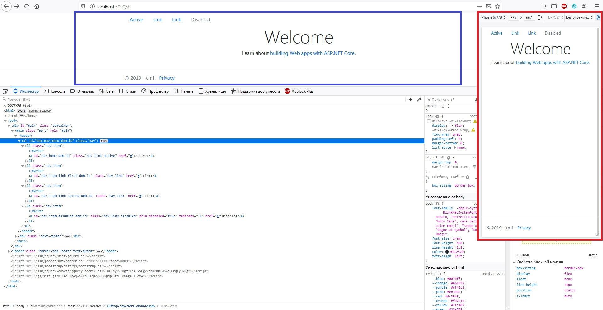

> Классы в **Bootstrap** используются повсюду, поэтому ваша разметка может быть очень гибкой.
Используйте `<ul>`s, как продемонстрировано выше, либо воспользуйтесь элементом `<nav>`.
Так-как **.nav** использует `display: flex`, теги ссылок `<a>` внутри `<nav>` ведут себя так же, как и стандартные элементы навигации.

Для того что бы компонент навигации ипользовал теги ссылок `<a>` внутри `<nav>` - достаточно указать другой тип обёртки:

```c#
nav.NavWrapperType = BootstrapViewComponentsRazorLibrary.Models.NavWrapperTypesEnum.nav;
```
***result:***
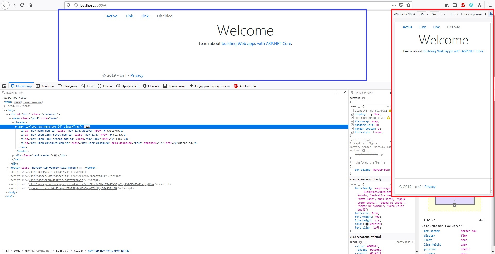

## [Horizontal alignment](https://getbootstrap.com/docs/4.3/components/navs/#horizontal-alignment)
> Измените горизонтальное выравнивание навигатора с помощью утилит flexbox. По умолчанию навигаторы выровнены по левому краю, но вы можете легко изменить их на выравнивание по центру или по правому краю.

Выравнивание назначается через позиционирование (параметр контсруктора менеджера навигации).
В следующем примере навигация центруется по горизонтали (применяется: `.justify-content-center`):

```c#
NavReferenceBehaviorManager nav = new NavReferenceBehaviorManager("top-menu", BootstrapViewComponentsRazorLibrary.Models.bootstrap.NavOrientationsEnum.HorizontallyCenterAligned);
```
***result:***
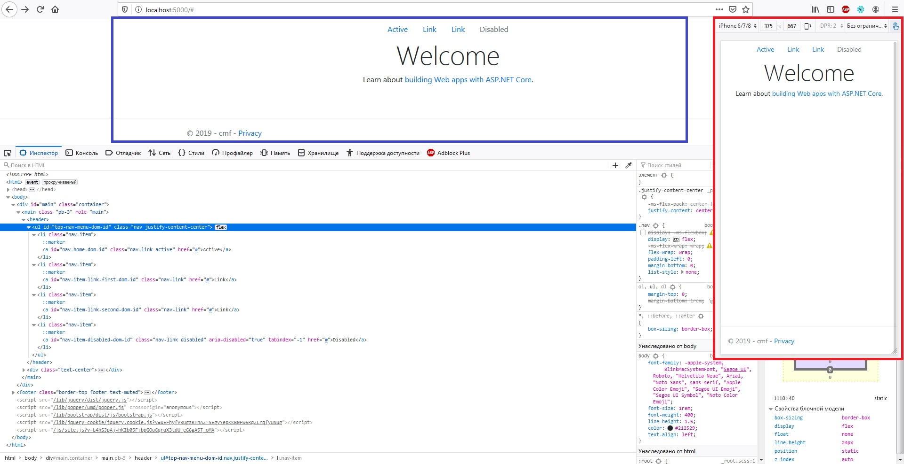

В следующем примере навигация распологается справа по горизонтали (применяется: `.justify-content-end`):
```c#
NavReferenceBehaviorManager nav = new NavReferenceBehaviorManager("top-menu", BootstrapViewComponentsRazorLibrary.Models.bootstrap.NavOrientationsEnum.HorizontallyRightAligned);
```
***result:***
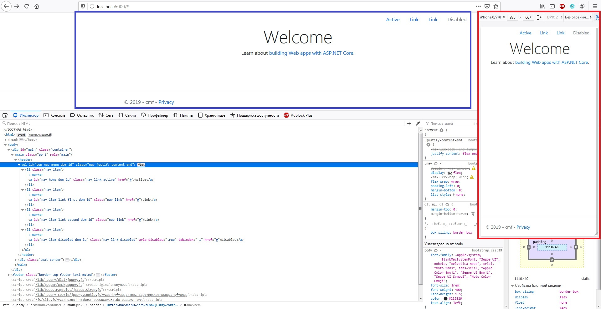

## [Vertical](https://getbootstrap.com/docs/4.3/components/navs/#vertical)
> Сделать навигацию в виде стэка можно изменив направление элемента flex с помощью утилиты .flex-column.

Горизонтальное расположение в виде стэка определяется через ориентацию. Так же как и при обычном базовом подходе:
```c#
NavReferenceBehaviorManager nav = new NavReferenceBehaviorManager("top-menu", BootstrapViewComponentsRazorLibrary.Models.bootstrap.NavOrientationsEnum.Vertically);
```
***result:***


> Нужно складывать их на некоторых видовых экранах, но не на других? Используйте адаптивные версии (например, `.flex-sm-column`).
```c#
NavReferenceBehaviorManager nav = new NavReferenceBehaviorManager("top-menu", BootstrapViewComponentsRazorLibrary.Models.bootstrap.NavOrientationsEnum.Vertically);
// удаляем стандартный для вертикального позиционирования CSS стилей
nav.RemoveCSS("flex-column");
// добавляем другой CSS стилей
nav.AddCSS("flex-md-column");

nav.AddNav("Active", "nav-home", "#").IsActive = true;
nav.AddNav("Link", "nav-link", "#");
nav.AddNav("Link", "nav-link-second", "#");
nav.AddNav("Disabled", "nav-disabled", "#").IsDisabled = true;                    
nav.NavWrapperType = BootstrapViewComponentsRazorLibrary.Models.NavWrapperTypesEnum.ul;
```
***result:*** сравнение отображения на разных устройствах (Монитор ПК и дисплей iPhone 6/7/8)


> Традиционно, вертикальная навигация возможна и без `<ul>`s.
```c#
nav.NavWrapperType = BootstrapViewComponentsRazorLibrary.Models.NavWrapperTypesEnum.nav;
```
***result:***


## [Tabs](https://getbootstrap.com/docs/4.3/components/navs/#tabs)
> За основу берется базовая навигация и добавляется `.nav-tabs` класс для создания интерфейса с вкладками.
Используйте их для создания вкладочных областей с помощью `JavaScript tab` плагина.

**Tabs** стиль определяется через конструктор менеджера навигации (третий парамтр:`bool SetTabsStyle`)
```c#
NavReferenceBehaviorManager nav = new NavReferenceBehaviorManager("top-menu", BootstrapViewComponentsRazorLibrary.Models.bootstrap.NavOrientationsEnum.HorizontallyLeftAligned, true);
```
***result:***

Не следует совмещать стили **[Tabs](https://github.com/badhitman/BootstrapViewComponentsRazorLibrary/tree/master/Components/bootstrap/navs#tabs)** и **[Pills](https://github.com/badhitman/BootstrapViewComponentsRazorLibrary/tree/master/Components/bootstrap/navs#pills)** одновременно

> Традиционно, навигация возможна и без `<ul>`s.

```c#
nav.NavWrapperType = BootstrapViewComponentsRazorLibrary.Models.NavWrapperTypesEnum.nav;
```
***result:***


## [Pills](https://getbootstrap.com/docs/4.3/components/navs/#pills)
> Возьмите базовую навигацию, но примените к нему `.nav-pills`

Включение **nav-pills** производиться через соостветвующее поле параметра вызова базового компонента навигации `SetPillsTheme = true`.

```cshtml
@await Component.InvokeAsync(typeof(NavBase).Name, new { navManager = nav, SetPillsTheme = true })
```
***result:***
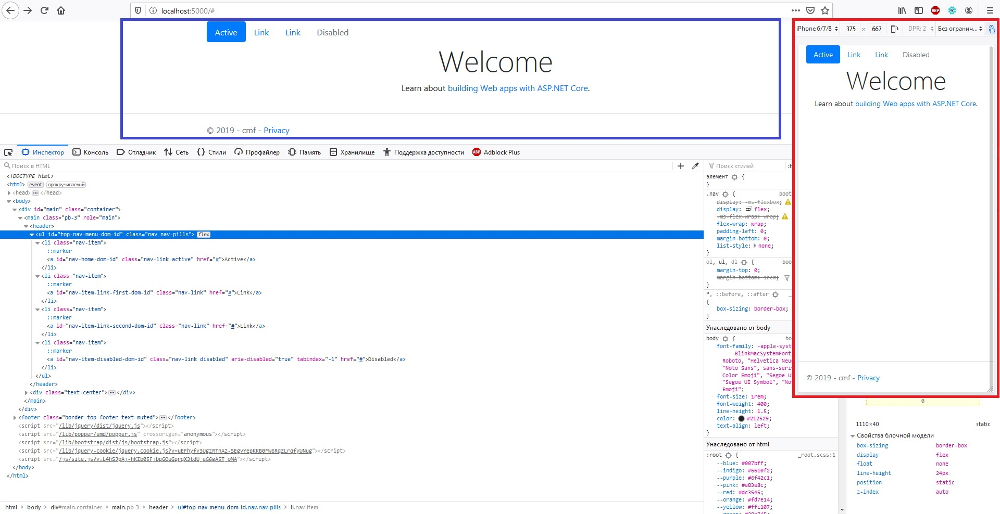
Не следует совмещать стили **[Tabs](https://github.com/badhitman/BootstrapViewComponentsRazorLibrary/tree/master/Components/bootstrap/navs#tabs)** и **[Pills](https://github.com/badhitman/BootstrapViewComponentsRazorLibrary/tree/master/Components/bootstrap/navs#pills)** одновременно

## [Fill and justify](https://getbootstrap.com/docs/4.3/components/navs/#fill-and-justify)
> Для принудительного расширения `.nav`s по всей доступной ширине применяется один из двух классов-модификаторов.
```c#
NavReferenceBehaviorManager nav = new NavReferenceBehaviorManager("top-menu", BootstrapViewComponentsRazorLibrary.Models.bootstrap.NavOrientationsEnum.HorizontallyFill);
```
***result:***
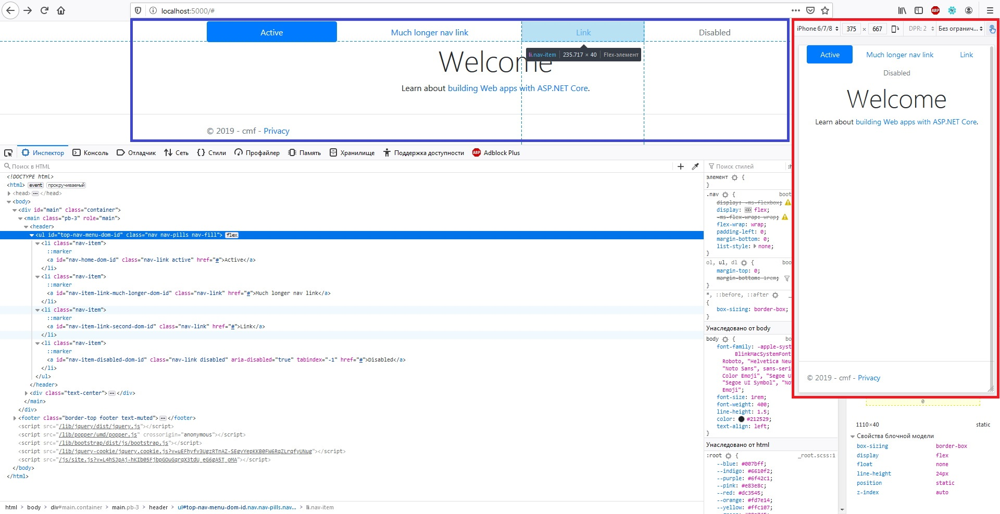
> Чтобы пропорционально заполнить все доступное пространство телом `.nav-items`, используется `.nav-fill`.
Обратите внимание, что все горизонтальное пространство занято, но не каждый элемент навигации имеет одинаковую ширину.

> При использовании навигации на основе `<nav>` в режиме `fill`, пункты меню будут промаркированы классом `.nav-item`.
```c#
NavReferenceBehaviorManager nav = new NavReferenceBehaviorManager("top-menu", BootstrapViewComponentsRazorLibrary.Models.bootstrap.NavOrientationsEnum.HorizontallyFill);
...
nav.NavWrapperType = BootstrapViewComponentsRazorLibrary.Models.NavWrapperTypesEnum.nav;
```
***result:***
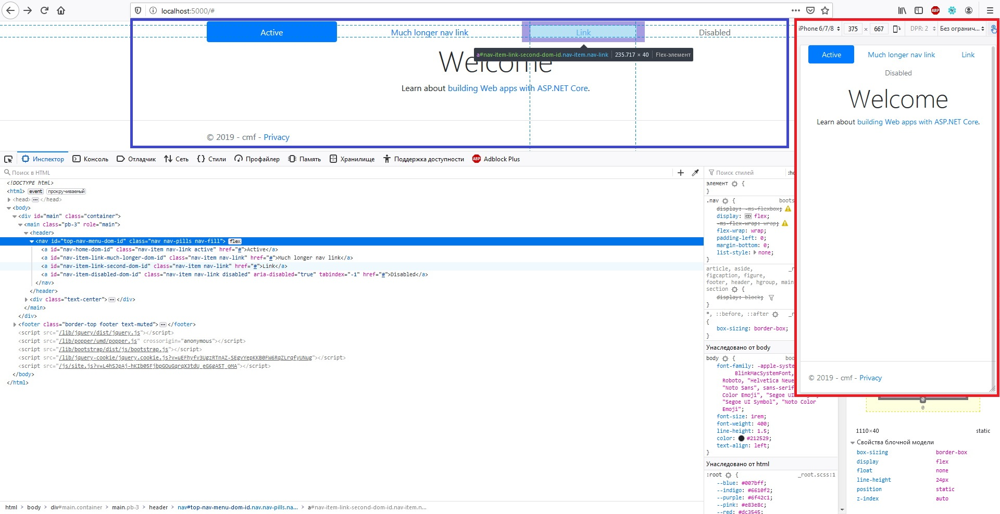

Для задания элементов равной ширины используйте соответсвующее позиционирование `NavOrientationsEnum.HorizontallyJustified` (которое задействует: `.nav-justified`):
```c#
NavReferenceBehaviorManager nav = new NavReferenceBehaviorManager("top-menu", BootstrapViewComponentsRazorLibrary.Models.bootstrap.NavOrientationsEnum.HorizontallyJustified);
// ...
nav.NavWrapperType = BootstrapViewComponentsRazorLibrary.Models.NavWrapperTypesEnum.ul;
```
***result:***
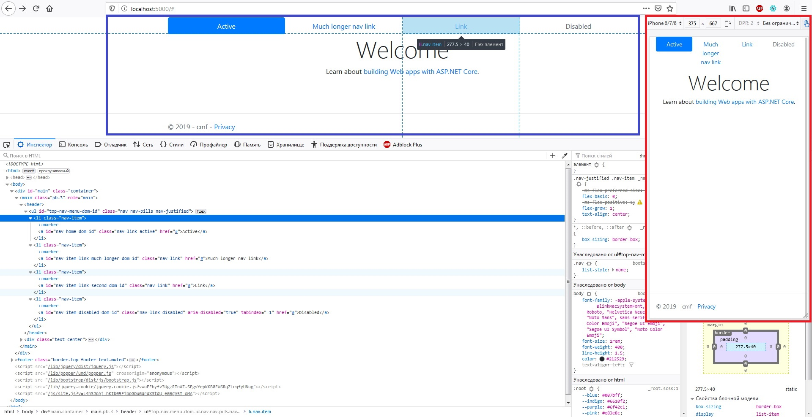
> Все горизонтальное пространство будет занято навигационными ссылками, но в отличие от предыдущего примера (`.nav-fill`), каждый элемент навигации будет одинаковой ширины.

## [Working with flex utilities](https://getbootstrap.com/docs/4.3/components/navs/#working-with-flex-utilities)
> Если вам нужны адаптивные варианты навигации, рассмотрите возможность использования ряда flexbox-утилит

Через механизм установки CSS стилей можно гибче манипулировать адаптивной вёрсткой:
```cshtml
<header>
  @{
    NavReferenceBehaviorManager nav = new NavReferenceBehaviorManager("top-menu", BootstrapViewComponentsRazorLibrary.Models.bootstrap.NavOrientationsEnum.Vertically);
    
    // добавление пользователського класса стилей блоку навигации
    // по умолчанию там уже будут классы "nav", "flex-column" (в случае вертикальной ориентации) и "nav-pills" (в случае применения стиля Pills)
    nav.AddCSS("flex-sm-row");

    nav.AddNav("Active", "nav-home", "#").IsActive = true;
    nav.AddNav("Link", "nav-link", "#");
    nav.AddNav("Link", "nav-link-second", "#");
    nav.AddNav("Disabled", "nav-disabled", "#").IsDisabled = true; 

    // метод добавления пользовательских классов в дочерние елементы (пункты меню на уровне тега <a></a>)
    // по умолчанию <a></a> якоря уже будут иметь обязательные классы стилей. мы к ним добавляем дополнительные
    // классы стилей будут добавлены толкьо в существующие(уже добавленые) пункты меню
    nav.ChildsAddCSS("flex-sm-fill text-sm-center");
                   
    nav.NavWrapperType = BootstrapViewComponentsRazorLibrary.Models.NavWrapperTypesEnum.nav;
  }
  @await Component.InvokeAsync(typeof(NavBase).Name, new { navManager = nav, SetPillsTheme = true })
</header>
```
> В приведенном ниже примере наш навигатор будет уложен на самую низкую **breakpoint**, а затем адаптируется к горизонтальной компоновке, которая заполняет доступную ширину, начиная с наименьшей **breakpoint**.

***result:*** сравнение отображения на разных устройствах (Монитор ПК и дисплей iPhone 6/7/8)
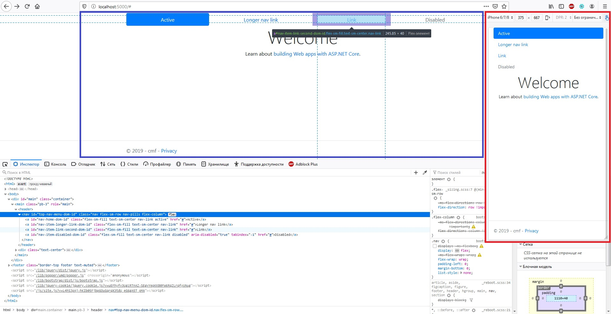

## [Tabs with dropdowns](https://getbootstrap.com/docs/4.3/components/navs/#tabs-with-dropdowns)
```cshtml
<header>
  @{
    NavReferenceBehaviorManager nav = new NavReferenceBehaviorManager("top-menu", BootstrapViewComponentsRazorLibrary.Models.bootstrap.NavOrientationsEnum.HorizontallyLeftAligned, true);
    nav.AddNav("Active", "nav-home", "#").IsActive = true;

    NavItemModel dropdown_nav = nav.AddNav("Dropdown", "dropdown-nav", "#");
    dropdown_nav.AddSubNav("Action", "dropdown-item-1", "#");
    dropdown_nav.AddSubNav("Another action", "dropdown-item-2", "#");
    dropdown_nav.AddSubNav("Something else here", "dropdown-item-3", "#");
    dropdown_nav.AddSubNav(null);//<div class="dropdown-divider"></div>
    dropdown_nav.AddSubNav("Separated link", "dropdown-item-4", "#");

    nav.AddNav("Link", "nav-link-second", "#");
    nav.AddNav("Disabled", "nav-disabled", "#").IsDisabled = true;

    nav.NavWrapperType = BootstrapViewComponentsRazorLibrary.Models.NavWrapperTypesEnum.ul;
  }
  @await Component.InvokeAsync(typeof(NavBase).Name, new { navManager = nav, SetPillsTheme = false })
</header>
```
***result:*** _под-меню свёрнуто (слева синим) и развёрнуто (справа красным)_
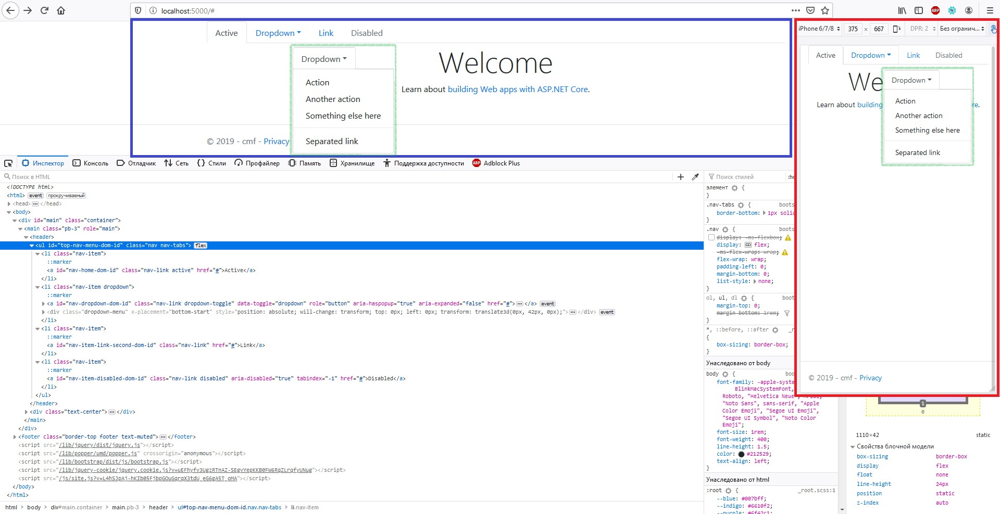

## [Pills with dropdowns](https://getbootstrap.com/docs/4.3/components/navs/#pills-with-dropdowns)
```cshtml
<header>
  @{
    NavReferenceBehaviorManager nav = new NavReferenceBehaviorManager("top-menu", BootstrapViewComponentsRazorLibrary.Models.bootstrap.NavOrientationsEnum.HorizontallyLeftAligned, false);
    ...
  }
  @await Component.InvokeAsync(typeof(NavBase).Name, new { navManager = nav, SetPillsTheme = true })
</header>
```
***result:*** _под-меню свёрнуто (слева синим) и развёрнуто (справа красным)_
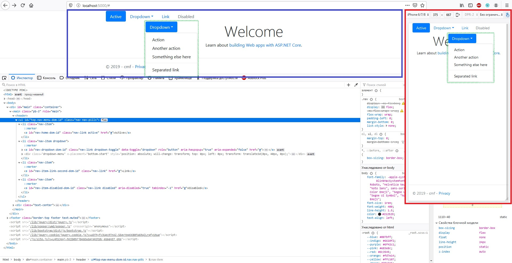

## [JavaScript behavior](https://getbootstrap.com/docs/4.3/components/navs/#javascript-behavior)
```cshtml
<header>
  @{
    // test content for tabs
    string contetnt_home = "Home! Raw denim you probably haven't heard of them jean shorts Austin. Nesciunt tofu stumptown aliqua, retro synth master cleanse. Mustache cliche tempor, williamsburg carles vegan helvetica. Reprehenderit butcher retro keffiyeh dreamcatcher synth. Cosby sweater eu banh mi, qui irure terry richardson ex squid. Aliquip placeat salvia cillum iphone. Seitan aliquip quis cardigan american apparel, butcher voluptate nisi qui.";
    string contetnt_profile = "Profile! Food truck fixie locavore, accusamus mcsweeney's marfa nulla single-origin coffee squid. Exercitation +1 labore velit, blog sartorial PBR leggings next level wes anderson artisan four loko farm-to-table craft beer twee. Qui photo booth letterpress, commodo enim craft beer mlkshk aliquip jean shorts ullamco ad vinyl cillum PBR. Homo nostrud organic, assumenda labore aesthetic magna delectus mollit. Keytar helvetica VHS salvia yr, vero magna velit sapiente labore stumptown. Vegan fanny pack odio cillum wes anderson 8-bit, sustainable jean shorts beard ut DIY ethical culpa terry richardson biodiesel. Art party scenester stumptown, tumblr butcher vero sint qui sapiente accusamus tattooed echo park.";
    string contetnt_contact = "Contact! Etsy mixtape wayfarers, ethical wes anderson tofu before they sold out mcsweeney's organic lomo retro fanny pack lo-fi farm-to-table readymade. Messenger bag gentrify pitchfork tattooed craft beer, iphone skateboard locavore carles etsy salvia banksy hoodie helvetica. DIY synth PBR banksy irony. Leggings gentrify squid 8-bit cred pitchfork. Williamsburg banh mi whatever gluten-free, carles pitchfork biodiesel fixie etsy retro mlkshk vice blog. Scenester cred you probably haven't heard of them, vinyl craft beer blog stumptown. Pitchfork sustainable tofu synth chambray yr.";

    NavJavaScriptBehaviorManager nav = new NavJavaScriptBehaviorManager("top-menu", BootstrapViewComponentsRazorLibrary.Models.bootstrap.NavOrientationsEnum.HorizontallyLeftAligned, true);
    nav.AddNav("Home", "nav-home", contetnt_home).IsActive = true;
    nav.AddNav("Profile", "nav-profile", contetnt_profile);
    nav.AddNav("Contact", "nav-contact", contetnt_contact);

    nav.IsFadeStyle = true;
    nav.NavWrapperType = BootstrapViewComponentsRazorLibrary.Models.NavWrapperTypesEnum.ul;
  }
  @await Component.InvokeAsync(typeof(NavBase).Name, new { navManager = nav, SetPillsTheme = false })
</header>
```
***result:***


> Традиционно, навигация возможна и без `<ul>`s.
***result:***
