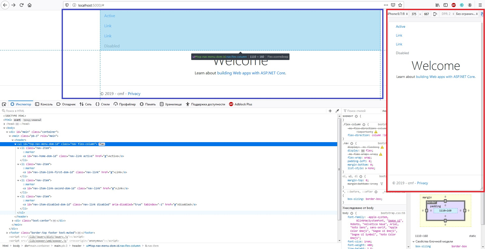
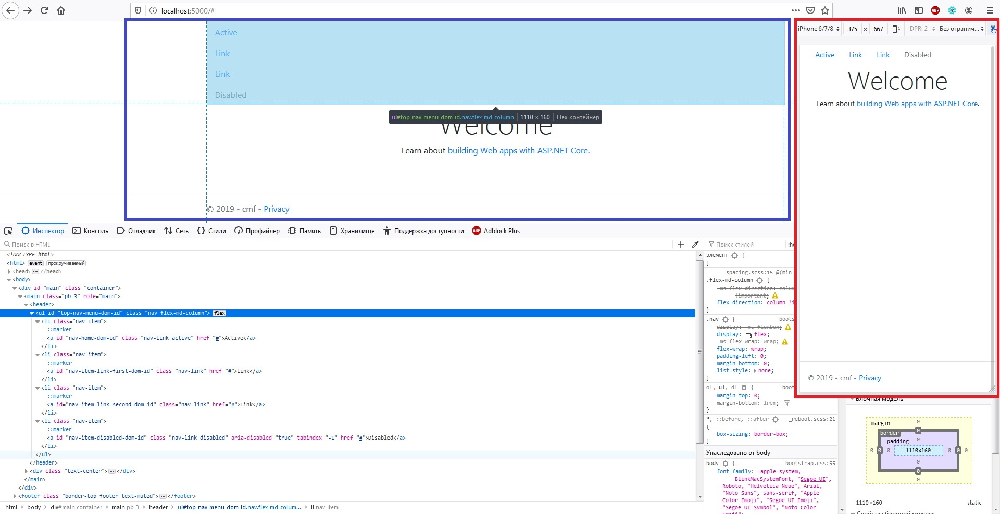
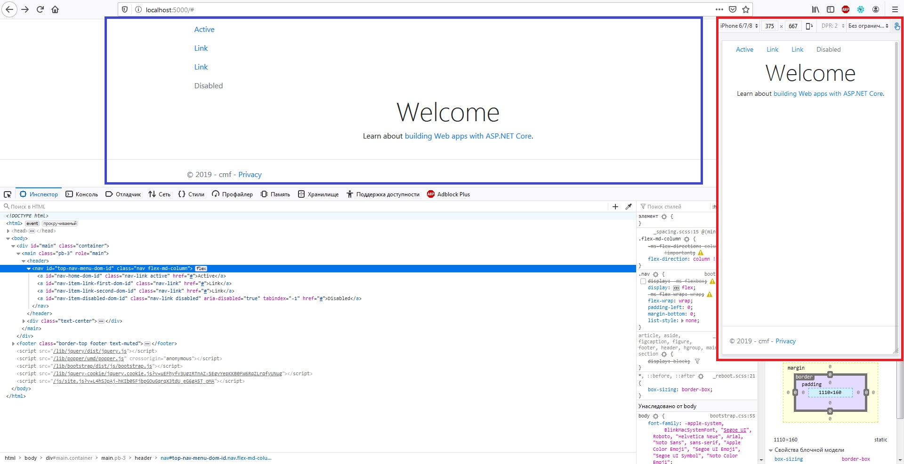

## [Base nav](https://getbootstrap.com/docs/4.3/components/navs/#base-nav)
> Базовая навигация построена с применением flexbox и обеспечивает прочную основу для формирования всех типов навигационных компонентов.
Он включает в себя некоторые переопределения стилей (например: для работы со списками и т.п.)

> Базовый компонент `nav` не включает в себя никакого рендеринга .active состояния пунктов меню.
Следующие примеры включают класс `active`, главным образом, чтобы продемонстрировать, что этот конкретный класс не вызывает никакого специального стиля.

```cshtml
@using BootstrapViewComponentsRazorLibrary.Service.bootstrap
@using BootstrapViewComponentsRazorLibrary.Components.bootstrap.nav
@{
  NavReferenceBehaviorManager nav = new NavReferenceBehaviorManager("top-menu", BootstrapViewComponentsRazorLibrary.Models.bootstrap.NavOrientationsEnum.HorizontallyLeftAligned);
  nav.AddNav("Active", "nav-home", "#").IsActive = true;
  nav.AddNav("Link", "nav-link", "#");
  nav.AddNav("Link", "nav-linc-second", "#");
  nav.AddNav("Disabled", "nav-disabled", "#").IsDisabled = true;
  nav.NavWrapperType = BootstrapViewComponentsRazorLibrary.Models.NavWrapperTypesEnum.ul;
}
@await Component.InvokeAsync(typeof(NavBase).Name, new { navManager = nav, SetPillsTheme = false })
```
***result:***


> Классы в **Bootstrap** используются повсюду, поэтому ваша разметка может быть очень гибкой.
Используйте `<ul>`s, как продемонстрировано выше, либо воспользуйтесь элементом `<nav>`.
Так-как **.nav** использует `display: flex`, теги ссылок `<a>` внутри `<nav>` ведут себя так же, как и стандартные элементы навигации.

Для того что бы компонент навигации ипользовал теги ссылок `<a>` внутри `<nav>` - достаточно указать другой тип обёртки:

```cshtml
nav.NavWrapperType = BootstrapViewComponentsRazorLibrary.Models.NavWrapperTypesEnum.nav;
```
***result:***


## [Horizontal alignment](https://getbootstrap.com/docs/4.3/components/navs/#horizontal-alignment)
> Измените горизонтальное выравнивание навигатора с помощью утилит flexbox. По умолчанию навигаторы выровнены по левому краю, но вы можете легко изменить их на выравнивание по центру или по правому краю.

Выравнивание назначается через контсруктор.
В следующем примере навигация центруется по горизонтали (применяется: `.justify-content-center`):

```cshtml
NavReferenceBehaviorManager nav = new NavReferenceBehaviorManager("top-menu", BootstrapViewComponentsRazorLibrary.Models.bootstrap.NavOrientationsEnum.HorizontallyCenterAligned);
```
***result:***


В следующем примере навигация распологается справа по горизонтали (применяется: `.justify-content-end`):
```cshtml
NavReferenceBehaviorManager nav = new NavReferenceBehaviorManager("top-menu", BootstrapViewComponentsRazorLibrary.Models.bootstrap.NavOrientationsEnum.HorizontallyRightAligned);
```
***result:***


## [Vertical](https://getbootstrap.com/docs/4.3/components/navs/#vertical)
> Сделать навигацию в виде стэка можно изменив направление элемента flex с помощью утилиты .flex-column.

Горизонтальное расположение в виде стэка определяется через ориентацию. Так же как и при обычном базовом подходе:
```cshtml
NavReferenceBehaviorManager nav = new NavReferenceBehaviorManager("top-menu", BootstrapViewComponentsRazorLibrary.Models.bootstrap.NavOrientationsEnum.Vertically);
```
***result:***


> Нужно складывать их на некоторых видовых экранах, но не на других? Используйте адаптивные версии (например, `.flex-sm-column`).
```cshtml
NavReferenceBehaviorManager nav = new NavReferenceBehaviorManager("top-menu", BootstrapViewComponentsRazorLibrary.Models.bootstrap.NavOrientationsEnum.VerticallySm);
```
***result:***


> Как всегда, вертикальная навигация возможна и без `<ul>`s.
```cshtml
nav.NavWrapperType = BootstrapViewComponentsRazorLibrary.Models.NavWrapperTypesEnum.nav;
```
***result:***



## [Tabs](https://getbootstrap.com/docs/4.3/components/navs/#tabs)
> За основу берется базовая навигация и добавляется `.nav-tabs` класс для создания интерфейса с вкладками.
Используйте их для создания вкладочных областей с помощью `JavaScript tab` плагина.

**Tabs** стиль определяется через конструктор менеджера навигации (третий парамтр:`bool SetTabsStyle`)
```cshtml
NavReferenceBehaviorManager nav = new NavReferenceBehaviorManager("top-menu", BootstrapViewComponentsRazorLibrary.Models.bootstrap.NavOrientationsEnum.HorizontallyLeftAligned, true);
```
***result:***


> Как всегда, навигация возможна и без `<ul>`s.

```cshtml
nav.NavWrapperType = BootstrapViewComponentsRazorLibrary.Models.NavWrapperTypesEnum.nav;
```
***result:***


## [Pills](https://getbootstrap.com/docs/4.3/components/navs/#pills)
> дополняется ...

## [Fill and justify](https://getbootstrap.com/docs/4.3/components/navs/#fill-and-justify)
> дополняется ...

## [Working with flex utilities](https://getbootstrap.com/docs/4.3/components/navs/#working-with-flex-utilities)
> дополняется ...

## [Regarding accessibility](https://getbootstrap.com/docs/4.3/components/navs/#regarding-accessibility)
> дополняется ...

## [Tabs with dropdowns](https://getbootstrap.com/docs/4.3/components/navs/#tabs-with-dropdowns)
> дополняется ...

## [Pills with dropdowns](https://getbootstrap.com/docs/4.3/components/navs/#pills-with-dropdowns)
> дополняется ...

## [JavaScript behavior](https://getbootstrap.com/docs/4.3/components/navs/#javascript-behavior)
> дополняется ...
