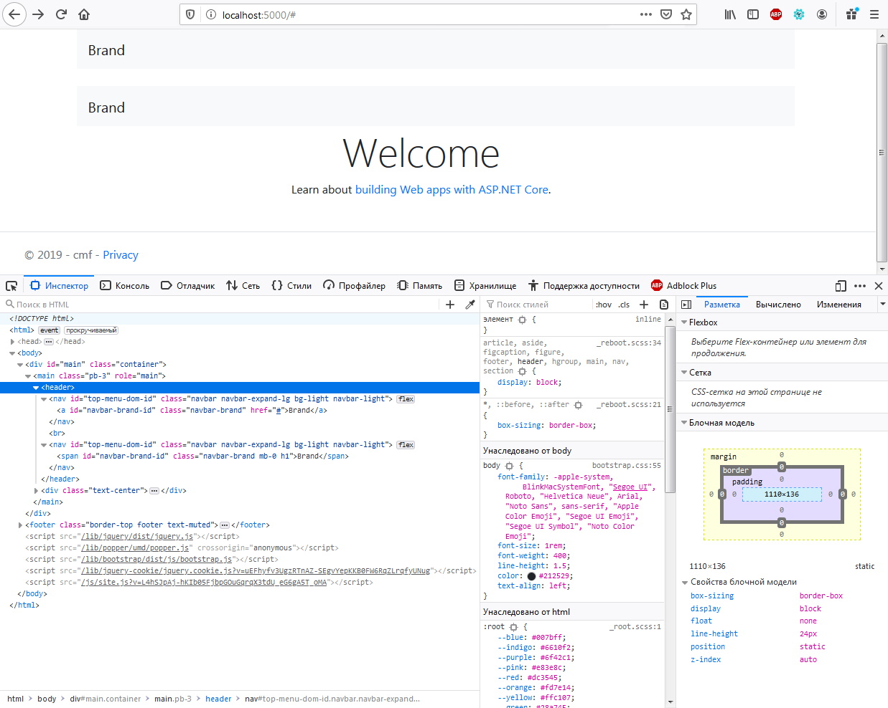
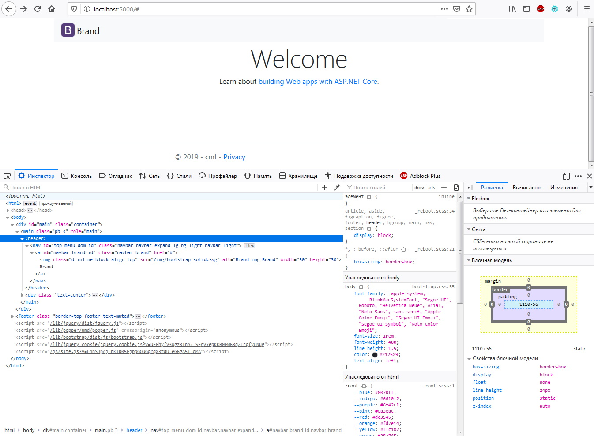
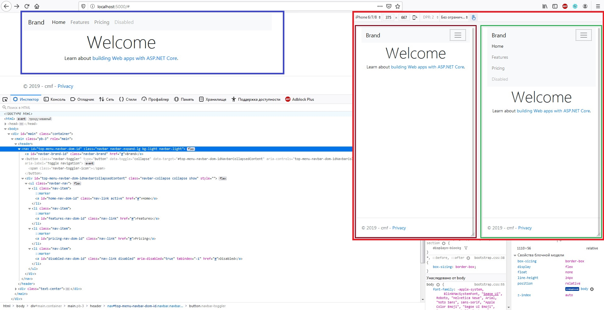
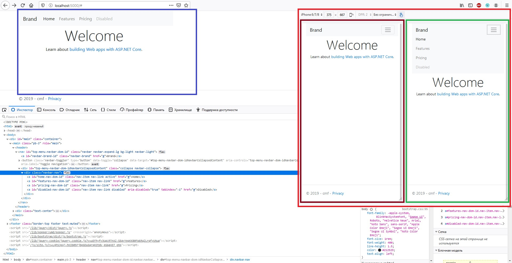
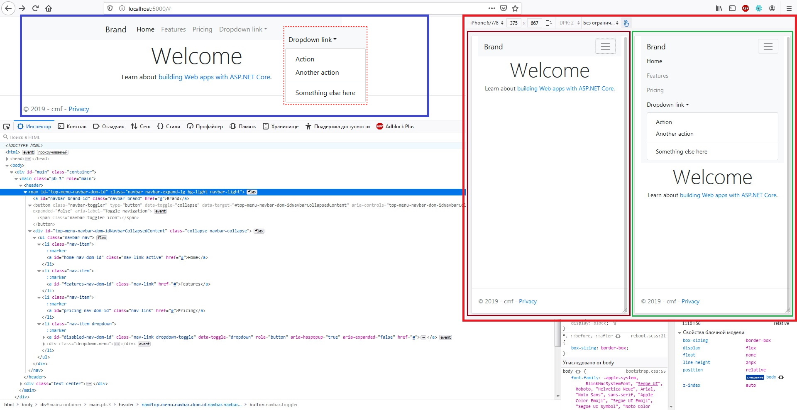
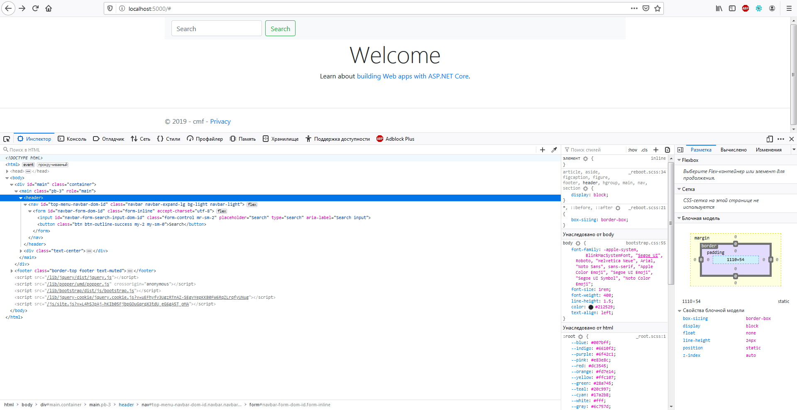
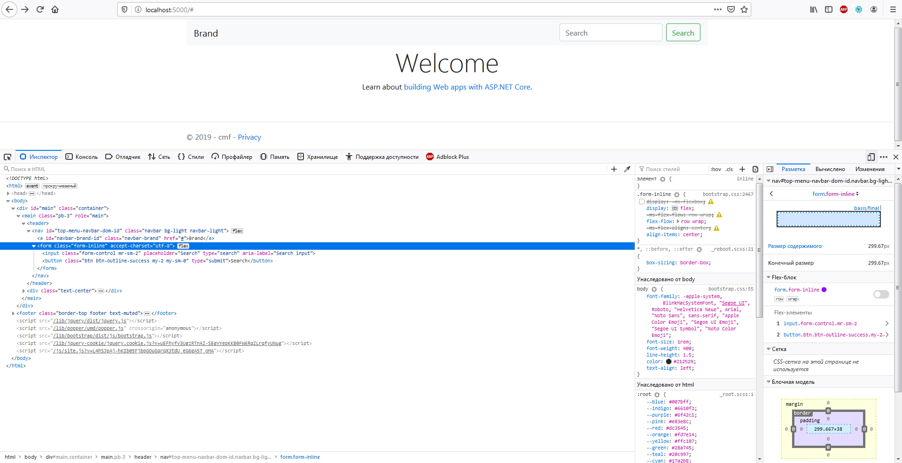

## [Navbar](https://getbootstrap.com/docs/4.3/components/navbar/)
> Вот что нужно знать, прежде чем начать работу с навигационной панелью:

- Навигационные панели требуют обертывания `.navbar` при помощи `.navbar-expand{-sm|-md|-lg|-xl}` для гибкой адаптивной разметки.
- Навигационные панели и их содержимое по умолчанию являются растягивающимся/жидкими. Используйте дополнительные контейнеры, чтобы ограничить их горизонтальную ширину.
- Используйте классы утилит `spacing` и `flex` для управления расстоянием и выравниванием в навигационных панелях.
- Навигационные панели реагируют по умолчанию, но вы можете легко изменить их, чтобы изменить это. Отзывчивое поведение зависит от нашего плагина **JavaScript Collapse**.
- Навигационные панели по умолчанию скрыты при печати. Заставьте их быть напечатаны путем добавления `.d-print` на `.navbar`. Обратите внимание на классы утилиты **display**.
- Обеспечьте доступность с помощью элемента `<nav>` или, если используется более общий элемент, такой как `<div>`, добавьте `role="navigation"` к каждой навигационной панели, чтобы явно определить ее как ориентир для пользователей вспомогательных технологий.

```cshtml
<header>
@{
  NavbarManager navbar_manager = new NavbarManager() { Id_DOM = "TopMenu" };
  navbar_manager.NavbarBrand = new NavbarBrandManager()
  {
    NavbarBrandPosition = NavbarBrandPositioningEnum.Left,
    Id_DOM = "navbar-brand-id",
    NavbarBrandDom = new BrandNavItemModel("brand-id")
	{
	  Href = "#",
	  Header = " Brand",
	  Title = "Описание бренда",
      ImageNavbarBrandSrc = "/img/bootstrap-solid.svg"
	}
  };


  NavbarNavManager navbar_nav_manager = new NavbarNavManager();
  navbar_nav_manager.AddCSS("mr-auto"); // добавляем контейнеру стили: margin-right: auto !important;
  navbar_nav_manager.AddNavItem(id_dom: "home-nav-id", header: "Home", href: "#").IsActive = true;
  navbar_nav_manager.AddNavItem("link-nav-id", "Link", "#");

  NavItemModel navbar_nav_dropdown_item = navbar_nav_manager.AddNavItem("dropdown-nav-id", "Dropdown", "#");
  navbar_nav_dropdown_item.AddSubNav(header_nav: "Action", href_nav: "#", id_dom: "action-nav-id");
  navbar_nav_dropdown_item.AddSubNav("Another action", "#", "another-action-nav-id");
  navbar_nav_dropdown_item.AddSubNav(null);
  navbar_nav_dropdown_item.AddSubNav("Something else here", "#", "something-else-here-nav-id");

  navbar_nav_manager.AddNavItem("disabled-nav-id", "Disabled", "#").IsDisabled = true;

  navbar_manager.NavbarBody.AddSubNode(navbar_nav_manager);

  FormManager formManager = new FormManager();

  TextedInputManager input_manager = new TextedInputManager(BootstrapViewComponents.InputTypesEnum.search)
  {
    Placeholder = "Search"
  };
  input_manager.AddCSS("form-control mr-sm-2", true);
   formManager.AddSubNode(input_manager);

  ButtonBaseManager button_manager = new ButtonBaseManager("Search");
  button_manager.AddCSS("btn btn-outline-success my-2 my-sm-0", true);

  formManager.AddSubNode(button_manager);


  formManager.AddCSS("my-2 my-lg-0", true);
  navbar_manager.NavbarBody.AddSubNode(formManager);

  @await Component.InvokeAsync(typeof(NavbarBase).Name, new { SetObjectManager = navbar_manager });
}
</header>
```
***result:*** пример: монитор ПК (слева синим) и на дисплее **iPhone 6/6/7** (справа красным). Дисплей **iPhone** в свою очередь демонстрируется в двух состояниях: свёрнутый (левее коричневый) и развернутый (правее зелёный)

В примере выше использовались утилиты [color](https://getbootstrap.com/docs/4.3/utilities/colors/) (__bg-light__) и [spacing](https://getbootstrap.com/docs/4.3/utilities/spacing/) (__my-2, my-lg-0, mr-sm-0, my-sm-0, mr-auto__).


> Navbars поставляются со встроенной поддержкой [нескольких субкомпонентов](https://getbootstrap.com/docs/4.3/components/navbar/#supported-content):

- [**.navbar-brand**](https://github.com/badhitman/BootstrapViewComponentsRazorLibrary/tree/master/Components/html/bootstrap/navbar#brand) для названия вашей компании, продукта или проекта. В том числе с аватаркой/картинкой.
- [**.navbar-nav**](https://github.com/badhitman/BootstrapViewComponentsRazorLibrary/tree/master/Components/html/bootstrap/navbar#nav) для `full-height` и `lightweight` навигации (включая поддержку выпадающих меню).
- [**.navbar-toggler**](https://github.com/badhitman/BootstrapViewComponentsRazorLibrary/tree/master/Components/html/bootstrap/navbar#toggler) для использования с нашим плагином _collapse_ и другими способами переключения навигации.
- [**.form-inline**](https://github.com/badhitman/BootstrapViewComponentsRazorLibrary/tree/master/Components/html/bootstrap/navbar#forms) для любых элементов управления и действий формы.
- [**.navbar-text**](https://github.com/badhitman/BootstrapViewComponentsRazorLibrary/tree/master/Components/html/bootstrap/navbar#text) для добавления вертикально центрированных строк текста.
- [**.collapse.navbar-collapse**](https://github.com/badhitman/BootstrapViewComponentsRazorLibrary/tree/master/Components/html/bootstrap/navbar#external-content) для группировки и скрытия содержимого навигационной панели.

## [Brand](https://getbootstrap.com/docs/4.3/components/navbar/#brand)
> **.navbar-brand** может быть применен к большинству типов **тегов**, но `<a></a>` работает лучше всего, поскольку другие типы тегов могут потребовать дополнительных **utility classes** или пользовательских стилей.

```cshtml
<header>
@{
  NavbarManager navbar_manager = new NavbarManager() { Id_DOM = "top-menu-dom-id" };

  navbar_manager.NavbarBrand = new NavbarBrandManager()
  {
    NavbarBrandPosition = NavbarBrandPositioningEnum.Left,
    Id_DOM = "navbar-brand-id",
    NavbarBrandDom = new BrandNavItemModel("navbar-brand-dom-id") { Href = "#", Header = " Brand", Title = "Описание бренда" }
  };
  @await Component.InvokeAsync(typeof(NavbarBase).Name, new { SetObjectManager = navbar_manager });
  
  <br />
  navbar_manager.NavbarBrand = new NavbarBrandManager()
  {
    NavbarBrandPosition = NavbarBrandPositioningEnum.Left,
    Id_DOM = "navbar-brand-id",
    NavbarBrandDom = new BrandNavItemModel("navbar-brand-dom-id") { Header = " Brand", Title = "Описание бренда" }
  };
  @await Component.InvokeAsync(typeof(NavbarBase).Name, new { SetObjectManager = navbar_manager });
}
</header>
```
***result:***


> Добавление изображений к **.navbar-brand**, скорее всего, потребует пользовательских стилей или утилит для правильного размера. Вот несколько примеров для демонстрации.

```cshtml
<header>
@{
  NavbarManager navbar_manager = new NavbarManager() { Id_DOM = "top-menu-dom-id" };
  navbar_manager.NavbarBrand = new NavbarBrandManager()
  {
    NavbarBrandPosition = NavbarBrandPositioningEnum.Left,
    Id_DOM = "navbar-brand-dom-id",
    NavbarBrandDom = new BrandNavItemModel("navbar-brand-dom-id")
    {
      Href = "#",
      Title = "Описание бренда",
      ImageNavbarBrandSrc = "/img/bootstrap-solid.svg"
    }
  };
  @await Component.InvokeAsync(typeof(NavbarBase).Name, new { SetObjectManager = navbar_manager });
  <br />
  navbar_manager.Id_DOM = "top-menu-2-dom-id";
  navbar_manager.NavbarBrand = new NavbarBrandManager()
  {
    NavbarBrandPosition = NavbarBrandPositioningEnum.Left,
    Id_DOM = "navbar-brand-2-dom-id",
    NavbarBrandDom = new BrandNavItemModel("navbar-brand-2-dom-id")
    {
      Href = "#",
      Header = " Brand",
      Title = "Описание бренда",
      ImageNavbarBrandSrc = "/img/bootstrap-solid.svg"
    }
  };
  @await Component.InvokeAsync(typeof(NavbarBase).Name, new { SetObjectManager = navbar_manager });
}
</header>
```
***result:***


## [Nav](https://getbootstrap.com/docs/4.3/components/navbar/#nav)
>  Навигационные ссылки **Navbar** построены на основе **.nav** . Имеют свой собственный класс модификации и требуют использования классов `toggler` для правильного адаптивного стиля.
Навигация в **navbars** также будет растягиваться, чтобы занять как можно больше горизонтального пространства, чтобы сохранить содержимое **navbar** надежно выровнено.
```cshtml
<header>
@{
  NavbarManager navbar_manager = new NavbarManager() { Id_DOM = "top-menu-navbar-dom-id" };
  navbar_manager.NavbarBrand = new NavbarBrandManager()
  {
    NavbarBrandPosition = NavbarBrandPositioningEnum.Left,
    Id_DOM = "navbar-brand-id",
    NavbarBrandDom = new BrandNavItemModel("navbar-brand-nav-dom-id")
    {
      Href = "#",
      Header = " Brand",
      Title = "Описание бренда"
    }
  };

  NavbarNavManager navbar_nav_manager = new NavbarNavManager();
  navbar_nav_manager.AddNavItem(id_dom: "home-nav-dom-id", header: "Home", href: "#").IsActive = true;
  navbar_nav_manager.AddNavItem("features-nav-dom-id", "Features", "#");
  navbar_nav_manager.AddNavItem("pricing-nav-dom-id", "Pricing", "#");
  navbar_nav_manager.AddNavItem("disabled-nav-dom-id", "Disabled", "#").IsDisabled = true;
  navbar_manager.NavbarBody.AddSubNode(navbar_nav_manager);

  @await Component.InvokeAsync(typeof(NavbarBase).Name, new { SetObjectManager = navbar_manager });
}
</header>
```
***result:***


> И поскольку мы используем классы для наших навигаторов, вы можете полностью избежать подхода на основе списка, если хотите.

```cshtml
<header>
@{
  NavbarManager navbar_manager = new NavbarManager()
  {
    Id_DOM = "top-menu-navbar-dom-id"
  };

  navbar_manager.NavbarBrand = new NavbarBrandManager()
  {
    NavbarBrandPosition = NavbarBrandPositioningEnum.Left,
    Id_DOM = "navbar-brand-id",
    NavbarBrandDom = new BrandNavItemModel("navbar-brand-nav-dom-id")
    {
      Href = "#",
      Header = " Brand",
      Title = "Описание бренда"
    }
  };

  NavbarNavManager navbar_nav_manager = new NavbarNavManager()
  {
    NavWrapper = NavbarNavWrappersEnum.div
  };

  navbar_nav_manager.AddNavItem(id_dom: "home-nav-dom-id", header: "Home", href: "#").IsActive = true;
  navbar_nav_manager.AddNavItem("features-nav-dom-id", "Features", "#");
  navbar_nav_manager.AddNavItem("pricing-nav-dom-id", "Pricing", "#");
  navbar_nav_manager.AddNavItem("disabled-nav-dom-id", "Disabled", "#").IsDisabled = true;
  navbar_manager.NavbarBody.AddSubNode(navbar_nav_manager);

  @await Component.InvokeAsync(typeof(NavbarBase).Name, new { SetObjectManager = navbar_manager });
}
</header>
```
***result:***


> Вы также можете использовать выпадающее меню в панели навигации.
Выпадающие меню требуют оберточного элемента для позиционирования, поэтому обязательно используйте отдельные и вложенные элементы: **.nav-item** и **.nav-link**, как показано ниже:

```cshtml
<header>
@{
  NavbarManager navbar_manager = new NavbarManager()
  {
    Id_DOM = "top-menu-navbar-dom-id"
  };

  navbar_manager.NavbarBrand = new NavbarBrandManager()
  {
    NavbarBrandPosition = NavbarBrandPositioningEnum.Left,
    Id_DOM = "navbar-brand-id",
    NavbarBrandDom = new BrandNavItemModel("navbar-brand-nav-dom-id")
    {
      Href = "#",
      Header = " Brand",
      Title = "Описание бренда"
    }
  };

  NavbarNavManager navbar_nav_manager = new NavbarNavManager();

  navbar_nav_manager.AddNavItem(id_dom: "home-nav-dom-id", header: "Home", href: "#").IsActive = true;
  navbar_nav_manager.AddNavItem("features-nav-dom-id", "Features", "#");
  navbar_nav_manager.AddNavItem("pricing-nav-dom-id", "Pricing", "#");

  NavItemModel navItem = navbar_nav_manager.AddNavItem("disabled-nav-dom-id", "Dropdown link", "#");
                    
  navItem.AddSubNav(header_nav: "Action", href_nav: "#", id_dom: "dropdown-action-dom-id");
  navItem.AddSubNav(header_nav: "Another action", href_nav: "#", id_dom: "dropdown-another-action-dom-id");
  navItem.AddSubNav(null);
  navItem.AddSubNav(header_nav: "Something else here", href_nav: "#", id_dom: "dropdown-something-action-dom-id");

  navbar_manager.NavbarBody.AddSubNode(navbar_nav_manager);

  @await Component.InvokeAsync(typeof(NavbarBase).Name, new { SetObjectManager = navbar_manager });
}
</header>
```
***result:***


## [Forms](https://getbootstrap.com/docs/4.3/components/navbar/#forms)
>  Поместите различные элементы управления и компоненты формы в навигационную панель **.form-inline**.

```cshtml
<header>
@{
  NavbarManager navbar_manager = new NavbarManager()
  {
    Id_DOM = "top-menu-navbar-dom-id"
  };
  navbar_manager.NavbarActions.IsHidesCollapse = false;
  FormManager formManager = new FormManager() { Id_DOM = "navbar-form-dom-id" };

  TextedInputManager input_manager = new TextedInputManager(BootstrapViewComponents.InputTypesEnum.search)
  {
    Placeholder = "Search",
    Id_DOM = "navbar-form-search-input-dom-id"
  };
  input_manager.AddCSS("form-control mr-sm-2", true);
  formManager.AddSubNode(input_manager);

  ButtonBaseManager button_manager = new ButtonBaseManager("Search");
  button_manager.AddCSS("btn btn-outline-success my-2 my-sm-0", true);

  formManager.AddSubNode(button_manager);
  navbar_manager.NavbarActions.AddSubNode(formManager);

  @await Component.InvokeAsync(typeof(NavbarBase).Name, new { SetObjectManager = navbar_manager });
}
</header>
```
***result:***


```cshtml
<header>
@{
  NavbarManager navbar_manager = new NavbarManager()
  {
    Id_DOM = "top-menu-navbar-dom-id",
    NavbarExpandSize = BootstrapViewComponents.BootstrapSizingEnum.NULL
  };
  navbar_manager.NavbarActions.IsHidesCollapse = false;
  navbar_manager.NavbarBrand = new NavbarBrandManager()
  {
    NavbarBrandPosition = NavbarBrandPositioningEnum.Left,
    Id_DOM = "navbar-brand-id",
    NavbarBrandDom = new BrandNavItemModel("navbar-brand-nav-dom-id")
    {
      Href = "#",
      Header = " Brand",
      Title = "Описание бренда"
    }
  };

  FormManager formManager = new FormManager();

  TextedInputManager input_manager = new TextedInputManager(BootstrapViewComponents.InputTypesEnum.search)
  {
    Placeholder = "Search"
  };
  input_manager.AddCSS("form-control mr-sm-2", true);
  formManager.AddSubNode(input_manager);

  ButtonBaseManager button_manager = new ButtonBaseManager("Search")
  {
    ButtonType = ButtonTypesEnum.submit
  };
  button_manager.AddCSS("btn btn-outline-success my-2 my-sm-0", true);

  formManager.AddSubNode(button_manager);

  navbar_manager.NavbarActions.AddSubNode(formManager);

  @await Component.InvokeAsync(typeof(NavbarBase).Name, new { SetObjectManager = navbar_manager });
}
</header>
```
***result:***


## [Text](https://getbootstrap.com/docs/4.3/components/navbar/#text)
>  дополняется

## [Color schemes](https://getbootstrap.com/docs/4.3/components/navbar/#color-schemes)
>  дополняется

## [Containers](https://getbootstrap.com/docs/4.3/components/navbar/#containers)
>  дополняется

## [Placement](https://getbootstrap.com/docs/4.3/components/navbar/#placement)
>  Используйте утилиты позиционирования для размещения навигационных панелей в нестатических положениях.
Выберите одно из фиксированных положений `top`, `fixed to the bottom` или `stickied to the top` (прокручивает страницу до тех пор, пока она не достигнет вершины, а затем остается там).
Фиксированные навигационные панели используют `position: fixed`, что означает, что они вытягиваются из нормального потока **DOM** и могут требовать пользовательского **CSS** (например, `padding-top` на `<body>`), чтобы предотвратить перекрытие с другими элементами.

> Также обратите внимание, что `.sticky-top` использует позицию: `sticky`, которая в некоторых браузерах не имеет полной поддержки.

## [Responsive behaviors](https://getbootstrap.com/docs/4.3/components/navbar/#responsive-behaviors)
>  дополняется

## [Toggler](https://getbootstrap.com/docs/4.3/components/navbar/#toggler)
>  дополняется

## [External content](https://getbootstrap.com/docs/4.3/components/navbar/#external-content)
>  дополняется