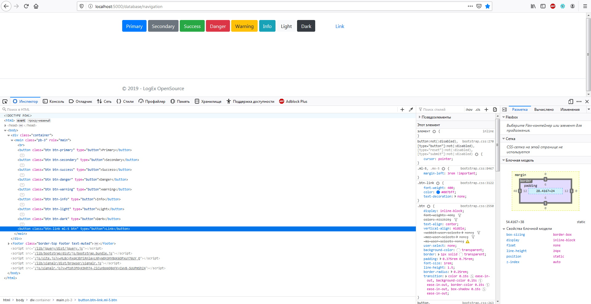
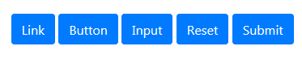
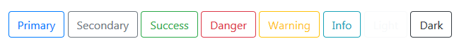
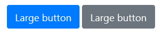
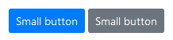
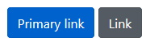
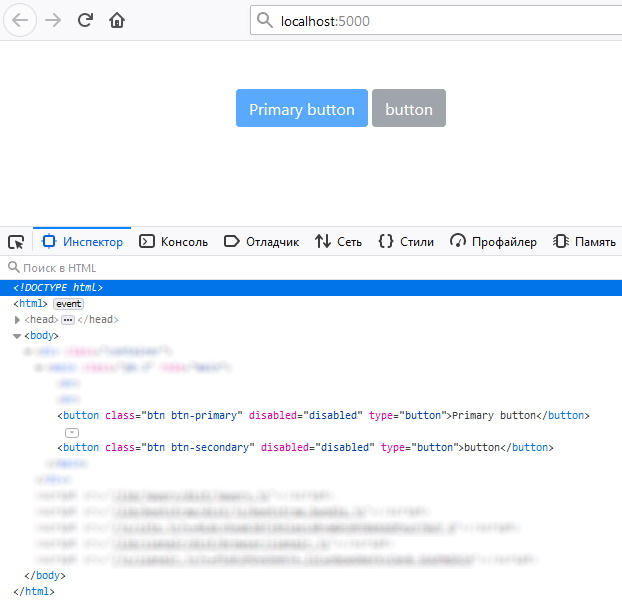
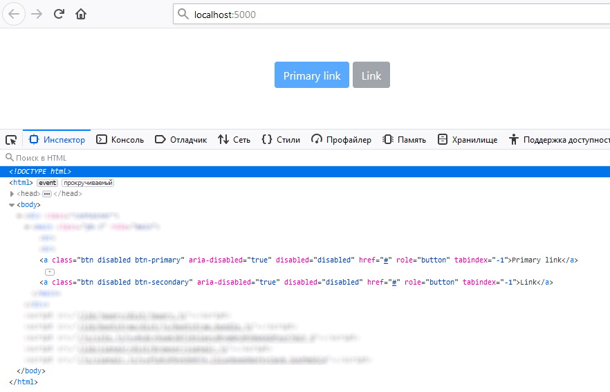
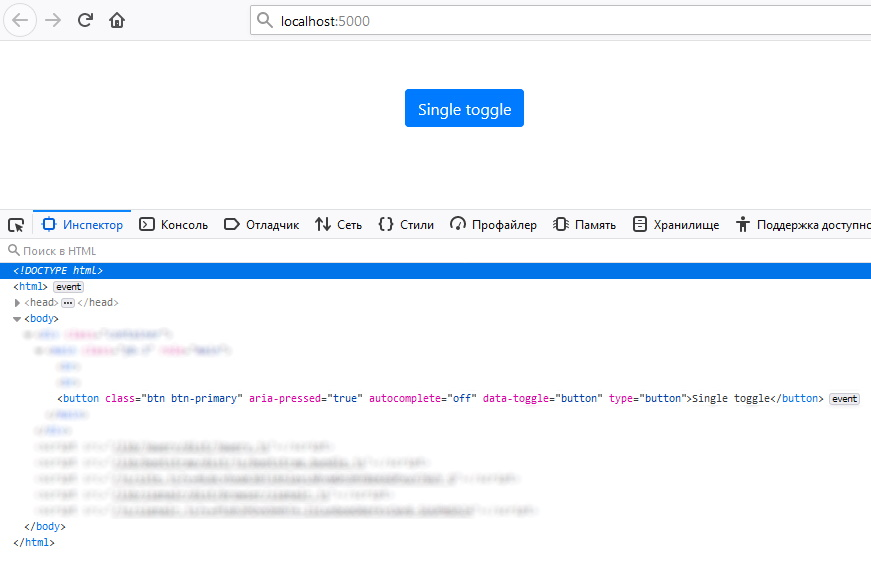

# Buttons[¶](https://getbootstrap.com/docs/4.3/components/buttons/)

```cshtml
@{
  DivBaseManager div = new DivBaseManager();

  div.AddChild(new BootstrapButtonManager("Primary") { BackgroundColorTheme = BackgroundColorThemesEnum.primary });
  div.AddChild(new BootstrapButtonManager("Secondary") { BackgroundColorTheme = BackgroundColorThemesEnum.secondary });
  div.AddChild(new BootstrapButtonManager("Success") { BackgroundColorTheme = BackgroundColorThemesEnum.success });
  div.AddChild(new BootstrapButtonManager("Danger") { BackgroundColorTheme = BackgroundColorThemesEnum.danger });
  div.AddChild(new BootstrapButtonManager("Warning") { BackgroundColorTheme = BackgroundColorThemesEnum.warning });
  div.AddChild(new BootstrapButtonManager("Info") { BackgroundColorTheme = BackgroundColorThemesEnum.info });
  div.AddChild(new BootstrapButtonManager("Light") { BackgroundColorTheme = BackgroundColorThemesEnum.light });
  div.AddChild(new BootstrapButtonManager("Dark") { BackgroundColorTheme = BackgroundColorThemesEnum.dark });

  BootstrapButtonManager button = new BootstrapButtonManager("Link") { BackgroundColorTheme = BackgroundColorThemesEnum.NULL };
  button.AddCSS("btn-link ml-5");
  div.AddChild(button);
  @await Component.InvokeAsync(typeof(HtmlRenderUniversalList).Name, new { SetObjectManager = div })
}
```

***result:***



## Button tags[¶](https://getbootstrap.com/docs/4.3/components/buttons/#button-tags)

> Классы **.btn** предназначены для использования с элементом `<button>`.
Однако вы также можете использовать эти классы для элементов `<a>` или `<input>`. Некоторые браузеры могут применять разную визуализацию.

> При использовании классов кнопок на элементах `<a>`, которые используются для запуска внутристраничных функций (например, сворачивания содержимого), 
вместо ссылок на новые страницы или разделы текущей страницы, этим ссылкам следует присвоить `role="button"`, 
чтобы соответствующим образом передать их назначение вспомогательным технологиям, таким как средства чтения с экрана.

```cshtml
@{
  DivBaseManager div = new DivBaseManager();

  div.AddChild(new BootstrapButtonLinkManager("Link", "#"));
  div.AddChild(new BootstrapButtonManager("Button"));
  //
  div.AddChild(new BootstrapButtonInputManager("Input"));
  div.AddChild(new BootstrapButtonInputManager("Reset", BootstrapButtonInputTypesEnum.reset));
  div.AddChild(new BootstrapButtonInputManager("Submit", BootstrapButtonInputTypesEnum.submit));

  @await Component.InvokeAsync(typeof(HtmlRenderUniversalList).Name, new { SetObjectManager = div })
}
```

***result***



## Outline buttons[¶](https://getbootstrap.com/docs/4.3/components/buttons/#outline-buttons)

> Нужны кнопки, но хотите избежать черезмерно насыщеный цвет фона, которые они приносят?
Замените классы модификаторов по умолчанию на **.btn-outline-**\* , чтобы удалить все фоновые изображения и цвета на любой кнопке.

```cshtml
@{
  DivBaseManager div = new DivBaseManager();

  div.AddChild(new BootstrapButtonManager("Primary") { IsOutlineStyle = true, BackgroundColorTheme = BackgroundColorThemesEnum.primary });
  div.AddChild(new BootstrapButtonManager("Secondary") { IsOutlineStyle = true, BackgroundColorTheme = BackgroundColorThemesEnum.secondary });
  div.AddChild(new BootstrapButtonManager("Success") { IsOutlineStyle = true, BackgroundColorTheme = BackgroundColorThemesEnum.success });
  div.AddChild(new BootstrapButtonManager("Danger") { IsOutlineStyle = true, BackgroundColorTheme = BackgroundColorThemesEnum.danger });
  div.AddChild(new BootstrapButtonManager("Warning") { IsOutlineStyle = true, BackgroundColorTheme = BackgroundColorThemesEnum.warning });
  div.AddChild(new BootstrapButtonManager("Info") { IsOutlineStyle = true, BackgroundColorTheme = BackgroundColorThemesEnum.info });
  div.AddChild(new BootstrapButtonManager("Light") { IsOutlineStyle = true, BackgroundColorTheme = BackgroundColorThemesEnum.light });
  div.AddChild(new BootstrapButtonManager("Dark") { IsOutlineStyle = true, BackgroundColorTheme = BackgroundColorThemesEnum.dark });

  @await Component.InvokeAsync(typeof(HtmlRenderUniversalList).Name, new { SetObjectManager = div })
}
```

***result***



## Sizes[¶](https://getbootstrap.com/docs/4.3/components/buttons/#sizes)

Нужны большие или маленькие кнопки? Используйте соответсвующее свойство `SizeButton`. Этим свойством применяется **.btn-lg** или **.btn-sm** для указания размеров.

Пример крупных кнопок:
```cshtml
@{
  DivBaseManager div = new DivBaseManager();

  div.AddChild(new BootstrapButtonManager("Large button") { BackgroundColorTheme = BackgroundColorThemesEnum.primary, SizeButton = TwinSizingEnum.Lg });
  div.AddChild(new BootstrapButtonManager("Large button") { BackgroundColorTheme = BackgroundColorThemesEnum.secondary, SizeButton = TwinSizingEnum.Lg });

  @await Component.InvokeAsync(typeof(HtmlRenderUniversalList).Name, new { SetObjectManager = div })
}
```

***result***



Пример мелких кнопок:
```cshtml
@{
  DivBaseManager div = new DivBaseManager();

  div.AddChild(new BootstrapButtonManager("Small button") { BackgroundColorTheme = BackgroundColorThemesEnum.primary, SizeButton = TwinSizingEnum.Sm });
  div.AddChild(new BootstrapButtonManager("Small button") { BackgroundColorTheme = BackgroundColorThemesEnum.secondary, SizeButton = TwinSizingEnum.Sm });

  @await Component.InvokeAsync(typeof(HtmlRenderUniversalList).Name, new { SetObjectManager = div })
}
```

***result***



Кнопки блочного типа (во всю ширину родительского DOM объекта) 
```cshtml
@{
  DivBaseManager div = new DivBaseManager();

  div.AddChild(new BootstrapButtonManager("Block level button") { BackgroundColorTheme = BackgroundColorThemesEnum.primary, SizeButton = TwinSizingEnum.Lg, IsBlockBtn = true });
  div.AddChild(new BootstrapButtonManager("Block level button") { BackgroundColorTheme = BackgroundColorThemesEnum.secondary, SizeButton = TwinSizingEnum.Lg, IsBlockBtn = true });

  @await Component.InvokeAsync(typeof(HtmlRenderUniversalList).Name, new { SetObjectManager = div })
}
```

***result***


## Active state[¶](https://getbootstrap.com/docs/4.3/components/buttons/#active-state)

Кнопки можно отобразить нажатыми (с более темным фоном, более темной границей и тенью), пометив их при помощи свойства `IsActive`

```
@{
  DivBaseManager div = new DivBaseManager();

  div.AddChild(new BootstrapButtonManager("Primary link") { BackgroundColorTheme = BackgroundColorThemesEnum.primary, IsActive = true });
  div.AddChild(new BootstrapButtonManager("Link") { BackgroundColorTheme = BackgroundColorThemesEnum.secondary, IsActive = true });

  @await Component.InvokeAsync(typeof(HtmlRenderUniversalList).Name, new { SetObjectManager = div })
}
```

***html***

```cshtml
<button aria-pressed="true" type="button" class="btn btn-primary active">Primary link</button>
<button aria-pressed="true" type="button" class="btn btn-secondary active">Link</button>
```

***result***



## Disabled state[¶](https://getbootstrap.com/docs/4.3/components/buttons/#disabled-state)

Сделайте кнопки неактивными, задав логический атрибут кнопки `IsDisabled = true`

```cshtml
@{
  DivBaseManager div = new DivBaseManager();

  div.AddChild(new BootstrapButtonManager("Primary button") { BackgroundColorTheme = BackgroundColorThemesEnum.primary, IsDisabled = true });
  div.AddChild(new BootstrapButtonManager("Link") { BackgroundColorTheme = BackgroundColorThemesEnum.secondary, IsDisabled = true });

  @await Component.InvokeAsync(typeof(HtmlRenderUniversalList).Name, new { SetObjectManager = div })
}
```

***result***



> Отключенные кнопки, использующие элемент `<a>` (BootstrapButtonLinkManager), ведут себя немного иначе:
- `<a>`**s** не поддерживает атрибут **disabled**, поэтому добавляется класс стилей **.disabled**, чтобы он визуально казался отключенным.
- Отключенные кнопки должны включать атрибут `aria-disabled="true"`, чтобы указать состояние элемента для вспомогательных технологий.

```cshtml
@{
  DivBaseManager div = new DivBaseManager();

  div.AddChild(new BootstrapButtonLinkManager("Primary link", "#") { BackgroundColorTheme = BackgroundColorThemesEnum.primary, IsDisabled = true });
  div.AddChild(new BootstrapButtonLinkManager("Link", "#") { BackgroundColorTheme = BackgroundColorThemesEnum.secondary, IsDisabled = true });

  @await Component.InvokeAsync(typeof(HtmlRenderUniversalList).Name, new { SetObjectManager = div })
}
```

***result***



## Toggle states[¶](https://getbootstrap.com/docs/4.3/components/buttons/#toggle-states)

Кнопка-переключатель состояния (нажато/активно или же нет)

```cshtml
@{
  DivBaseManager div = new DivBaseManager();

  div.AddChild(new BootstrapButtonManager("Single toggle") { BackgroundColorTheme = BackgroundColorThemesEnum.primary, ToggleActiveState = true });

  @await Component.InvokeAsync(typeof(HtmlRenderUniversalList).Name, new { SetObjectManager = div })
}
```

***result*** на скрине ниже зафиксированы состояния (подряд) после каждого клика по кнопке

