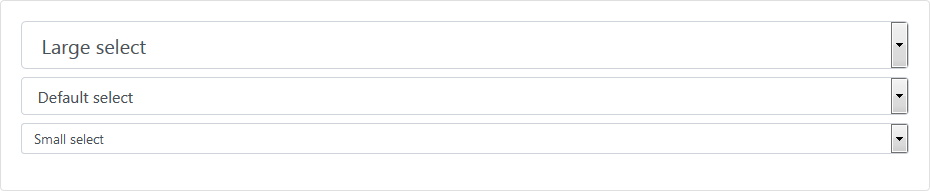
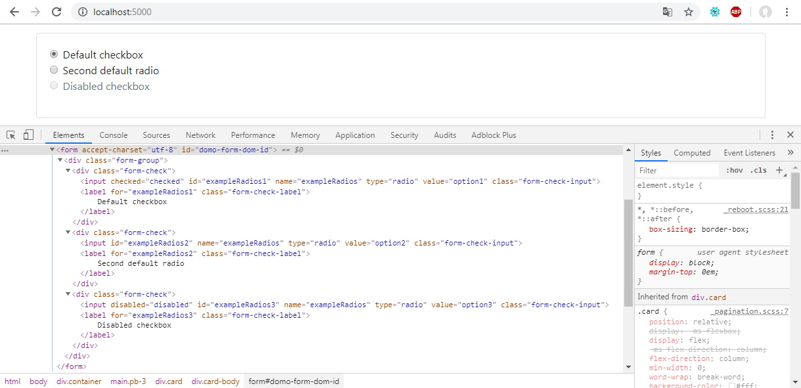
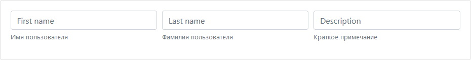

# Forms[¶](https://getbootstrap.com/docs/4.3/components/forms/#overview)

> Классы **Bootstrap** форм расширяют [перегруженые стили "по умолчанию"](https://getbootstrap.com/docs/4.3/content/reboot/#forms).
Используйте эти классы, для более согласованного отображения в браузерах и устройствах.

> Обязательно используйте соответствующий атрибут **type** во всех `<input>`**s** (например, **email** для адреса электронной почты или **number** для числовой информации), чтобы воспользоваться преимуществами новых элементов управления вводом, таких как проверка электронной почты, выбор номера и многое другое.

```cshtml
@{
  BootstrapFormManager form = new BootstrapFormManager(){ ID = "domo-form-dom-id"};

  FormGroupSingleManager SingleGroup = new FormGroupSingleManager();
  SingleGroup.CustomInput.Label = "Email address";
  SingleGroup.CustomInput.Input = new InputEmailManager()
  {
    Placeholder = "Enter email",
    ID = "input-email-dom-id"
  };

  SingleGroup.CustomInput.HelpCaption = "We'll never share your email with anyone else.";
  form.AddChild(SingleGroup);

  SingleGroup = new FormGroupSingleManager();
  SingleGroup.CustomInput.Label = "Password";
  SingleGroup.CustomInput.Input = new InputPasswordManager()
  {
    Placeholder = "Password",
    ID = "input-password-dom-id"
  };
  form.AddChild(SingleGroup);

  SingleGroup = new FormGroupSingleManager();
  SingleGroup.CustomInput.Input = new InputCheckboxManager() { ID = "input-checkbox-dom-id" };
  SingleGroup.CustomInput.Label = "Check me out";
  form.AddChild(SingleGroup);

  form.AddChild(new BootstrapButtonManager("Submit")
  {
    ButtonType = ButtonTypesEnum.submit,
    BackgroundColorTheme = BackgroundColorThemesEnum.primary
  });

  @await Component.InvokeAsync(form.ViewComponentName, new { SetObjectManager = form })
}
```

***result:***


## Form controls[¶](https://getbootstrap.com/docs/4.3/components/forms/#form-controls)

> Текстовые контролы `<input>`**s**, `<select>`**s** и `<textarea>`**s** — оформлены классом стилей **.form-control**.
В базовое оформление включены стили для общего внешнего вида, состояния фокуса, размеров и многого другого.

```cshtml
@{
  BootstrapFormManager form = new BootstrapFormManager() { ID = "domo-form-dom-id" };

  FormGroupSingleManager SingleGroup = new FormGroupSingleManager();
  SingleGroup.CustomInput.Label = "Email address";
  SingleGroup.CustomInput.Input = new InputEmailManager()
  {
    Placeholder = "name@example.com",
    ID = "input-email-dom-id"
  };
  form.AddChild(SingleGroup);

  SingleGroup = new FormGroupSingleManager();
  SingleGroup.CustomInput.Label = "Example select";
  InputSelectManager inputSelect = new InputSelectManager()
  {
    ID = "input-select-dom-id"
  };
  for (int i = 1; i < 6; i++)
  {
    inputSelect.AddItem(i.ToString(), null);
  }
  //
  SingleGroup.CustomInput.Input = inputSelect;
  form.AddChild(SingleGroup);

  SingleGroup = new FormGroupSingleManager();
  SingleGroup.CustomInput.Label = "Example multiple select";
  inputSelect = new InputSelectManager()
  {
    ID = "input-multiple-select-dom-id",
    IsMultiple = true
  };
  for (int i = 1; i < 6; i++)
  {
    inputSelect.AddItem(i.ToString(), null);
  }
  //
  SingleGroup.CustomInput.Input = inputSelect;
  form.AddChild(SingleGroup);

  SingleGroup = new FormGroupSingleManager();
  SingleGroup.CustomInput.Label = "Example textarea";
  SingleGroup.CustomInput.Input = new TextareaManager() { ID = "input-textarea-dom-id", Placeholder = "Full-text input", SizeArea = 3 };
  form.AddChild(SingleGroup);

  @await Component.InvokeAsync(form.ViewComponentName, new { SetObjectManager = form })
}
```

***result:***


> Для файлов `<inputs />`**s**, вместо **.form-control** применяется **.form-control-file**.

```cshtml
@{
    BootstrapFormManager form = new BootstrapFormManager() { ID = "domo-form-dom-id" };

    FormGroupSingleManager SingleGroup = new FormGroupSingleManager();
    SingleGroup.CustomInput.Label = "Example file input";
    SingleGroup.CustomInput.Input = new InputFileManager()
    {
        ID = "input-file-dom-id"
    };
    form.AddChild(SingleGroup);

    @await Component.InvokeAsync(form.ViewComponentName, new { SetObjectManager = form })
}
```

***result:***


## Sizing[¶](https://getbootstrap.com/docs/4.3/components/forms/#sizing)

> Установите высоту, используя такие классы, как **.form-control-lg** и **.form-control-sm**.

```cshtml
@{
  BootstrapFormManager form = new BootstrapFormManager() { ID = "domo-form-dom-id" };

  FormGroupStackedManager GroupStacked = new FormGroupStackedManager();
  GroupStacked.CustomInputs.Add(new CustomInputModel()
  {
    Input = new InputTextManager()
    {
      Placeholder = ".form-control-lg"
    },
    SizeInput = TwinSizingEnum.Lg
  });
    GroupStacked.CustomInputs.Add(new CustomInputModel()
    {
      Input = new InputTextManager()
      {
        Placeholder = "Default input"
      }
  });
  GroupStacked.CustomInputs.Add(new CustomInputModel()
  {
    Input = new InputTextManager()
    {
      Placeholder = ".form-control-sm"
    },
    SizeInput = TwinSizingEnum.Sm
  });
  form.AddChild(GroupStacked);

  @await Component.InvokeAsync(form.ViewComponentName, new { SetObjectManager = form })
}
```

***result:***


```cshtml
@{
  BootstrapFormManager form = new BootstrapFormManager() { ID = "domo-form-dom-id" };

  FormGroupStackedManager GroupStacked = new FormGroupStackedManager();
  InputSelectManager SelectInput = new InputSelectManager();
  SelectInput.AddItem("Large select", null);
  GroupStacked.CustomInputs.Add(new CustomInputModel()
  {
    Input = SelectInput,
    SizeInput = TwinSizingEnum.Lg
  });

  SelectInput = new InputSelectManager();
  SelectInput.AddItem("Default select", null);
  GroupStacked.CustomInputs.Add(new CustomInputModel()
  {
    Input = SelectInput
  });

  SelectInput = new InputSelectManager();
  SelectInput.AddItem("Small select", null);
  GroupStacked.CustomInputs.Add(new CustomInputModel()
  {
    Input = SelectInput,
    SizeInput = TwinSizingEnum.Sm
  });
      
  @await Component.InvokeAsync(form.ViewComponentName, new { SetObjectManager = form })
}
```

***result:***



## Readonly[¶](https://getbootstrap.com/docs/4.3/components/forms/#readonly)

> Добавьте логический атрибут `readonly` для `<input>`, чтобы предотвратить изменение значения поля формы.
Поля формы **"только для чтения"** выглядят светлее остальных и похоже на **"отключенные"**, но сохраняют стандартный курсор.

```cshtml
@{

}
```

***result:***


## Readonly plain text[¶](https://getbootstrap.com/docs/4.3/components/forms/#readonly-plain-text)

> Если вы хотите, чтобы элементы `<input readonly>` в вашей форме были оформлены как обычный текст, используйте класс **.form-control-plaintext** для удаления оформления полей формы по умолчанию и сохранения правильного **margin** и **padding**.

```cshtml
@{

}
```

***result:***


```cshtml
@{

}
```

***result:***


## Range Inputs[¶](https://getbootstrap.com/docs/4.3/components/forms/#range-inputs)

> Установите горизонтально прокручиваемый "range `<input>`**s**" с помощью **.form-control-range**.

```cshtml
@{

}
```

***result:***


## Checkboxes and radios[¶](https://getbootstrap.com/docs/4.3/components/forms/#checkboxes-and-radios)

> По умолчанию `checkbox`**es** и `radio`**s** усовершенствованны с помощью единого класса стилей **.form-check**, который улучшает макет и поведение их HTML-элементов. `Сheckbox`**es** предназначены для выбора одного или нескольких вариантов в списке, в то время как `radio`**s** предназначены для выбора одного варианта из многих.

> Поддерживаются отключенные `checkbox`**es** и `radio`**s**.
Отключенный **disabled** применяет более светлый цвет елементу, чтобы помочь указать состояние `<input>`’***s**.

> `Checkbox`**es** и `radio`**s** используются для поддержки валидации формы на основе HTML и предоставления кратких, доступных меток.
Таким образом, ваши `<input>`s `<label>`s являются одноуровневыми элементами, а не `<input>` внутри `<label>`.
Это немного более подробно, так как вы должны указать **id** и атрибуты, чтобы связать `<input>` и `<label>`.

## Default (stacked)[¶](https://getbootstrap.com/docs/4.3/components/forms/#default-stacked)

> По умолчанию любое количество `checkbox`**es** и `radio`**s**, которые являются непосредственными дочерними элементами, будут вертикально сложены c соответствующими отступами **.form-check**.

```cshtml
@{

}
```

***result:***


```cshtml
@{

}
```

***result:***



## Inline[¶](https://getbootstrap.com/docs/4.3/components/forms/#inline)

> Группируйте `checkbox`**es** и `radio`**s** в одной горизонтальной строке путем добавления **.form-check-inline** в любой **.form-check**.

```cshtml
@{

}
```

***result:***


```cshtml
@{

}
```

***result:***


## Without labels[¶](https://getbootstrap.com/docs/4.3/components/forms/#without-labels)

> Добавление **position-static** к `<input>`**s** внутри **.form-check**, когда нет текста метки.
Не забудьте по-прежнему предоставлять какую-нибудь метку для вспомогательных технологий (например, используя **aria-label**).

```cshtml
@{

}
```

***result:***


## Layout[¶](https://getbootstrap.com/docs/4.3/components/forms/#layout)

> Поскольку **Bootstrap** применяет `display: block;` и `width: 100%;` почти ко всем элементам управления формами, формы по умолчанию будут складываться вертикально.
Дополнительные классы могут использоваться для изменения этого макета для конкретной отдельно взятой формы.

## Form groups[¶](https://getbootstrap.com/docs/4.3/components/forms/#form-groups)

> Класс стилей **.form-group** - это самый простой способ добавить некоторую структуру в формы.
Он предоставляет гибкость, которая поощряет правильную группировку `<label>`**s**, элементов управления, необязательного текста справки и сообщений проверки формы.
По умолчанию он применяет только `margin-bottom` ,но подбирает дополнительные стили в **.form-inline** по мере необходимости.
Используйте его с `<fieldset>`**s**, `<div>`**s** или почти любым другим элементом.

```cshtml
@{

}
```

***result:***


## Form grid[¶](https://getbootstrap.com/docs/4.3/components/forms/#form-grid)

> Более сложные формы могут быть построены с использованием **grid** классов сетки.
Используйте их для макетов форм, требующих нескольких столбцов, различной ширины и дополнительных параметров выравнивания.

```cshtml
@{

}
```

***result:***


## Form row[¶](https://getbootstrap.com/docs/4.3/components/forms/#form-row)

> Можно также использовать **.form-row** вместо стандартной строки сетки **.row**, чтобы переопределить зазор по умолчанию для более плотных и компактных макетов.

```cshtml
@{

}
```

***result:***



> Более сложные и комплексные макеты также могут быть созданы с помощью **grid**-системы.

```cshtml
@{

}
```

***result:***


## Horizontal form[¶](https://getbootstrap.com/docs/4.3/components/forms/#horizontal-form)

> Создавайте горизонтальные формы с помощью сетки, добавив класс **.row** для формирования групп форм и используйте классы `.col-*-*` для указания ширины ваших меток и элементов управления.
Обязательно добавьте **.col-form-label** к вашим `<label>`, чтобы они были вертикально отцентрированы с соответствующими элементами управления формы.

```cshtml
@{

}
```

***result:***


###### Horizontal form label sizing[¶](https://getbootstrap.com/docs/4.3/components/forms/#horizontal-form-label-sizing)

> Обязательно используйте **.col-form-label-sm** или **.col-form-label-lg** для ваших `<label>` или `<legend>`**s**, чтобы правильно следовать размеру **.form-control-lg** и **.form-control-sm**.

```cshtml
@{

}
```

***result:***


## Column sizing[¶](https://getbootstrap.com/docs/4.3/components/forms/#column-sizing)

> Как показано в предыдущих примерах, **grid** система позволяет вам размещать любое количество **.cols** в **.row** или **.form-row**.
Они разделят доступную ширину поровну между ними.
Вы также можете выбрать подмножество ваших столбцов, чтобы они занимали больше или меньше места, в то время как остальные **.cols** в равной степени разделяют остальные, с конкретными классами столбцов, такими как **.col-7**.

```cshtml
@{

}
```

***result:***


## Auto-sizing[¶](https://getbootstrap.com/docs/4.3/components/forms/#auto-sizing)

> В приведенном ниже примере используется утилита **flexbox** для вертикального центрирования содержимого и изменения **.col** на **.col-auto**, чтобы ваши столбцы занимали столько места, сколько необходимо.
Другими словами, размер столбца зависит от его содержимого.

```cshtml
@{

}
```

***result:***


> Затем вы можете повторить это еще раз с помощью классов столбцов, зависящих от размера.

```cshtml
@{

}
```

***result:***


> [Пользовательские элементы управления формы](https://getbootstrap.com/docs/4.3/components/forms/#custom-forms) тоже поддерживаются

```cshtml
@{

}
```

***result:***


## Inline forms[¶](https://getbootstrap.com/docs/4.3/components/forms/#inline-forms)

> Используйте класс **.form-inline** для отображения серии меток, элементов управления формы и кнопок в одной горизонтальной строке.
Элементы управления формы внутри встроенных форм немного отличаются от их состояний по умолчанию.

- Элементам управления формы устанавлиывается атрибут `display: flex`, сворачивая любое пустое пространство HTML и позволяя вам обеспечить контроль выравнивания с помощью утилит [spacing](https://getbootstrap.com/docs/4.3/utilities/spacing/) и [flexbox](https://getbootstrap.com/docs/4.3/utilities/flex/).
- Элементы управления и группы ввода получают `width: auto;`, чтобы переопределить ширину **Bootstrap** по умолчанию: `width: 100%;`.
- Элементы управления **отображаются встроенными только в окнах просмотра шириной не менее 576px** для учета узких окон просмотра на мобильных устройствах.

> Возможно, вам придется вручную задавать ширину и выравнивание отдельных элементов управления формы с помощью [служебных spacing утилит](https://getbootstrap.com/docs/4.3/utilities/spacing/) (как показано ниже).
Наконец, обязательно добавляйте `<label>` к каждому полю формы. Если вам нужно скрыть его от посетителей, примените **.sr-only**.

```cshtml
@{

}
```

***result:***


> Пользовательские элементы управления формы и `select`**s** тоже поддерживаются.

```cshtml
@{

}
```

***result:***


> Альтернативы скрытым меткам
У вспомогательных технологий, такие как программы чтения с экрана, могут иметь проблемы с вашими формами, если вы не включаете метку для каждого ввода.
Для таких inline форм, вы можете спрятать ярлыки с помощью ".sr-only" класса.
Существуют и другие альтернативные способы предоставления метки для вспомогательных технологий. Например атрибуты **aria-label**, **aria-labelledby** или **title**.
Если ни один из них не присутствует, вспомогательные технологии могут прибегнуть к использованию атрибута **placeholder**, если он присутствует, но обратите внимание, что использование **placeholder** в качестве замены для других методов маркировки не рекомендуется.

## Help text[¶](https://getbootstrap.com/docs/4.3/components/forms/#help-text)

> Текст справки на уровне блоков в формах может быть создан с использованием **.form-text** (ранее в `v3` известный как **.help-block**).
Встроенный текст справки может быть гибко реализован с использованием любого встроенного HTML-элемента и служебных классов, таких как **.text-muted**.

> Связывание текста справки с элементами управления формы: 
Текст справки должен быть явно связан с элементом управления формы, к которому он относится с использованием атрибута **aria-describedby**.
Это гарантирует, что вспомогательные технологии, такие как программы чтения с экрана, будут объявлять этот текст справки, когда пользователь фокусируется или активизирует элемент управления.

> Текст справки под `<input>` может быть оформлен с помощью **.form-text**.
Этот класс включает `display: block;` и добавляет отступ от `<input>` сверху.

```cshtml
@{

}
```

***result:***


> Inline текст может использовать любой типичный Inline HTML-элемент (будь то `<small>`, `<span>` или что-то еще) без какого либо служебного класса.

```cshtml
@{

}
```

***result:***


## Disabled forms[¶](https://getbootstrap.com/docs/4.3/components/forms/#disabled-forms)

> Добавьте в `<input>` логический атрибут **disabled**, чтобы предотвратить взаимодействие с пользователем и сделать его более светлым.

```cshtml
@{

}
```

***result:***


> Будьте осторожны с якорями! 
По умолчанию браузеры будут обрабатывать все собственные элементы управления формой (элементы `<input>`, `<select>` и `<button>`) внутри `<fieldset disabled>` как отключенные, предотвращая на них взаимодействие с клавиатурой и мышью.
Однако, если ваша форма также содержит элементы `<a ... class="btn btn-*">`, им будет присвоен только стиль `pointer-events: none;`.
Как отмечено в разделе об отключенном состоянии для кнопок (и, в частности, в подразделе для якорных элементов), это свойство CSS еще не стандартизировано и не полностью поддерживается в **Internet Explorer 10** и не будет препятствовать пользователям клавиатуры возможность сфокусировать или активировать эти ссылки. 
Поэтому, чтобы быть в безопасности, используйте пользовательский **JavaScript**, чтобы отключить такие ссылки.

> Кросс-браузерная совместимость:
Хотя **Bootstrap** будет применять эти стили во всех браузерах, **Internet Explorer 11** и ниже не полностью поддерживает атрибут **disabled** в `<fieldset>`.
Используйте пользовательский **JavaScript**, чтобы отключить набор полей в этих браузерах.

## Validation forms[¶](https://getbootstrap.com/docs/4.3/components/forms/#validation)

> Предоставьте ценную и действенную обратную связь своим пользователям с проверкой формы HTML5, доступной во всех [поддерживаемых браузерах](https://caniuse.com/#feat=form-validation).
Выберите в браузере отзывы о проверке по умолчанию или создайте пользовательские сообщения с помощью наших встроенных классов и начального JavaScript.

## How it works[¶](https://getbootstrap.com/docs/4.3/components/forms/#how-it-works)

> Вот как проверка формы работает с Bootstrap:
- Проверка формы HTML применяется с помощью двух псевдоклассов CSS `:invalid` и `:valid`. Он применяется к элементам `<input>`, `<select>` и `<textarea>`.
- **Bootstrap** применяет стили `:invalid` и `:valid` к родительскому классу **.was-validated**, обычно применяемому к `<form>`. В противном случае любое обязательное поле без значения отображается как недопустимое при загрузке страницы. Таким образом, вы можете выбрать, когда их активировать (обычно после попытки отправки формы).
- Чтобы сбросить внешний вид формы (например, в случае динамической отправки формы с использованием AJAX), снова удалите класс **.was-validated** из `<form>` после отправки.
- В качестве запасного варианта вместо псевдоклассов [для проверки на стороне сервера](https://getbootstrap.com/docs/4.3/components/forms/#server-side) могут использоваться классы **.is-invalid** и **.is-valid**. Им не требуется родительский класс **.was-validated**.
- Из-за ограничений в том, как работает CSS, мы не можем (в настоящее время) применять стили к `<label>`, который находится перед элементом управления формой в DOM, без помощи специального **JavaScript**.
- Все [современные браузеры поддерживают API](https://www.w3.org/TR/html5/sec-forms.html#the-constraint-validation-api) проверки ограничений - серию методов JavaScript для проверки элементов управления формы.
- Cообщения обратной связи могут отображаться [браузером самостоятельно по умолчанию](https://getbootstrap.com/docs/4.3/components/forms/#browser-defaults) (разные для каждого браузера и нестабильные через CSS) или пользовательские **Bootstrap** стили обратной связи с дополнительными HTML и CSS.
- Вы можете предоставить пользовательские сообщения о валидности с помощью `setCustomValidity` в **JavaScript**.

## Custom styles[¶](https://getbootstrap.com/docs/4.3/components/forms/#custom-styles)

> 

```cshtml
@{

}
```

***result:***


## Browser defaults[¶](https://getbootstrap.com/docs/4.3/components/forms/#browser-defaults)

> 

```cshtml
@{

}
```

***result:***


## Server side[¶](https://getbootstrap.com/docs/4.3/components/forms/#server-side)

> 

```cshtml
@{

}
```

***result:***


## Supported elements[¶](https://getbootstrap.com/docs/4.3/components/forms/#supported-elements)

> 

```cshtml
@{

}
```

***result:***


## Tooltips[¶](https://getbootstrap.com/docs/4.3/components/forms/#tooltips)

> 

```cshtml
@{

}
```

***result:***


## Customizing[¶](https://getbootstrap.com/docs/4.3/components/forms/#customizing)

> 

```cshtml
@{

}
```

***result:***


## Custom forms[¶](https://getbootstrap.com/docs/4.3/components/forms/#custom-forms)

> 

## Checkboxes and radios[¶](https://getbootstrap.com/docs/4.3/components/forms/#checkboxes-and-radios-1)

> 

## Checkboxes[¶](https://getbootstrap.com/docs/4.3/components/forms/#checkboxes)

```cshtml
@{

}
```

***result:***


> Пользовательские `checkbox`**es** также могут использовать псевдокласс: **indeterminate** при ручной установке с помощью JavaScript (для этого в HTML нет доступного атрибута).

```cshtml
@{

}
```

***result:***


> Если вы используете jQuery,то должно быть достаточно что-то вроде этого:

```js
@{
  $('.your-checkbox').prop('indeterminate', true);
}
```

## Radios[¶](https://getbootstrap.com/docs/4.3/components/forms/#radios)

```cshtml
@{

}
```

***result:***


## Inline[¶](https://getbootstrap.com/docs/4.3/components/forms/#inline-1)

```cshtml
@{

}
```

***result:***


## Disabled[¶](https://getbootstrap.com/docs/4.3/components/forms/#disabled)

> 

```cshtml
@{

}
```

***result:***


## Switches[¶](https://getbootstrap.com/docs/4.3/components/forms/#switches)

> 

```cshtml
@{

}
```

***result:***


## Select menu[¶](https://getbootstrap.com/docs/4.3/components/forms/#select-menu)

> **Switch** имеет разметку пользовательского флажка, но использует класс **.custom-switch** для рендеринга тумблера.
**Switches** также поддерживают отключенный атрибут.

```cshtml
@{

}
```

***result:***


> Вы также можете установить размер пользовательских `<selects>`**s**, чтобы соответствовать текстовым `<inputs>` аналогичного размера.

```cshtml
@{

}
```

***result:***


> Множественный выбор также поддерживается:

```cshtml
@{

}
```

***result:***


> Как и атрибут размера:

```cshtml
@{

}
```

***result:***


## Range[¶](https://getbootstrap.com/docs/4.3/components/forms/#range)

> 

```cshtml
@{

}
```

***result:***


> 

```cshtml
@{

}
```

***result:***


> 

```cshtml
@{

}
```

***result:***


## File browser[¶](https://getbootstrap.com/docs/4.3/components/forms/#file-browser)

> 

```cshtml
@{

}
```

***result:***

