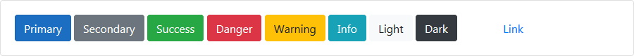
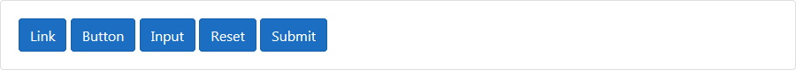
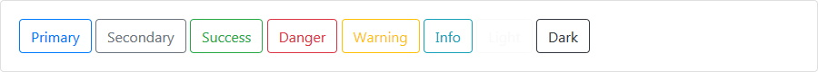
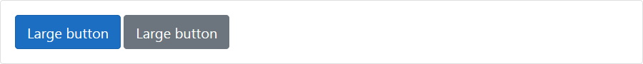
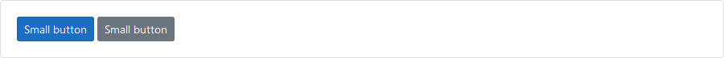
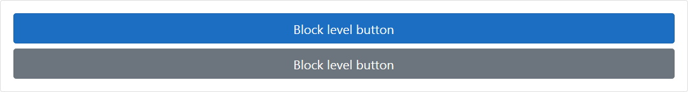
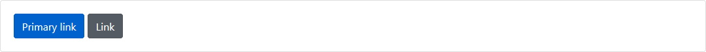
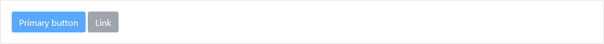
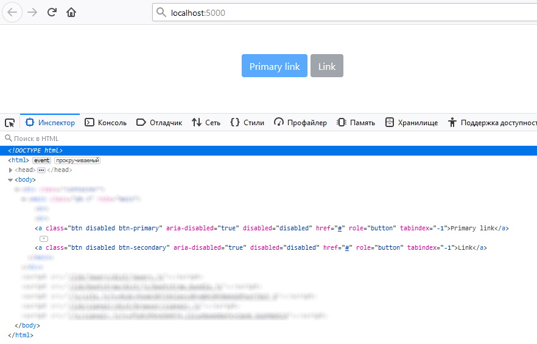
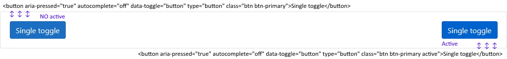

# Buttons[¶](https://getbootstrap.com/docs/4.3/components/buttons/)

```cshtml
@{
  hsDiv div = new hsDiv();
  //
  div.AddChild(new bsButton("Primary") { BackgroundColorTheme = bmBackgroundColorThemesEnum.primary });
  div.AddChild(new bsButton("Secondary") { BackgroundColorTheme = bmBackgroundColorThemesEnum.secondary });
  div.AddChild(new bsButton("Success") { BackgroundColorTheme = bmBackgroundColorThemesEnum.success });
  div.AddChild(new bsButton("Danger") { BackgroundColorTheme = bmBackgroundColorThemesEnum.danger });
  div.AddChild(new bsButton("Warning") { BackgroundColorTheme = bmBackgroundColorThemesEnum.warning });
  div.AddChild(new bsButton("Info") { BackgroundColorTheme = bmBackgroundColorThemesEnum.info });
  div.AddChild(new bsButton("Light") { BackgroundColorTheme = bmBackgroundColorThemesEnum.light });
  div.AddChild(new bsButton("Dark") { BackgroundColorTheme = bmBackgroundColorThemesEnum.dark });
  //
  bsButton button = new bsButton("Link") { BackgroundColorTheme = bmBackgroundColorThemesEnum.NULL };
  button.AddCSS("btn-link ml-5");
  div.AddChild(button);
  @await Component.InvokeAsync(typeof(hrUniversalList).Name, new { SetObjectManager = div })
}
```

***result:***



```html
<button type="button" class="btn btn-primary">Primary</button>
<button type="button" class="btn btn-secondary">Secondary</button>
<button type="button" class="btn btn-success">Success</button>
<button type="button" class="btn btn-danger">Danger</button>
<button type="button" class="btn btn-warning">Warning</button>
<button type="button" class="btn btn-info">Info</button>
<button type="button" class="btn btn-light">Light</button>
<button type="button" class="btn btn-dark">Dark</button>
<button type="button" class="btn-link ml-5 btn">Link</button>
```

## Button tags[¶](https://getbootstrap.com/docs/4.3/components/buttons/#button-tags)

> Классы **.btn** предназначены для использования с элементом `<button>`.
Однако вы также можете использовать эти классы для элементов `<a>` или `<input>`. Некоторые браузеры могут применять разную визуализацию.

> При использовании классов кнопок на элементах `<a>`, которые используются для запуска внутристраничных функций (например, сворачивания содержимого), 
вместо ссылок на новые страницы или разделы текущей страницы, этим ссылкам следует присвоить `role="button"`, 
чтобы соответствующим образом передать их назначение вспомогательным технологиям, таким как средства чтения с экрана.

```cshtml
@{
  hsDiv div = new hsDiv();
  //
  div.AddChild(new bsButtonLink("Link", "#"));
  div.AddChild(new bsButton("Button"));
  //
  div.AddChild(new bsButtonInput("Input"));
  div.AddChild(new bsButtonInput("Reset", bmButtonInputTypesEnum.reset));
  div.AddChild(new bsButtonInput("Submit", bmButtonInputTypesEnum.submit));

  @await Component.InvokeAsync(typeof(hrUniversalList).Name, new { SetObjectManager = div })
}
```

***result***



```html
<a href="#" role="button" class="btn btn-primary">Link</a>
<button type="button" class="btn btn-primary">Button</button>
<input type="button" value="Input" class="btn btn-primary">
<input type="reset" value="Reset" class="btn btn-primary">
<input type="submit" value="Submit" class="btn btn-primary">
```

## Outline buttons[¶](https://getbootstrap.com/docs/4.3/components/buttons/#outline-buttons)

> Нужны кнопки, но хотите избежать черезмерно насыщеный цвет фона, которые они приносят?
Замените классы модификаторов по умолчанию на **.btn-outline-**\* , чтобы удалить все фоновые изображения и цвета на любой кнопке.

```cshtml
@{
  hsDiv div = new hsDiv();
  //
  div.AddChild(new bsButton("Primary") { IsOutlineStyle = true, BackgroundColorTheme = bmBackgroundColorThemesEnum.primary });
  div.AddChild(new bsButton("Secondary") { IsOutlineStyle = true, BackgroundColorTheme = bmBackgroundColorThemesEnum.secondary });
  div.AddChild(new bsButton("Success") { IsOutlineStyle = true, BackgroundColorTheme = bmBackgroundColorThemesEnum.success });
  div.AddChild(new bsButton("Danger") { IsOutlineStyle = true, BackgroundColorTheme = bmBackgroundColorThemesEnum.danger });
  div.AddChild(new bsButton("Warning") { IsOutlineStyle = true, BackgroundColorTheme = bmBackgroundColorThemesEnum.warning });
  div.AddChild(new bsButton("Info") { IsOutlineStyle = true, BackgroundColorTheme = bmBackgroundColorThemesEnum.info });
  div.AddChild(new bsButton("Light") { IsOutlineStyle = true, BackgroundColorTheme = bmBackgroundColorThemesEnum.light });
  div.AddChild(new bsButton("Dark") { IsOutlineStyle = true, BackgroundColorTheme = bmBackgroundColorThemesEnum.dark });
  //
  @await Component.InvokeAsync(typeof(hrUniversalList).Name, new { SetObjectManager = div })
}
```

***result***



```html
<button type="button" class="btn btn-outline-primary">Primary</button>
<button type="button" class="btn btn-outline-secondary">Secondary</button>
<button type="button" class="btn btn-outline-success">Success</button>
<button type="button" class="btn btn-outline-danger">Danger</button>
<button type="button" class="btn btn-outline-warning">Warning</button>
<button type="button" class="btn btn-outline-info">Info</button>
<button type="button" class="btn btn-outline-light">Light</button>
<button type="button" class="btn btn-outline-dark">Dark</button>
```

## Sizes[¶](https://getbootstrap.com/docs/4.3/components/buttons/#sizes)

Нужны большие или маленькие кнопки? Используйте соответсвующее свойство `SizeButton`. Этим свойством применяется **.btn-lg** или **.btn-sm** для указания размеров.

Пример крупных кнопок:
```cshtml
@{
  hsDiv div = new hsDiv();

  div.AddChild(new bsButton("Large button") { BackgroundColorTheme = bmBackgroundColorThemesEnum.primary, SizeButton = bmTwinSizingsEnum.Lg });
  div.AddChild(new bsButton("Large button") { BackgroundColorTheme = bmBackgroundColorThemesEnum.secondary, SizeButton = bmTwinSizingsEnum.Lg });

  @await Component.InvokeAsync(typeof(hrUniversalList).Name, new { SetObjectManager = div })
}
```

***result***



```html
<button type="button" class="btn btn-primary btn-lg">Large button</button>
<button type="button" class="btn btn-secondary btn-lg">Large button</button>
```

Пример мелких кнопок:
```cshtml
@{
  hsDiv div = new hsDiv();

  div.AddChild(new bsButton("Small button") { BackgroundColorTheme = bmBackgroundColorThemesEnum.primary, SizeButton = bmTwinSizingsEnum.Sm });
  div.AddChild(new bsButton("Small button") { BackgroundColorTheme = bmBackgroundColorThemesEnum.secondary, SizeButton = bmTwinSizingsEnum.Sm });

  @await Component.InvokeAsync(typeof(hrUniversalList).Name, new { SetObjectManager = div })
}
```

***result***



```html
<button type="button" class="btn btn-primary btn-sm">Small button</button>
<button type="button" class="btn btn-secondary btn-sm">Small button</button>
```

Кнопки блочного типа (во всю ширину родительского DOM объекта) 
```cshtml
@{
  hsDiv div = new hsDiv();

  div.AddChild(new bsButton("Block level button") { BackgroundColorTheme = bmBackgroundColorThemesEnum.primary, SizeButton = bmTwinSizingsEnum.Lg, IsBlockBtn = true });
  div.AddChild(new bsButton("Block level button") { BackgroundColorTheme = bmBackgroundColorThemesEnum.secondary, SizeButton = bmTwinSizingsEnum.Lg, IsBlockBtn = true });

  @await Component.InvokeAsync(typeof(hrUniversalList).Name, new { SetObjectManager = div })
}
```

***result***



```html
<button type="button" class="btn btn-primary btn-lg btn-block">Block level button</button>
<button type="button" class="btn btn-secondary btn-lg btn-block">Block level button</button>
```

## Active state[¶](https://getbootstrap.com/docs/4.3/components/buttons/#active-state)

Кнопки можно отобразить нажатыми (с более темным фоном, более темной границей и тенью), пометив их при помощи свойства `IsActive`

```
@{
  hsDiv div = new hsDiv();

  div.AddChild(new bsButton("Primary link") { BackgroundColorTheme = bmBackgroundColorThemesEnum.primary, IsActive = true });
  div.AddChild(new bsButton("Link") { BackgroundColorTheme = bmBackgroundColorThemesEnum.secondary, IsActive = true });

  @await Component.InvokeAsync(typeof(hrUniversalList).Name, new { SetObjectManager = div })
}
```

```cshtml
<button aria-pressed="true" type="button" class="btn btn-primary active">Primary link</button>
<button aria-pressed="true" type="button" class="btn btn-secondary active">Link</button>
```

***result***



```html
<button aria-pressed="true" type="button" class="btn btn-primary active">Primary link</button>
<button aria-pressed="true" type="button" class="btn btn-secondary active">Link</button>
```

## Disabled state[¶](https://getbootstrap.com/docs/4.3/components/buttons/#disabled-state)

Сделайте кнопки неактивными, задав логический атрибут кнопки `IsDisabled = true`

```cshtml
@{
  hsDiv div = new hsDiv();

  div.AddChild(new bsButton("Primary button") { BackgroundColorTheme = bmBackgroundColorThemesEnum.primary, IsDisabled = true });
  div.AddChild(new bsButton("Link") { BackgroundColorTheme = bmBackgroundColorThemesEnum.secondary, IsDisabled = true });

  @await Component.InvokeAsync(typeof(hrUniversalList).Name, new { SetObjectManager = div })
}
```

***result***



```html
<button disabled="disabled" type="button" class="btn btn-primary">Primary button</button>
<button disabled="disabled" type="button" class="btn btn-secondary">Link</button>
```

> Отключенные кнопки, использующие элемент `<a>` (bsButtonLink), ведут себя немного иначе:
- `<a>`**s** не поддерживает атрибут **disabled**, поэтому добавляется класс стилей **.disabled**, чтобы он визуально казался отключенным.
- Отключенные кнопки должны включать атрибут `aria-disabled="true"`, чтобы указать состояние элемента для вспомогательных технологий.

```cshtml
@{
  hsDiv div = new hsDiv();

  div.AddChild(new bsButtonLink("Primary link", "#") { BackgroundColorTheme = bmBackgroundColorThemesEnum.primary, IsDisabled = true });
  div.AddChild(new bsButtonLink("Link", "#") { BackgroundColorTheme = bmBackgroundColorThemesEnum.secondary, IsDisabled = true });

  @await Component.InvokeAsync(typeof(hrUniversalList).Name, new { SetObjectManager = div })
}
```

***result***



```html
<a aria-disabled="true" disabled="disabled" href="#" role="button" tabindex="-1" class="disabled btn btn-primary">Primary link</a>
<a aria-disabled="true" disabled="disabled" href="#" role="button" tabindex="-1" class="disabled btn btn-secondary">Link</a>
```

## Toggle states[¶](https://getbootstrap.com/docs/4.3/components/buttons/#toggle-states)

Кнопка-переключатель состояния (нажато/активно или же нет)

```cshtml
@{
  hsDiv div = new hsDiv();

  div.AddChild(new bsButton("Single toggle") { BackgroundColorTheme = bmBackgroundColorThemesEnum.primary, ToggleActiveState = true });

  @await Component.InvokeAsync(typeof(hrUniversalList).Name, new { SetObjectManager = div })
}
```

***result*** на скрине ниже зафиксированы состояния (подряд) после каждого клика по кнопке

