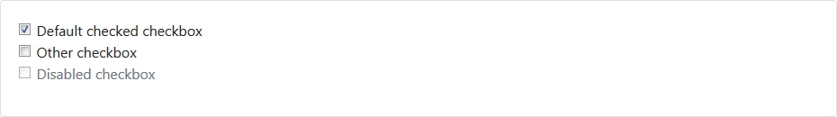
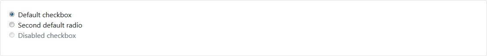
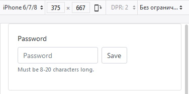

# Forms[¶](https://getbootstrap.com/docs/4.3/components/forms/#overview)

> Классы **Bootstrap** форм расширяют [перегруженые стили "по умолчанию"](https://getbootstrap.com/docs/4.3/content/reboot/#forms).
Используйте эти классы, для более согласованного отображения в браузерах и устройствах.

> Обязательно используйте соответствующий атрибут **type** во всех `<input>`**s** (например, **email** для адреса электронной почты или **number** для числовой информации), чтобы воспользоваться преимуществами новых элементов управления вводом, таких как проверка электронной почты, выбор номера и многое другое.

```cshtml
@{
  bsForm form = new bsForm() { ID = "demo-form-dom-id" };

  bsFormGroupSingle SingleGroup = new bsFormGroupSingle();
  SingleGroup.CustomInput.Label = "Email address";
  SingleGroup.CustomInput.Input = new hsInputEmail()
  {
    Placeholder = "Enter email",
    ID = "input-email-dom-id"
  };
  SingleGroup.CustomInput.HelpCaption = "We'll never share your email with anyone else.";
  form.AddChild(SingleGroup);

  SingleGroup = new bsFormGroupSingle();
  SingleGroup.CustomInput.Label = "Password";
  SingleGroup.CustomInput.Input = new hsInputPassword()
  {
    Placeholder = "Password",
    ID = "input-password-dom-id"
  };
  form.AddChild(SingleGroup);

  SingleGroup = new bsFormGroupSingle();
  SingleGroup.CustomInput.Input = new hsInputCheckbox() { ID = "input-checkbox-dom-id" };
  SingleGroup.CustomInput.Label = "Check me out";
  form.AddChild(SingleGroup);

  form.AddChild(new bsButton("Submit")
  {
    ButtonType = hmButtonTypesEnum.submit,
    BackgroundColorTheme = bmBackgroundColorThemesEnum.primary
  });

  @await Component.InvokeAsync(form.ViewComponentName, new { SetObjectManager = form })
}
```

***result:***


```html
<form accept-charset="utf-8" id="demo-form-dom-id">
  <div class="form-group">
    <label for="input-email-dom-id">Email address</label>
    <input aria-describedby="input-email-dom-id-HelpCaption" id="input-email-dom-id" name="input-email-dom-id" placeholder="Enter email" type="email" class="form-control">
    <small id="input-email-dom-id-HelpCaption" class="form-text text-muted">We'll never share your email with anyone else.</small>
  </div>
  <div class="form-group">
    <label for="input-password-dom-id">Password</label>
    <input id="input-password-dom-id" name="input-password-dom-id" placeholder="Password" type="password" class="form-control">
  </div>
  <div class="form-check form-group">
    <input id="input-checkbox-dom-id" name="input-checkbox-dom-id" type="checkbox" class="form-check-input">
    <label for="input-checkbox-dom-id" class="form-check-label">Check me out</label>
  </div>
  <button type="submit" class="btn btn-primary">Submit</button>
</form>
```
## Form controls[¶](https://getbootstrap.com/docs/4.3/components/forms/#form-controls)

> Текстовые контролы `<input>`**s**, `<select>`**s** и `<textarea>`**s** — оформлены классом стилей **.form-control**.
В базовое оформление включены стили для общего внешнего вида, состояния фокуса, размеров и многого другого.

```cshtml
@{
  bsForm form = new bsForm() { ID = "demo-form-dom-id" };

  bsFormGroupSingle SingleGroup = new bsFormGroupSingle();
  SingleGroup.CustomInput.Label = "Email address";
  SingleGroup.CustomInput.Input = new hsInputEmail()
  {
    Placeholder = "name@example.com",
    ID = "input-email-dom-id"
  };
  form.AddChild(SingleGroup);

  SingleGroup = new bsFormGroupSingle();
  SingleGroup.CustomInput.Label = "Example select";
  hsInputSelect inputSelect = new hsInputSelect()
  {
    ID = "input-select-dom-id"
  };
  for (int i = 1; i < 6; i++)
  {
    inputSelect.AddItem(i.ToString(), null);
  }
  //
  SingleGroup.CustomInput.Input = inputSelect;
  form.AddChild(SingleGroup);

  SingleGroup = new bsFormGroupSingle();
  SingleGroup.CustomInput.Label = "Example multiple select";
  inputSelect = new hsInputSelect()
  {
    ID = "input-multiple-select-dom-id",
    IsMultiple = true
  };
  for (int i = 1; i < 6; i++)
  {
    inputSelect.AddItem(i.ToString(), null);
  }
  //
  SingleGroup.CustomInput.Input = inputSelect;
  form.AddChild(SingleGroup);

  SingleGroup = new bsFormGroupSingle();
  SingleGroup.CustomInput.Label = "Example textarea";
  SingleGroup.CustomInput.Input = new hsTextarea() { ID = "input-textarea-dom-id", Placeholder = "Full-text input", SizeArea = 3 };
  form.AddChild(SingleGroup);

  @await Component.InvokeAsync(form.ViewComponentName, new { SetObjectManager = form })
}
```

***result:***


```html
<form accept-charset="utf-8" id="demo-form-dom-id">
  <div class="form-group">
    <label for="input-email-dom-id">Email address</label>
    <input id="input-email-dom-id" name="input-email-dom-id" placeholder="name@example.com" type="email" class="form-control">
  </div>
  <div class="form-group">
    <label for="input-select-dom-id">Example select</label>
    <select id="input-select-dom-id" name="input-select-dom-id" class="form-control">
      <option>1</option>
      <option>2</option>
      <option>3</option>
      <option>4</option>
      <option>5</option>
    </select>
  </div>
  <div class="form-group">
    <label for="input-multiple-select-dom-id">Example multiple select</label>
    <select id="input-multiple-select-dom-id" multiple="" name="input-multiple-select-dom-id" class="form-control">
      <option>1</option>
      <option>2</option>
      <option>3</option>
      <option>4</option>
      <option>5</option>
    </select>
  </div>
  <div class="form-group">
    <label for="input-textarea-dom-id">Example textarea</label>
    <textarea id="input-textarea-dom-id" name="input-textarea-dom-id" placeholder="Full-text input" rows="3" class="form-control"></textarea>
  </div>
</form>
```
> Для файлов `<inputs />`**s**, вместо **.form-control** применяется **.form-control-file**.

```cshtml
@{
  bsForm form = new bsForm() { ID = "demo-form-dom-id" };

  bsFormGroupSingle SingleGroup = new bsFormGroupSingle();
  SingleGroup.CustomInput.Label = "Example file input";
  SingleGroup.CustomInput.Input = new hsInputFile()
  {
    ID = "input-file-dom-id"
  };
  form.AddChild(SingleGroup);

  @await Component.InvokeAsync(form.ViewComponentName, new { SetObjectManager = form })
}
```

***result:***


```html
<div class="form-group">
  <label for="input-file-dom-id">Example file input</label>
  <input id="input-file-dom-id" name="input-file-dom-id" type="file" class="form-control-file">
</div>
```
## Sizing[¶](https://getbootstrap.com/docs/4.3/components/forms/#sizing)

> Установите высоту, используя такие классы, как **.form-control-lg** и **.form-control-sm**.

```cshtml
 @{
  bsForm form = new bsForm() { ID = "demo-form-dom-id" };

  bsFormGroupStacked GroupStacked = new bsFormGroupStacked();

  GroupStacked.CustomInputs.Add(new bmInput()
  {
    Input = new hsInputText()
    {
      Placeholder = ".form-control-lg"
    }.AddCSS("mb-2") as hsInputText,
    SizeInput = bmTwinSizingsEnum.Lg
  });
  GroupStacked.CustomInputs.Add(new bmInput()
  {
    Input = new hsInputText()
    {
      Placeholder = "Default input"
    }.AddCSS("mb-2") as hsInputText
  });
  GroupStacked.CustomInputs.Add(new bmInput()
  {
    Input = new hsInputText()
    {
      Placeholder = ".form-control-sm"
    },
    SizeInput = bmTwinSizingsEnum.Sm
  });
  form.AddChild(GroupStacked);

  @await Component.InvokeAsync(form.ViewComponentName, new { SetObjectManager = form })
}
```

***result:***

```html
<form accept-charset="utf-8" id="demo-form-dom-id">
  <div class="form-group">
    <input placeholder=".form-control-lg" type="text" class="mb-2 form-control-lg form-control">
    <input placeholder="Default input" type="text" class="mb-2 form-control">
    <input placeholder=".form-control-sm" type="text" class="form-control-sm form-control">
  </div>
</form>
```

```cshtml
@{
  bsForm form = new bsForm() { ID = "demo-form-dom-id" };

  bsFormGroupStacked GroupStacked = new bsFormGroupStacked();
  hsInputSelect SelectInput = new hsInputSelect().AddCSS("mb-2") as hsInputSelect;
  SelectInput.AddItem("Large select", null);
  GroupStacked.CustomInputs.Add(new bmInput()
  {
    Input = SelectInput,
    SizeInput = bmTwinSizingsEnum.Lg
  });

  SelectInput = new hsInputSelect().AddCSS("mb-2") as hsInputSelect;
  SelectInput.AddItem("Default select", null);
  GroupStacked.CustomInputs.Add(new bmInput()
  {
    Input = SelectInput
  });

  SelectInput = new hsInputSelect();
  SelectInput.AddItem("Small select", null);
  GroupStacked.CustomInputs.Add(new bmInput()
  {
    Input = SelectInput,
    SizeInput = bmTwinSizingsEnum.Sm
  });

  form.AddChild(GroupStacked);    
  @await Component.InvokeAsync(form.ViewComponentName, new { SetObjectManager = form })
}
```

***result:***


```html
<form accept-charset="utf-8" id="demo-form-dom-id">  
  <div class="form-group">
    <div class="mb-2">
      <select class="form-control form-control-lg">
        <option>Large select</option>
      </select>
    </div>
    <div class="mb-2">
      <select class="form-control">
        <option>Default select</option>
      </select>
    </div>
    <div class="mb-2">
      <select class="form-control form-control-sm">
        <option>Small select</option>
      </select>
    </div>
  </div>
</form>
```

## Readonly[¶](https://getbootstrap.com/docs/4.3/components/forms/#readonly)

> Добавьте логический атрибут `readonly` для `<input>`, чтобы предотвратить изменение значения поля формы.
Поля формы **"только для чтения"** выглядят светлее остальных и похоже на **"отключенные"**, но сохраняют стандартный курсор.

```cshtml
@{
  bsForm form = new bsForm() { ID = "demo-form-dom-id" };

  bsFormGroupSingle SingleGroup = new bsFormGroupSingle();
  SingleGroup.CustomInput.Input = new hsInputText()
  {
    Readonly = true,
    Placeholder = "Readonly input here...",
    ID = "input-text-dom-id"
  };
  form.AddChild(SingleGroup);

  @await Component.InvokeAsync(form.ViewComponentName, new { SetObjectManager = form })
}
```

***result:***


## Readonly plain text[¶](https://getbootstrap.com/docs/4.3/components/forms/#readonly-plain-text)

> Если вы хотите, чтобы элементы `<input readonly>` в вашей форме были оформлены как обычный текст, используйте класс **.form-control-plaintext** для удаления оформления полей формы по умолчанию и сохранения правильного **margin** и **padding**.

```cshtml
@{
  bsForm form = new bsForm() { ID = "demo-form-dom-id" };

  bsFormGroupSingle SingleGroup = new bsFormGroupSingle() { IsHorisontal = true };
  SingleGroup.CustomInput.Label = "Email";
  SingleGroup.CustomInput.Input = new bsPlainTextInput()
  {
    ID = "input-email-dom-id",
    Value = "email@example.com",
    Readonly = true
  };
  
  form.AddChild(SingleGroup);

  SingleGroup = new bsFormGroupSingle() { IsHorisontal = true };
  SingleGroup.CustomInput.Label = "Password";
  SingleGroup.CustomInput.Input = new hsInputPassword()
  {
    Placeholder = "Password",
    ID = "input-password-dom-id"
  };
  form.AddChild(SingleGroup);

  @await Component.InvokeAsync(form.ViewComponentName, new { SetObjectManager = form })
}
```

***result:***


```cshtml
@{
  bsForm form = new bsForm() { ID = "demo-form-dom-id", IsInlineForm = true };

  bsFormGroupSingle FormGroup = new bsFormGroupSingle().AddCSS("mb-2") as bsFormGroupSingle;
  FormGroup.CustomInput.Label = "Email";
  FormGroup.CustomInput.LabelSrOnly = true;
  FormGroup.CustomInput.Input = new bsPlainTextInput()
  {
    ID = "staticEmail2",
    Value = "email@example.com",
    Readonly = true
  };
  
  form.AddChild(FormGroup);

  FormGroup = new bsFormGroupSingle().AddCSS("mx-sm-3 mb-2") as bsFormGroupSingle;
  FormGroup.CustomInput.Label = "Password";
  FormGroup.CustomInput.LabelSrOnly = true;
  FormGroup.CustomInput.Input = new hsInputPassword()
  {
    ID = "inputPassword2",
    Placeholder = "Password"
  };
  form.AddChild(FormGroup);

  form.AddChild(new bsButton("Confirm identity") { BackgroundColorTheme = bmBackgroundColorThemesEnum.primary, ButtonType = hmButtonTypesEnum.submit }.AddCSS("mb-2"));

  @await Component.InvokeAsync(form.ViewComponentName, new { SetObjectManager = form })
}
```

***result:***


## Range Inputs[¶](https://getbootstrap.com/docs/4.3/components/forms/#range-inputs)

> Установите горизонтально прокручиваемый "range `<input>`**s**" с помощью **.form-control-range**.

```cshtml
@{
  bsForm form = new bsForm() { ID = "demo-form-dom-id" };

  bsFormGroupSingle FormGroup = new bsFormGroupSingle();
  FormGroup.CustomInput.Label = "Example Range input";
  FormGroup.CustomInput.Input = new hsInputRange() { ID = "formControlRange" };
  form.AddChild(FormGroup);

  @await Component.InvokeAsync(form.ViewComponentName, new { SetObjectManager = form })
}
```

***result:***


## Checkboxes and radios[¶](https://getbootstrap.com/docs/4.3/components/forms/#checkboxes-and-radios)

> По умолчанию `checkbox`**es** и `radio`**s** усовершенствованны с помощью единого класса стилей **.form-check**, который улучшает макет и поведение их HTML-элементов. `Сheckbox`**es** предназначены для выбора одного или нескольких вариантов в списке, в то время как `radio`**s** предназначены для выбора одного варианта из многих.

> Поддерживаются отключенные `checkbox`**es** и `radio`**s**.
Отключенный **disabled** применяет более светлый цвет елементу, чтобы помочь указать состояние `<input>`’***s**.

> `Checkbox`**es** и `radio`**s** используются для поддержки валидации формы на основе HTML и предоставления кратких, доступных меток.
Таким образом, ваши `<input>`s `<label>`s являются одноуровневыми элементами, а не `<input>` внутри `<label>`.
Это немного более подробно, так как вы должны указать **id** и атрибуты, чтобы связать `<input>` и `<label>`.

## Default (stacked)[¶](https://getbootstrap.com/docs/4.3/components/forms/#default-stacked)

> По умолчанию любое количество `checkbox`**es** и `radio`**s**, которые являются непосредственными дочерними элементами, будут вертикально сложены c соответствующими отступами **.form-check**.

```cshtml
@{
  bsForm form = new bsForm() { ID = "demo-form-dom-id" };

  bsFormGroupStacked GroupStacked = new bsFormGroupStacked();

  GroupStacked.CustomInputs.Add(new bmInput()
  {
    Input = new hsInputCheckbox()
    {
      ID = "defaultCheck1"
    },
    Label = "Default checkbox"
  });

  GroupStacked.CustomInputs.Add(new bmInput()
  {
    Input = new hsInputCheckbox()
    {
      ID = "defaultCheck2",
      IsDisabled = true
    },
    Label = "Disabled checkbox"
  });

  form.AddChild(GroupStacked);

  @await Component.InvokeAsync(form.ViewComponentName, new { SetObjectManager = form })
}
```

***result:***



```cshtml
@{
  bsForm form = new bsForm() { ID = "demo-form-dom-id" };

  bsFormGroupStacked GroupStacked = new bsFormGroupStacked();

  GroupStacked.CustomInputs.Add(new bmInput()
  {
    Input = new hsInputRadio()
    {
      Value = "option1",
      NameDom = "exampleRadios",
      ID = "exampleRadios1",
      IsChecked = true
    },
    Label = "Default checkbox"
  });

  GroupStacked.CustomInputs.Add(new bmInput()
  {
    Input = new hsInputRadio()
    {
      Value = "option2",
      NameDom = "exampleRadios",
      ID = "exampleRadios2"
    },
    Label = "Second default radio"
  });

  GroupStacked.CustomInputs.Add(new bmInput()
  {
    Input = new hsInputRadio()
    {
      Value = "option3",
      NameDom = "exampleRadios",
      ID = "exampleRadios3",
      IsDisabled = true
    },
    Label = "Disabled checkbox"
  });

  form.AddChild(GroupStacked);

  @await Component.InvokeAsync(form.ViewComponentName, new { SetObjectManager = form })
}
```

***result:***



## Inline[¶](https://getbootstrap.com/docs/4.3/components/forms/#inline)

> Группируйте `checkbox`**es** и `radio`**s** в одной горизонтальной строке путем добавления **.form-check-inline** в любой **.form-check**.

```cshtml
@{
  bsForm form = new bsForm() { ID = "demo-form-dom-id" };

  bsFormGroupStacked GroupStacked = new bsFormGroupStacked() { IsInline = true };

  GroupStacked.CustomInputs.Add(new bmInput()
  {
    Input = new hsInputCheckbox()
    {
      ID = "inlineCheckbox1"
    },
    Label = "1"
  });

  GroupStacked.CustomInputs.Add(new bmInput()
  {
    Input = new hsInputCheckbox()
    {
      ID = "inlineCheckbox2"
    },
    Label = "2"
  });

  GroupStacked.CustomInputs.Add(new bmInput()
  {
    Input = new hsInputCheckbox()
    {
      ID = "inlineCheckbox3",
      IsDisabled = true
    },
    Label = "3"
  });

  form.AddChild(GroupStacked);

  @await Component.InvokeAsync(form.ViewComponentName, new { SetObjectManager = form })
}
```

***result:***


```html
<form accept-charset="utf-8" id="demo-form-dom-id">
  <div class="form-row">
    <div class="form-check form-check-inline">
      <input id="inlineCheckbox1" name="inlineCheckbox1" type="checkbox" class="form-check-input">
      <label for="inlineCheckbox1" class="form-check-label">1</label>
    </div>
    <div class="form-check form-check-inline">
      <input id="inlineCheckbox2" name="inlineCheckbox2" type="checkbox" class="form-check-input">
      <label for="inlineCheckbox2" class="form-check-label">2</label>
    </div>
    <div class="form-check form-check-inline">
      <input disabled="disabled" id="inlineCheckbox3" name="inlineCheckbox3" type="checkbox" class="form-check-input">
      <label for="inlineCheckbox3" class="form-check-label">3</label>
    </div>
  </div>
</form>
```

```cshtml
@{
  bsForm form = new bsForm() { ID = "demo-form-dom-id" };

  bsFormGroupStacked GroupStacked = new bsFormGroupStacked() { IsInline = true };

  GroupStacked.CustomInputs.Add(new bmInput()
  {
        Input = new hsInputRadio()
        {
            ID = "inlineRadio1",
            NameDom = "inlineRadioOptions",
            Value = "option1"
        },
        Label = "1"
  });

  GroupStacked.CustomInputs.Add(new bmInput()
  {
    Input = new hsInputRadio()
    {
      ID = "inlineRadio2",
      NameDom = "inlineRadioOptions",
      Value = "option2"
    },
    Label = "2"
  });

  GroupStacked.CustomInputs.Add(new bmInput()
  {
    Input = new hsInputRadio()
    {
      ID = "inlineRadio3",
      NameDom = "inlineRadioOptions",
      Value = "option3",
      IsDisabled = true
    },
    Label = "3"
  });

  form.AddChild(GroupStacked);

  @await Component.InvokeAsync(form.ViewComponentName, new { SetObjectManager = form })
}
```

***result:***


```html
<form accept-charset="utf-8" id="demo-form-dom-id">
  <div class="form-row">
    <div class="form-check form-check-inline">
      <input id="inlineRadio1" name="inlineRadioOptions" type="radio" value="option1" class="form-check-input">
      <label for="inlineRadio1" class="form-check-label">1</label>
    </div>
    <div class="form-check form-check-inline">
      <input id="inlineRadio2" name="inlineRadioOptions" type="radio" value="option2" class="form-check-input">
      <label for="inlineRadio2" class="form-check-label">2</label>
    </div>
    <div class="form-check form-check-inline">
      <input disabled="disabled" id="inlineRadio3" name="inlineRadioOptions" type="radio" value="option3" class="form-check-input">
      <label for="inlineRadio3" class="form-check-label">3</label>
    </div>
  </div>
</form>
```

## Without labels[¶](https://getbootstrap.com/docs/4.3/components/forms/#without-labels)

> Добавление **position-static** к `<input>`**s** внутри **.form-check**, когда нет текста метки.
Не забудьте по-прежнему предоставлять какую-нибудь метку для вспомогательных технологий (например, используя **aria-label**).

```cshtml
@{
  bsForm form = new bsForm() { ID = "demo-form-dom-id" };

  bsFormGroupStacked GroupStacked = new bsFormGroupStacked();

  GroupStacked.CustomInputs.Add(new bmInput()
  {
    Input = new hsInputCheckbox()
    {
      ID = "blankCheckbox"
    }.SetAttribute("aria-label","Checkbox without labels demo") as hsInputCheckbox
  });

  GroupStacked.CustomInputs.Add(new bmInput()
  {
    Input = new hsInputRadio()
    {
      ID = "blankRadio1",
      NameDom = "blankRadio",
      Value = "option1"
    }.SetAttribute("aria-label","Radio without labels demo") as hsInputRadio
  });

  form.AddChild(GroupStacked);

  @await Component.InvokeAsync(form.ViewComponentName, new { SetObjectManager = form })
}
```

***result:***


```html
<form accept-charset="utf-8" id="demo-form-dom-id">
  <div class="form-group">
    <div class="form-check">
      <input id="blankCheckbox" name="blankCheckbox" type="checkbox" class="form-check-input position-static" aria-label="Checkbox without labels demo">
    </div>
    <div class="form-check">
      <input id="blankRadio1" name="blankRadio" type="radio" value="option1" class="form-check-input position-static" aria-label="Radio without labels demo">
    </div>
  </div>
</form>
```

## Layout[¶](https://getbootstrap.com/docs/4.3/components/forms/#layout)

> Поскольку **Bootstrap** применяет `display: block;` и `width: 100%;` почти ко всем элементам управления формами, формы по умолчанию будут складываться вертикально.
Дополнительные классы могут использоваться для изменения этого макета для конкретной отдельно взятой формы.

## Form groups[¶](https://getbootstrap.com/docs/4.3/components/forms/#form-groups)

> Класс стилей **.form-group** - это самый простой способ добавить некоторую структуру в формы.
Он предоставляет гибкость, которая поощряет правильную группировку `<label>`**s**, элементов управления, необязательного текста справки и сообщений проверки формы.
По умолчанию он применяет только `margin-bottom` ,но подбирает дополнительные стили в **.form-inline** по мере необходимости.
Используйте его с `<fieldset>`**s**, `<div>`**s** или почти любым другим элементом.

```cshtml
@{
  bsForm form = new bsForm() { ID = "demo-form-dom-id" };

  bsFormGroupSingle SingleGroup = new bsFormGroupSingle();
  SingleGroup.CustomInput.Label = "Example label";
  SingleGroup.CustomInput.Input = new hsInputText()
  {
    Placeholder = "Example input",
    ID = "input-example-dom-id"
  };
  form.AddChild(SingleGroup);

  SingleGroup = new bsFormGroupSingle();
  SingleGroup.CustomInput.Label = "Another label";
  SingleGroup.CustomInput.Input = new hsInputText()
  {
    Placeholder = "Another label",
    ID = "input-another-example-dom-id"
  };
  form.AddChild(SingleGroup);

  @await Component.InvokeAsync(form.ViewComponentName, new { SetObjectManager = form })
}
```

***result:***


```html
<form accept-charset="utf-8" id="demo-form-dom-id">
  <div class="form-group">
    <label for="input-example-dom-id">Example label</label>
    <input id="input-example-dom-id" name="input-example-dom-id" placeholder="Example input" type="text" class="form-control">
  </div>
  <div class="form-group">
    <label for="input-another-example-dom-id">Another label</label>
    <input id="input-another-example-dom-id" name="input-another-example-dom-id" placeholder="Another label" type="text" class="form-control">
  </div>
</form>
```

## Form grid[¶](https://getbootstrap.com/docs/4.3/components/forms/#form-grid)

> Более сложные формы могут быть построены с использованием **grid** классов сетки.
Используйте их для макетов форм, требующих нескольких столбцов, различной ширины и дополнительных параметров выравнивания.

```cshtml
@{
  bsForm form = new bsForm() { ID = "demo-form-dom-id" };

  /////////////////////////////////////////////////
  //

  hsDiv div_row = new hsDiv().AddCSS("row") as hsDiv;

  hsDiv div_col = new hsDiv().AddCSS("col") as hsDiv;
  div_col.AddChild(new hsInputText() { Placeholder = "First name" }.AddCSS("form-control"));
  div_row.AddChild(div_col);

  div_col = new hsDiv().AddCSS("col") as hsDiv;
  div_col.AddChild(new hsInputText() { Placeholder = "Last name" }.AddCSS("form-control"));
  div_row.AddChild(div_col);
  form.AddChild(div_row);

  //
  /////////////////////////////////////////////////

  @await Component.InvokeAsync(form.ViewComponentName, new { SetObjectManager = form })
}
```

***result:***


```html
<form accept-charset="utf-8" id="demo-form-dom-id">
  <div class="row">
    <div class="col">
      <input placeholder="First name" type="text" class="form-control">
    </div>
    <div class="col">
      <input placeholder="Last name" type="text" class="form-control">
    </div>
  </div>
</form>
```

Вручную из низкоуровневых HTML тегов можно собирать самые различные макеты
```cshtml
@{
  bsForm form = new bsForm() { ID = "demo-form-dom-id" };

  /////////////////////////////////////////////////
  //

  hsDiv div_row = new hsDiv().AddCSS("row") as hsDiv;

  hsDiv div_col = new hsDiv().AddCSS("col") as hsDiv;
  div_col.AddChild(new hsLabelInput() { Header = "First label" });
  div_col.AddChild(new hsInputText() { Placeholder = "First name" }.AddCSS("form-control"));
  div_row.AddChild(div_col);

  div_col = new hsDiv().AddCSS("col") as hsDiv;
  div_col.AddChild(new hsLabelInput() { Header = "Last label" });
  div_col.AddChild(new hsInputText() { Placeholder = "Last name" }.AddCSS("form-control"));
  div_row.AddChild(div_col);

  div_col = new hsDiv().AddCSS("col") as hsDiv;
  div_col.AddChild(new hsLabelInput() { Header = "Description label" });
  div_col.AddChild(new hsInputText() { Placeholder = "Description" }.AddCSS("form-control"));
  div_row.AddChild(div_col);
  form.AddChild(div_row);

  //
  /////////////////////////////////////////////////

  @await Component.InvokeAsync(form.ViewComponentName, new { SetObjectManager = form })
}
```

***result:***


```html
<form accept-charset="utf-8" id="demo-form-dom-id">
  <div class="row">
    <div class="col">
      <label>First label</label>
      <input placeholder="First name" type="text" class="form-control">
    </div>
    <div class="col">   
      <label>Last label</label>
      <input placeholder="Last name" type="text" class="form-control">
    </div>
    <div class="col">   
      <label>Description label</label>
      <input placeholder="Description" type="text" class="form-control">
    </div>
  </div>
</form>
```

## Form row[¶](https://getbootstrap.com/docs/4.3/components/forms/#form-row)

> Можно также использовать **.form-row** вместо стандартной строки сетки **.row**, чтобы переопределить зазор по умолчанию для более плотных и компактных макетов.

абстракция `bsFormGroupStacked` при включённом `IsInline = true` исполнена в данном ключе 

```cshtml
@{
  bsForm form = new bsForm() { ID = "demo-form-dom-id" };

  bsFormGroupStacked GroupStacked = new bsFormGroupStacked() { IsInline = true };
  GroupStacked.CustomInputs.Add(new bmInput()
  {
    Input = new hsInputText()
    {
      Placeholder = "First name"
    },
    HelpCaption = "Имя пользователя"
  });
  GroupStacked.CustomInputs.Add(new bmInput()
  {
    Input = new hsInputText()
    {
      Placeholder = "Last name"
    },
    HelpCaption = "Фамилия пользователя"
  });
  GroupStacked.CustomInputs.Add(new bmInput()
  {
    Input = new hsInputText()
    {
      Placeholder = "Description"
    },
    HelpCaption = "Краткое примечание"
  });
  form.AddChild(GroupStacked);

  @await Component.InvokeAsync(form.ViewComponentName, new { SetObjectManager = form })
}
```

***result:***


```html
<form accept-charset="utf-8" id="demo-form-dom-id">
  <div class="form-row">
    <div class="form-group col">
      <input aria-describedby="-HelpCaption" placeholder="First name" type="text" class="form-control">
      <small id="-HelpCaption" class="form-text text-muted">Имя пользователя</small>
    </div>
    <div class="form-group col">
      <input aria-describedby="-HelpCaption" placeholder="Last name" type="text" class="form-control">
      <small id="-HelpCaption" class="form-text text-muted">Фамилия пользователя</small>
    </div>
    <div class="form-group col">
      <input aria-describedby="-HelpCaption" placeholder="Description" type="text" class="form-control">
      <small id="-HelpCaption" class="form-text text-muted">Краткое примечание</small>
    </div>
  </div>
</form>
```

***result 2:***


> Блочная система позволяет строить комплексные макеты форм почти любой сложности.

```cshtml
@{
  bsForm form = new bsForm() { ID = "demo-form-dom-id" };

  /////////////////////////////////////////////////
  //

  bsFormGroupStacked GroupStacked = new bsFormGroupStacked() { IsInline = true };
  GroupStacked.CustomInputs.Add(new bmInput()
  {
    Label = "Email",
    Input = new hsInputEmail() { Placeholder = "Email", ID = "email-input-dom-id" }
  });

  GroupStacked.CustomInputs.Add(new bmInput()
  {
    Label = "Password",
    Input = new hsInputPassword()
    {
      Placeholder = "Password",
      ID = "password-input-dom-id"
    }
  });
  form.AddChild(GroupStacked);

  //
  /////////////////////////////////////////////////

  /////////////////////////////////////////////////
  //

  bsFormGroupSingle SingleGroup = new bsFormGroupSingle();
  SingleGroup.CustomInput.Label = "Address";
  SingleGroup.CustomInput.Input = new hsInputEmail()
  {
    Placeholder = "1234 Main St",
    ID = "input-address-dom-id"
  };
  form.AddChild(SingleGroup);

  //
  /////////////////////////////////////////////////

  /////////////////////////////////////////////////
  //

  SingleGroup = new bsFormGroupSingle();
  SingleGroup.CustomInput.Label = "Address 2";
  SingleGroup.CustomInput.Input = new hsInputEmail()
  {
    Placeholder = "Apartment, studio, or floor",
    ID = "input-address-2-dom-id"
  };
  form.AddChild(SingleGroup);

  //
  /////////////////////////////////////////////////

  /////////////////////////////////////////////////
  //

  GroupStacked = new bsFormGroupStacked() { IsInline = true };
  GroupStacked.CustomInputs.Add(new bmInput()
  {
    Label = "City",
    Input = new hsInputText() { ID = "city-input-dom-id" },
    AddedWrapCSS = "col-md-6"
  });
  //
  hsInputSelect InputSelect = new hsInputSelect()
  {
    ID = "state-select-input-dom-id"
  };
  InputSelect.AddItem("Choose...", null).IsSelect = true;
  GroupStacked.CustomInputs.Add(new bmInput()
  {
    Label = "State",
    Input = InputSelect,
    AddedWrapCSS = "col-md-4"
  });
  GroupStacked.CustomInputs.Add(new bmInput()
  {
    Label = "Zip",
    Input = new hsInputText() { ID = "zip-input-dom-id" },
    AddedWrapCSS = "col-md-2"
  });
  form.AddChild(GroupStacked);

  //
  /////////////////////////////////////////////////

  SingleGroup = new bsFormGroupSingle();
  SingleGroup.CustomInput.Input = new hsInputCheckbox() { ID = "input-checkbox-dom-id" };
  SingleGroup.CustomInput.Label = "Check me out";
  form.AddChild(SingleGroup);

  form.AddChild(new bsButton("Submit")
  {
    ButtonType = hmButtonTypesEnum.submit,
    BackgroundColorTheme = bmBackgroundColorThemesEnum.primary
  });

  @await Component.InvokeAsync(form.ViewComponentName, new { SetObjectManager = form })
}
```

***result:***


```html
<form accept-charset="utf-8" id="demo-form-dom-id">
  <div class="form-row">
    <div class="form-group col">
      <label for="email-input-dom-id">Email</label>
      <input id="email-input-dom-id" name="email-input-dom-id" placeholder="Email" type="email" class="form-control">
    </div>
    <div class="form-group col">
      <label for="password-input-dom-id">Password</label>
      <input id="password-input-dom-id" name="password-input-dom-id" placeholder="Password" type="password" class="form-control">
    </div>
  </div>
  <div class="form-group">
    <label for="input-address-dom-id">Address</label>
    <input id="input-address-dom-id" name="input-address-dom-id" placeholder="1234 Main St" type="email" class="form-control">
  </div>
  <div class="form-group">
    <label for="input-address-2-dom-id">Address 2</label>
    <input id="input-address-2-dom-id" name="input-address-2-dom-id" placeholder="Apartment, studio, or floor" type="email" class="form-control">
  </div>
  <div class="form-row">
    <div class="form-group col col-md-6">
      <label for="city-input-dom-id">City</label>
      <input id="city-input-dom-id" name="city-input-dom-id" type="text" class="form-control">
    </div>
    <div class="form-group col col-md-4">
      <label for="state-select-input-dom-id">State</label>
      <select id="state-select-input-dom-id" name="state-select-input-dom-id" class="form-control">
        <option select="">Choose...</option>
      </select>
    </div>
    <div class="form-group col col-md-2">
      <label for="zip-input-dom-id">Zip</label>
      <input id="zip-input-dom-id" name="zip-input-dom-id" type="text" class="form-control">
    </div>
  </div>
  <div class="form-check form-group">
    <input id="input-checkbox-dom-id" name="input-checkbox-dom-id" type="checkbox" class="form-check-input">
    <label for="input-checkbox-dom-id" class="form-check-label">Check me out</label>
  </div>
  <button type="submit" class="btn btn-primary">Submit</button>
</form>
```

## Horizontal form[¶](https://getbootstrap.com/docs/4.3/components/forms/#horizontal-form)

> Создавайте горизонтальные формы с помощью сетки, добавив класс **.row** для формирования групп форм и используйте классы `.col-*-*` для указания ширины ваших меток и элементов управления.
Обязательно добавьте **.col-form-label** к вашим `<label>`, чтобы они были вертикально отцентрированы с соответствующими элементами управления формы.

```cshtml
@{
  bsForm form = new bsForm() { ID = "demo-form-dom-id" };

  /////////////////////////////////////////////////////////////////
  //

  bsFormGroupSingle SingleGroup = new bsFormGroupSingle() { IsHorisontal = true };
  SingleGroup.CustomInput.Label = "Email";
  SingleGroup.CustomInput.Input = new hsInputEmail()
  {
    ID = "input-email-dom-id",
    Placeholder = "Email"
  };

  form.AddChild(SingleGroup);

  //
  /////////////////////////////////////////////////////////////////

  /////////////////////////////////////////////////////////////////
  //
  
  SingleGroup = new bsFormGroupSingle() { IsHorisontal = true };
  SingleGroup.CustomInput.Label = "Password";
  SingleGroup.CustomInput.Input = new hsInputPassword()
  {
    Placeholder = "Password",
    ID = "input-password-dom-id"
  };
  form.AddChild(SingleGroup);

  //
  /////////////////////////////////////////////////////////////////

  /////////////////////////////////////////////////////////////////
  //

  bsFormGroupHorizontalStacked formGroupHorizontal = new bsFormGroupHorizontalStacked() { HeaderInputsGroup = "Radios" };
  formGroupHorizontal.CustomInputs.Add(new bmInput()
  {
    Label = "First radio",
    Input = new hsInputRadio()
    {
      NameDom = "gridRadios",
      ID = "gridRadios1",
      Value = "option1",
      IsChecked = true
    }
  });
  formGroupHorizontal.CustomInputs.Add(new bmInput()
  {
    Label = "Second radio",
    Input = new hsInputRadio()
    {
      NameDom = "gridRadios",
      ID = "gridRadios2",
      Value = "option2"
    }
  });
  formGroupHorizontal.CustomInputs.Add(new bmInput()
  {
    Label = "Third disabled radio",
    Input = new hsInputRadio()
    {
      NameDom = "gridRadios",
      ID = "gridRadios3",
      Value = "option3",
      IsDisabled = true
    }
  });

  form.AddChild(formGroupHorizontal);

  //
  /////////////////////////////////////////////////////////////////

  /////////////////////////////////////////////////////////////////
  //

  formGroupHorizontal = new bsFormGroupHorizontalStacked() { HeaderInputsGroup = "Checkbox" };
  formGroupHorizontal.CustomInputs.Add(new bmInput()
  {
    Label = "Example checkbox",
    Input = new hsInputCheckbox()
    {
      NameDom = "gridCheck1"
    }
  });
  
  form.AddChild(formGroupHorizontal);

  //
  /////////////////////////////////////////////////////////////////

  form.AddChild(new bsButton("Sign in")
  {
    ButtonType = hmButtonTypesEnum.submit,
    BackgroundColorTheme = bmBackgroundColorThemesEnum.primary
  });

  @await Component.InvokeAsync(form.ViewComponentName, new { SetObjectManager = form })
}
```

***result:***


```html
<form accept-charset="utf-8" id="demo-form-dom-id">   
  <div class="row form-group">
    <label for="input-email-dom-id" class="col-sm-2 col-form-label">Email</label>  
    <div class="col-sm-10">              
      <input id="input-email-dom-id" name="input-email-dom-id" placeholder="Email" type="email" class="form-control">               
    </div>
  </div>
  <div class="row form-group">
    <label for="input-password-dom-id" class="col-sm-2 col-form-label">Password</label>  
    <div class="col-sm-10">
      <input id="input-password-dom-id" name="input-password-dom-id" placeholder="Password" type="password" class="form-control">
    </div>
  </div>
  <fieldset class="form-group">
    <div class="row">
      <legend class="col-form-label col-sm-2 pt-0">Radios</legend>
      <div class="col-sm-10">
        <div class="form-check">
          <input checked="checked" id="gridRadios1" name="gridRadios" type="radio" value="option1" class="form-check-input">
          <label for="gridRadios1" class="form-check-label">First radio</label>
        </div>
        <div class="form-check">
          <input id="gridRadios2" name="gridRadios" type="radio" value="option2" class="form-check-input">
          <label for="gridRadios2" class="form-check-label">Second radio</label>
        </div>
        <div class="form-check">
          <input disabled="disabled" id="gridRadios3" name="gridRadios" type="radio" value="option3" class="form-check-input">
          <label for="gridRadios3" class="form-check-label">Third disabled radio</label>
        </div>
      </div>
    </div>
  </fieldset>
  <fieldset class="form-group">
    <div class="row">
      <legend class="col-form-label col-sm-2 pt-0">Checkbox</legend>
      <div class="col-sm-10">
        <div class="form-check">
          <input id="gridCheck1" name="gridCheck1" type="checkbox" class="form-check-input">
          <label for="gridCheck1" class="form-check-label">Example checkbox</label>
        </div>
      </div>
    </div>
  </fieldset>
  <button type="submit" class="btn btn-primary">Sign in</button>
</form>
```

###### Horizontal form label sizing[¶](https://getbootstrap.com/docs/4.3/components/forms/#horizontal-form-label-sizing)

> Обязательно используйте **.col-form-label-sm** или **.col-form-label-lg** для ваших `<label>` или `<legend>`**s**, чтобы правильно следовать размеру **.form-control-lg** и **.form-control-sm**.

```cshtml
@{
  bsForm form = new bsForm() { ID = "demo-form-dom-id" };

  /////////////////////////////////////////////////////////////////
  //

  bsFormGroupSingle SingleGroup = new bsFormGroupSingle() { IsHorisontal = true };
  SingleGroup.CustomInput.Label = "Email";
  SingleGroup.CustomInput.Input = new hsInputEmail()
  {
    Placeholder = "col-form-label-sm"
  };
  SingleGroup.CustomInput.SizeInput = bmTwinSizingsEnum.Sm;
  form.AddChild(SingleGroup);

  //
  /////////////////////////////////////////////////////////////////

  /////////////////////////////////////////////////////////////////
  //

  SingleGroup = new bsFormGroupSingle() { IsHorisontal = true };
  SingleGroup.CustomInput.Label = "Email";
  SingleGroup.CustomInput.Input = new hsInputPassword()
  {
    Placeholder = "col-form-label"
  };

  form.AddChild(SingleGroup);

  //
  /////////////////////////////////////////////////////////////////

  /////////////////////////////////////////////////////////////////
  //

  SingleGroup = new bsFormGroupSingle() { IsHorisontal = true };
  SingleGroup.CustomInput.Label = "Email";
  SingleGroup.CustomInput.Input = new hsInputPassword()
  {
    Placeholder = "col-form-label-lg"
  };
  SingleGroup.CustomInput.SizeInput = bmTwinSizingsEnum.Lg;
  form.AddChild(SingleGroup);

  //
  /////////////////////////////////////////////////////////////////

  @await Component.InvokeAsync(form.ViewComponentName, new { SetObjectManager = form })
}
```

***result:***


```html
<form accept-charset="utf-8" id="demo-form-dom-id">   
  <div class="row form-group">
    <label class="col-sm-2 col-form-label col-form-label-sm">Email</label> 
    <div class="col-sm-10">                
      <input placeholder="col-form-label-sm" type="email" class="form-control form-control-sm">
    </div>
  </div>
  <div class="row form-group">
    <label class="col-sm-2 col-form-label">Email</label>  
    <div class="col-sm-10">
      <input placeholder="col-form-label" type="password" class="form-control">
    </div>
  </div>
  <div class="row form-group">
    <label class="col-sm-2 col-form-label col-form-label-lg">Email</label>   
    <div class="col-sm-10">                
      <input placeholder="col-form-label-lg" type="password" class="form-control form-control-lg">
    </div>
  </div>
</form>
```

## Column sizing[¶](https://getbootstrap.com/docs/4.3/components/forms/#column-sizing)

> Как показано в предыдущих примерах, **grid** система позволяет вам размещать любое количество **.cols** в **.row** или **.form-row**.
Они разделят доступную ширину поровну между ними.
Вы также можете выбрать подмножество ваших столбцов, чтобы они занимали больше или меньше места, в то время как остальные **.cols** в равной степени разделяют остальные, с конкретными классами столбцов, такими как **.col-7**.

```cshtml
@{
  bsForm form = new bsForm() { ID = "demo-form-dom-id" };

  bsFormGroupStacked GroupStacked = new bsFormGroupStacked() { IsInline = true };
  
  GroupStacked.CustomInputs.Add(new bmInput() { Input = new hsInputText() { Placeholder = "City" }, AddedWrapCSS = "col-7" });
  GroupStacked.CustomInputs.Add(new bmInput() { Input = new hsInputText() { Placeholder = "State" } });
  GroupStacked.CustomInputs.Add(new bmInput() { Input = new hsInputText() { Placeholder = "Zip" } });
  
  form.AddChild(GroupStacked);

  @await Component.InvokeAsync(form.ViewComponentName, new { SetObjectManager = form })
}
```

***result:***


```html
<form accept-charset="utf-8" id="demo-form-dom-id">  
  <div class="form-row">
    <div class="form-group col col-7">
      <input placeholder="City" type="text" class="form-control">
    </div>
    <div class="form-group col">
      <input placeholder="State" type="text" class="form-control">
    </div>
    <div class="form-group col">
      <input placeholder="Zip" type="text" class="form-control">
    </div>
  </div>
</form>
```

## Auto-sizing[¶](https://getbootstrap.com/docs/4.3/components/forms/#auto-sizing)

> В приведенном ниже примере используется утилита **flexbox** для вертикального центрирования содержимого и изменения **.col** на **.col-auto**, чтобы ваши столбцы занимали столько места, сколько необходимо.
Другими словами, размер столбца зависит от его содержимого.

```cshtml
@{

}
```

***result:***


> Затем вы можете повторить это еще раз с помощью классов столбцов, зависящих от размера.

```cshtml
@{

}
```

***result:***


> [Пользовательские элементы управления формы](https://getbootstrap.com/docs/4.3/components/forms/#custom-forms) тоже поддерживаются

```cshtml
@{

}
```

***result:***


## Inline forms[¶](https://getbootstrap.com/docs/4.3/components/forms/#inline-forms)

> Используйте класс **.form-inline** для отображения серии меток, элементов управления формы и кнопок в одной горизонтальной строке.
Элементы управления формы внутри встроенных форм немного отличаются от их состояний по умолчанию.

- Элементам управления формы устанавлиывается атрибут `display: flex`, сворачивая любое пустое пространство HTML и позволяя вам обеспечить контроль выравнивания с помощью утилит [spacing](https://getbootstrap.com/docs/4.3/utilities/spacing/) и [flexbox](https://getbootstrap.com/docs/4.3/utilities/flex/).
- Элементы управления и группы ввода получают `width: auto;`, чтобы переопределить ширину **Bootstrap** по умолчанию: `width: 100%;`.
- Элементы управления **отображаются встроенными только в окнах просмотра шириной не менее 576px** для учета узких окон просмотра на мобильных устройствах.

> Возможно, вам придется вручную задавать ширину и выравнивание отдельных элементов управления формы с помощью [служебных spacing утилит](https://getbootstrap.com/docs/4.3/utilities/spacing/) (как показано ниже).
Наконец, обязательно добавляйте `<label>` к каждому полю формы. Если вам нужно скрыть его от посетителей, примените **.sr-only**.

```cshtml
@{

}
```

***result:***


> Пользовательские элементы управления формы и `select`**s** тоже поддерживаются.

```cshtml
@{

}
```

***result:***


> Альтернативы скрытым меткам
У вспомогательных технологий, такие как программы чтения с экрана, могут иметь проблемы с вашими формами, если вы не включаете метку для каждого ввода.
Для таких inline форм, вы можете спрятать ярлыки с помощью ".sr-only" класса.
Существуют и другие альтернативные способы предоставления метки для вспомогательных технологий. Например атрибуты **aria-label**, **aria-labelledby** или **title**.
Если ни один из них не присутствует, вспомогательные технологии могут прибегнуть к использованию атрибута **placeholder**, если он присутствует, но обратите внимание, что использование **placeholder** в качестве замены для других методов маркировки не рекомендуется.

## Help text[¶](https://getbootstrap.com/docs/4.3/components/forms/#help-text)

> Текст справки на уровне блоков в формах может быть создан с использованием **.form-text** (ранее в `v3` известный как **.help-block**).
Встроенный текст справки может быть гибко реализован с использованием любого встроенного HTML-элемента и служебных классов, таких как **.text-muted**.

> Связывание текста справки с элементами управления формы: 
Текст справки должен быть явно связан с элементом управления формы, к которому он относится с использованием атрибута **aria-describedby**.
Это гарантирует, что вспомогательные технологии, такие как программы чтения с экрана, будут объявлять этот текст справки, когда пользователь фокусируется или активизирует элемент управления.

> Текст справки под `<input>` может быть оформлен с помощью **.form-text**.
Этот класс включает `display: block;` и добавляет отступ от `<input>` сверху.

```cshtml
@{
  bsForm form = new bsForm() { ID = "demo-form-dom-id" };

  bsFormGroupSingle SingleGroup = new bsFormGroupSingle();
  SingleGroup.CustomInput.Label = "Password";
  SingleGroup.CustomInput.Input = new hsInputPassword()
  {
    Placeholder = "Password",
    ID = "input-password-dom-id"
  };
  SingleGroup.CustomInput.HelpCaption = "Your password must be 8-20 characters long, contain letters and numbers, and must not contain spaces, special characters, or emoji.";
  form.AddChild(SingleGroup);

  @await Component.InvokeAsync(form.ViewComponentName, new { SetObjectManager = form })
}
```

***result:***


```html
<form accept-charset="utf-8" id="demo-form-dom-id">
  <div class="form-group">
    <label for="input-password-dom-id">Password</label>
    <input aria-describedby="input-password-dom-id-HelpCaption" id="input-password-dom-id" name="input-password-dom-id" placeholder="Password" type="password" class="form-control" />
    <small id="input-password-dom-id-HelpCaption" class="form-text text-muted">Your password must be 8-20 characters long, contain letters and numbers, and must not contain spaces, special characters, or emoji.</small>
  </div>
</form>
```

> Inline текст может использовать любой типичный Inline HTML-элемент (будь то `<small>`, `<span>` или что-то еще) без какого либо служебного класса.

```cshtml
@{
  bsForm form = new bsForm() { ID = "demo-form-dom-id", IsInlineForm = true };

  bsFormGroupSingle SingleGroup = new bsFormGroupSingle();
  SingleGroup.CustomInput.Label = "Password";
  SingleGroup.CustomInput.Input = new hsInputText()
  {
    Placeholder = "Password",
    ID = "input-password-dom-id"
  }.AddCSS("mx-sm-3") as hsInputText;
  SingleGroup.CustomInput.HelpCaption = "Must be 8-20 characters long.";
  form.AddChild(SingleGroup);

  SingleGroup = new bsFormGroupSingle().AddCSS("ml-2 mt-2 mt-md-0") as bsFormGroupSingle;
  SingleGroup.CustomInput.Input = new hsInputSubmit()
  {
    Value = "Save",
    ID = "input-submit-dom-id"
  };
  form.AddChild(SingleGroup);

  @await Component.InvokeAsync(form.ViewComponentName, new { SetObjectManager = form })
}
```

***result:***




```html
<form accept-charset="utf-8" id="demo-form-dom-id" class="form-inline">
  <div class="form-group">
    <label for="input-password-dom-id">Password</label>
    <input aria-describedby="input-password-dom-id-HelpCaption" id="input-password-dom-id" name="input-password-dom-id" placeholder="Password" type="text" class="mx-sm-3 form-control" />
    <small id="input-password-dom-id-HelpCaption" class="text-muted">Must be 8-20 characters long.</small>
  </div>
  <div class="ml-2 mt-2 mt-md-0 form-group">
    <input id="input-submit-dom-id" name="input-submit-dom-id" type="submit" value="Save" class="form-control">
  </div>
</form>
```

## Disabled forms[¶](https://getbootstrap.com/docs/4.3/components/forms/#disabled-forms)

> Установите логический атрибут **disabled** для `<input>`, чтобы предотвратить взаимодействие с пользователем и сделать его более светлым.

```cshtml
@{
  bsForm form = new bsForm() { ID = "demo-form-dom-id" };

  bsFormGroupSingle SingleGroup = new bsFormGroupSingle();
  SingleGroup.CustomInput.Input = new hsInputText()
  {
    ID = "disabledInput",
    Placeholder = "Disabled input here...",
    IsDisabled = true
  };
  form.AddChild(SingleGroup);

  @await Component.InvokeAsync(form.ViewComponentName, new { SetObjectManager = form })

  <span>или</span><br />

  hsInputText inputText = new hsInputText()
  {
    ID = "disabledInput",
    Placeholder = "Disabled input here...",
    IsDisabled = true
  }.AddCSS("form-control") as hsInputText;
  @await Component.InvokeAsync(inputText.ViewComponentName, new { SetObjectManager = inputText })
}
```

***result:***


```html
<form accept-charset="utf-8" id="demo-form-dom-id">
  <div class="form-group">
    <input disabled="disabled" id="disabledInput" name="disabledInput" placeholder="Disabled input here..." type="text" class="form-control">
  </div>
</form>
<span>или</span><br>
<input disabled="disabled" id="disabledInput" name="disabledInput" placeholder="Disabled input here..." type="text" class="form-control" />
```

Что бы иметь возможность отключать сразу целмими наборами полей формы - используйте `<fieldset>` для группировки таких полей и устанавливайте для него атрибут **disabled**.

```cshtml
@{
  bsForm form = new bsForm() { ID = "demo-form-dom-id" };

  hsFieldset fieldset = new hsFieldset() { IsDisabled = true };

  bsFormGroupSingle SingleGroup = new bsFormGroupSingle();
  SingleGroup.CustomInput.Label = "Disabled input";
  SingleGroup.CustomInput.Input = new hsInputText()
  {
    ID = "disabledTextInput",
    Placeholder = "Disabled input"
  };
  fieldset.AddChild(SingleGroup);

  SingleGroup = new bsFormGroupSingle();
  SingleGroup.CustomInput.Label = "Disabled select menu";
  hsInputSelect inputSelect = new hsInputSelect()
  {
    ID = "disabledSelect"
  };
  inputSelect.AddItem("Disabled select", null);
  SingleGroup.CustomInput.Input = inputSelect;
  fieldset.AddChild(SingleGroup);

  SingleGroup = new bsFormGroupSingle();
  SingleGroup.CustomInput.Label = "Can't check this";

  SingleGroup.CustomInput.Input = new hsInputCheckbox()
  {
    ID = "disabledFieldsetCheck"
  };
  fieldset.AddChild(SingleGroup);

  form.AddChild(fieldset);

  @await Component.InvokeAsync(form.ViewComponentName, new { SetObjectManager = form })
}
```

***result:***


```html
<form accept-charset="utf-8" id="demo-form-dom-id">
  <fieldset disabled="disabled">
    <div class="form-group">
      <label for="disabledTextInput">Disabled input</label>
      <input id="disabledTextInput" name="disabledTextInput" placeholder="Disabled input" type="text" class="form-control">
    </div>
    <div class="form-group">
      <label for="disabledSelect">Disabled select menu</label>
      <select id="disabledSelect" name="disabledSelect" class="form-control">
        <option>Disabled select</option>
      </select>
    </div>
    <div class="form-check form-group">
      <input id="disabledFieldsetCheck" name="disabledFieldsetCheck" type="checkbox" class="form-check-input">
      <label for="disabledFieldsetCheck" class="form-check-label">Can't check this</label>
    </div>
  </fieldset>
</form>
```

> Будьте осторожны с якорями! 
По умолчанию браузеры будут обрабатывать все собственные элементы управления формой (элементы `<input>`, `<select>` и `<button>`) внутри `<fieldset disabled>` как отключенные, предотвращая на них взаимодействие с клавиатурой и мышью.
Однако, если ваша форма также содержит элементы `<a ... class="btn btn-*">`, им будет присвоен только стиль `pointer-events: none;`.
Как отмечено в разделе об отключенном состоянии для кнопок (и, в частности, в подразделе для якорных элементов), это свойство CSS еще не стандартизировано и не полностью поддерживается в **Internet Explorer 10** и не будет препятствовать пользователям клавиатуры возможность сфокусировать или активировать эти ссылки. 
Поэтому, чтобы быть в безопасности, используйте пользовательский **JavaScript**, чтобы отключить такие ссылки.

> Кросс-браузерная совместимость:
Хотя **Bootstrap** будет применять эти стили во всех браузерах, **Internet Explorer 11** и ниже не полностью поддерживает атрибут **disabled** в `<fieldset>`.
Используйте пользовательский **JavaScript**, чтобы отключить `<fieldset>` в этих браузерах.

## Validation forms[¶](https://getbootstrap.com/docs/4.3/components/forms/#validation)

> Предоставьте ценную и действенную обратную связь своим пользователям с проверкой формы HTML5, доступной во всех [поддерживаемых браузерах](https://caniuse.com/#feat=form-validation).
Выберите в браузере отзывы о проверке по умолчанию или создайте пользовательские сообщения с помощью наших встроенных классов и начального JavaScript.

## How it works[¶](https://getbootstrap.com/docs/4.3/components/forms/#how-it-works)

> Вот как проверка формы работает с Bootstrap:
- Проверка формы HTML применяется с помощью двух псевдоклассов CSS `:invalid` и `:valid`. Он применяется к элементам `<input>`, `<select>` и `<textarea>`.
- **Bootstrap** применяет стили `:invalid` и `:valid` к родительскому классу **.was-validated**, обычно применяемому к `<form>`. В противном случае любое обязательное поле без значения отображается как недопустимое при загрузке страницы. Таким образом, вы можете выбрать, когда их активировать (обычно после попытки отправки формы).
- Чтобы сбросить внешний вид формы (например, в случае динамической отправки формы с использованием AJAX), снова удалите класс **.was-validated** из `<form>` после отправки.
- В качестве запасного варианта вместо псевдоклассов [для проверки на стороне сервера](https://getbootstrap.com/docs/4.3/components/forms/#server-side) могут использоваться классы **.is-invalid** и **.is-valid**. Им не требуется родительский класс **.was-validated**.
- Из-за ограничений в том, как работает CSS, мы не можем (в настоящее время) применять стили к `<label>`, который находится перед элементом управления формой в DOM, без помощи специального **JavaScript**.
- Все [современные браузеры поддерживают API](https://www.w3.org/TR/html5/sec-forms.html#the-constraint-validation-api) проверки ограничений - серию методов JavaScript для проверки элементов управления формы.
- Cообщения обратной связи могут отображаться [браузером самостоятельно по умолчанию](https://getbootstrap.com/docs/4.3/components/forms/#browser-defaults) (разные для каждого браузера и нестабильные через CSS) или пользовательские **Bootstrap** стили обратной связи с дополнительными HTML и CSS.
- Вы можете предоставить пользовательские сообщения о валидности с помощью `setCustomValidity` в **JavaScript**.

## Custom styles[¶](https://getbootstrap.com/docs/4.3/components/forms/#custom-styles)

> 

```cshtml
@{

}
```

***result:***


## Browser defaults[¶](https://getbootstrap.com/docs/4.3/components/forms/#browser-defaults)

> 

```cshtml
@{

}
```

***result:***


## Server side[¶](https://getbootstrap.com/docs/4.3/components/forms/#server-side)

> 

```cshtml
@{

}
```

***result:***


## Supported elements[¶](https://getbootstrap.com/docs/4.3/components/forms/#supported-elements)

> 

```cshtml
@{

}
```

***result:***


## Tooltips[¶](https://getbootstrap.com/docs/4.3/components/forms/#tooltips)

> 

```cshtml
@{

}
```

***result:***


## Customizing[¶](https://getbootstrap.com/docs/4.3/components/forms/#customizing)

> 

```cshtml
@{

}
```

***result:***


## Custom forms[¶](https://getbootstrap.com/docs/4.3/components/forms/#custom-forms)

> Для еще большей настройки и согласованности между браузерами используйте полностью настраиваемые элементы формы для замены настроек браузера по умолчанию.
Они построены поверх семантической и доступной разметки, поэтому они являются надежными заменами для любого элемента управления формой по умолчанию.

Для того что бы в **form-group** вместо нативных **Input** выводились **Bootstrap Custom input** (для поддерживаемых типов) следует установить признак

```c#
bsFormGroupSingle.UseCustomisation = true;
```

## Checkboxes and radios[¶](https://getbootstrap.com/docs/4.3/components/forms/#checkboxes-and-radios-1)

> Каждый **checkbox** и **radio** `<input>` и сопряжённый с ним `<label>` должны быть завернуты в `<div>` для создания пользовательского элемента управления.
Структурно это тот же подход, что в обычном **.form-check**.

## Checkboxes[¶](https://getbootstrap.com/docs/4.3/components/forms/#checkboxes)

```cshtml
@{
  bsForm form = new bsForm() { ID = "demo-form-dom-id" };
  bsFormGroupStacked.UseCustomisation = true;
  bsFormGroupSingle GroupSingle = new bsFormGroupSingle();
  GroupSingle.CustomInput.Input = new hsInputCheckbox() { ID = "customCheck1"};
  GroupSingle.CustomInput.Label = "Check this custom checkbox";
  form.AddChild(GroupSingle);

  @await Component.InvokeAsync(form.ViewComponentName, new { SetObjectManager = form })
}
```

***result:***


```html
<form accept-charset="utf-8" id="demo-form-dom-id">
  <div class="form-group">
    <div class="custom-control custom-checkbox">
      <input id="customCheck1" name="customCheck1" type="checkbox" class="custom-control-input">
      <label for="customCheck1" class="custom-control-label">Check this custom checkbox</label>
    </div>
  </div>
</form>
```

> Пользовательские `checkbox`**es** также могут использовать псевдокласс: **indeterminate** при ручной установке с помощью JavaScript (для этого в HTML нет доступного атрибута).


> Если вы используете jQuery,то должно быть достаточно что-то вроде этого:

```js
  $('#customCheck1').prop('indeterminate', true);
```

***result:***


## Radios[¶](https://getbootstrap.com/docs/4.3/components/forms/#radios)

```cshtml
 @{
  bsFormGroupStacked.UseCustomisation = true;
  bsForm form = new bsForm() { ID = "demo-form-dom-id" };

  bsFormGroupStacked GroupStacked = new bsFormGroupStacked();

  GroupStacked.CustomInputs.Add(new bmInput()
  {
    Input = new hsInputRadio()
    {
      Value = "option1",
      NameDom = "exampleRadios",
      ID = "exampleRadios1",
      IsChecked = true
    },
    Label = "Default checkbox"
  });

  GroupStacked.CustomInputs.Add(new bmInput()
  {
    Input = new hsInputRadio()
    {
      Value = "option2",
      NameDom = "exampleRadios",
      ID = "exampleRadios2"
    },
    Label = "Second default radio"
  });

  GroupStacked.CustomInputs.Add(new bmInput()
  {
    Input = new hsInputRadio()
    {
      Value = "option3",
      NameDom = "exampleRadios",
      ID = "exampleRadios3",
      IsDisabled = true
    },
    Label = "Disabled checkbox"
  });

  form.AddChild(GroupStacked);

  @await Component.InvokeAsync(form.ViewComponentName, new { SetObjectManager = form })
}
```

***result:***


```html
<form accept-charset="utf-8" id="demo-form-dom-id">
  <div class="form-group">
    <div class="custom-control custom-radio">
      <input checked="checked" id="exampleRadios1" name="exampleRadios" type="radio" value="option1" class="custom-control-input">
      <label for="exampleRadios1" class="custom-control-label">Default checkbox</label>
    </div>
    <div class="custom-control custom-radio">
      <input id="exampleRadios2" name="exampleRadios" type="radio" value="option2" class="custom-control-input">
      <label for="exampleRadios2" class="custom-control-label">Second default radio</label>
    </div>
    <div class="custom-control custom-radio">
      <input disabled="disabled" id="exampleRadios3" name="exampleRadios" type="radio" value="option3" class="custom-control-input">
      <label for="exampleRadios3" class="custom-control-label">Disabled checkbox</label>
    </div>
  </div>
</form>
```

## Inline[¶](https://getbootstrap.com/docs/4.3/components/forms/#inline-1)

От предыдущего отличается только это: `bsFormGroupStacked GroupStacked = new bsFormGroupStacked() { IsInline = true };`

```cshtml
@{
  bsFormGroupStacked.UseCustomisation = true;
  bsForm form = new bsForm() { ID = "demo-form-dom-id" };

  bsFormGroupStacked GroupStacked = new bsFormGroupStacked() { IsInline = true };

  GroupStacked.CustomInputs.Add(new bmInput()
  {
    Input = new hsInputRadio()
    {
      Value = "option1",
      NameDom = "exampleRadios",
      ID = "exampleRadios1",
      IsChecked = true
    },
    Label = "Toggle this custom radio"
  });

  GroupStacked.CustomInputs.Add(new bmInput()
  {
    Input = new hsInputRadio()
    {
      Value = "option2",
      NameDom = "exampleRadios",
      ID = "exampleRadios2"
    },
    Label = "Or toggle this other custom radio"
  });

  GroupStacked.CustomInputs.Add(new bmInput()
  {
    Input = new hsInputRadio()
    {
      Value = "option3",
      NameDom = "exampleRadios",
      ID = "exampleRadios3",
      IsDisabled = true
    },
    Label = "Disabled radio"
  });

  form.AddChild(GroupStacked);

  @await Component.InvokeAsync(form.ViewComponentName, new { SetObjectManager = form })
}
```

***result:***


## Disabled[¶](https://getbootstrap.com/docs/4.3/components/forms/#disabled)

> 

```cshtml
@{

}
```

***result:***


## Switches[¶](https://getbootstrap.com/docs/4.3/components/forms/#switches)

> 

```cshtml
@{

}
```

***result:***


## Select menu[¶](https://getbootstrap.com/docs/4.3/components/forms/#select-menu)

> **Switch** имеет разметку пользовательского флажка, но использует класс **.custom-switch** для рендеринга тумблера.
**Switches** также поддерживают отключенный атрибут.

```cshtml
@{

}
```

***result:***


> Вы также можете установить размер пользовательских `<selects>`**s**, чтобы соответствовать текстовым `<inputs>` аналогичного размера.

```cshtml
@{

}
```

***result:***


> Множественный выбор также поддерживается:

```cshtml
@{

}
```

***result:***


> Как и атрибут размера:

```cshtml
@{

}
```

***result:***


## Range[¶](https://getbootstrap.com/docs/4.3/components/forms/#range)

> 

```cshtml
@{

}
```

***result:***


> 

```cshtml
@{

}
```

***result:***


> 

```cshtml
@{

}
```

***result:***


## File browser[¶](https://getbootstrap.com/docs/4.3/components/forms/#file-browser)

> 

```cshtml
@{

}
```

***result:***


