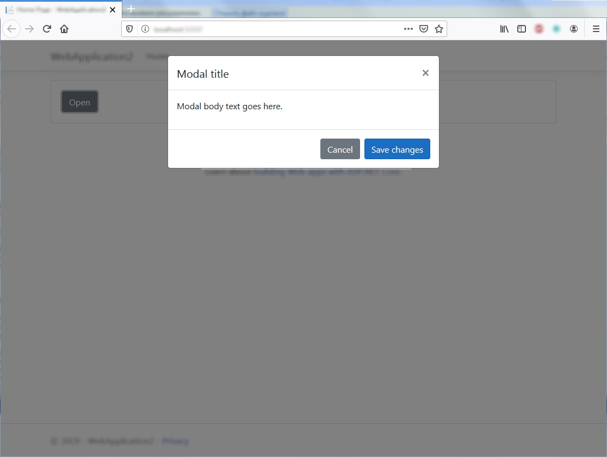
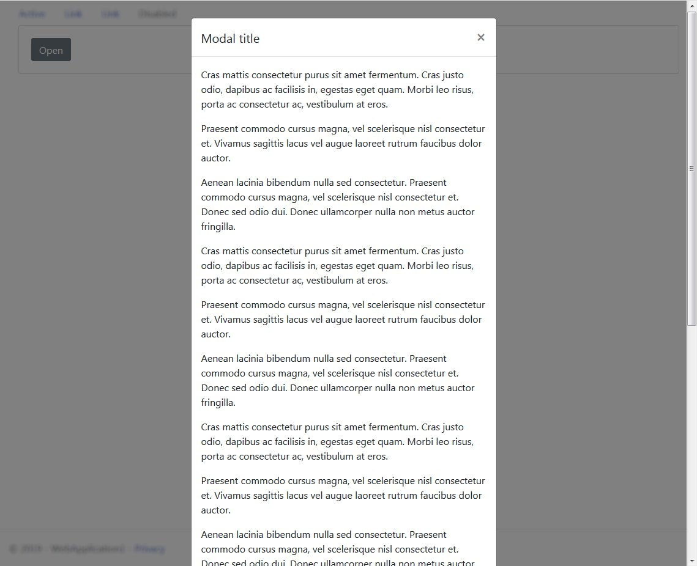
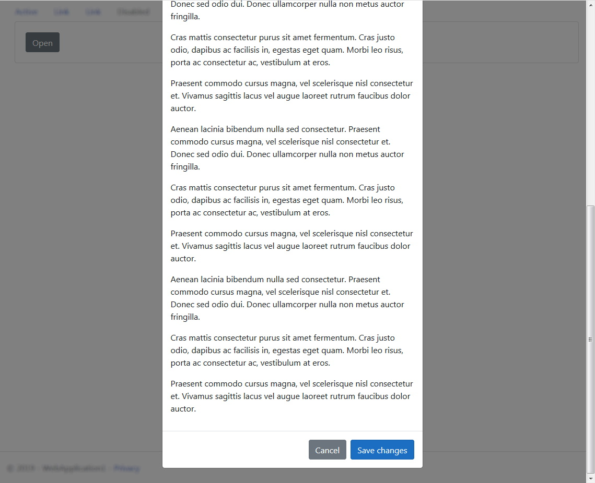
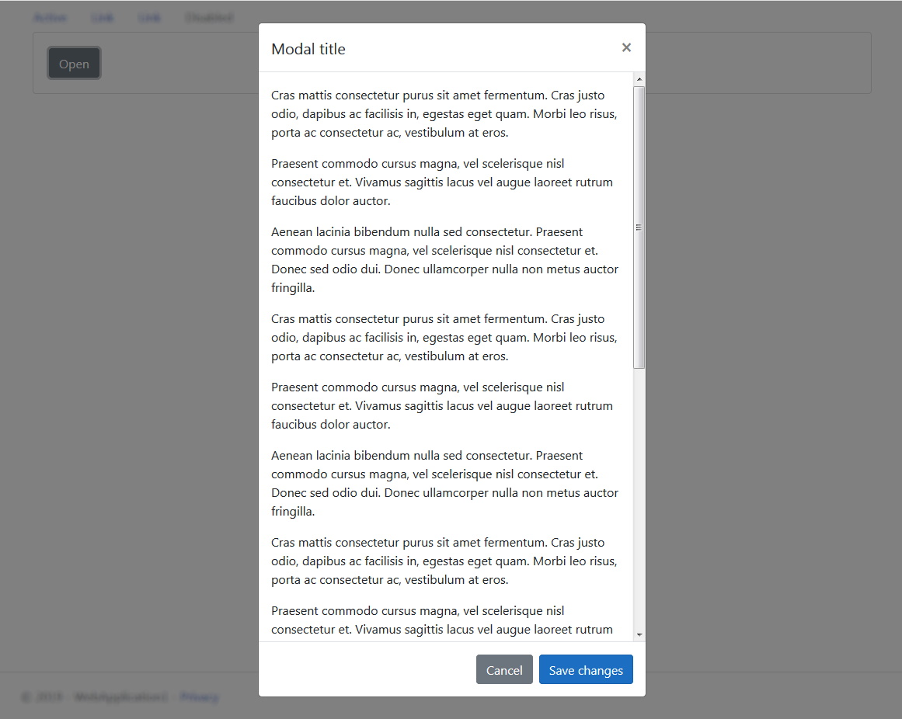
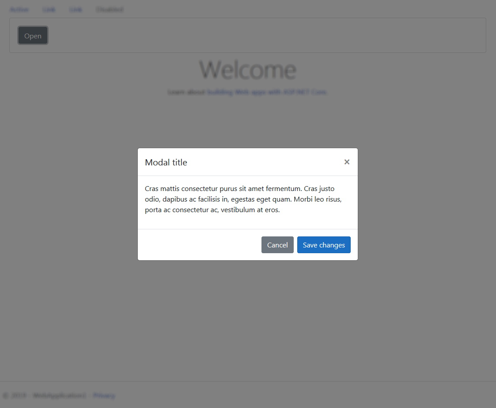

# Modal[¶](https://getbootstrap.com/docs/4.3/components/modal/)

> Используйте Bootstrap JavaScript **modal** плагин для добавления диалоговых окон на ваш сайт для лайтбоксов, уведомлений пользователей или полностью пользовательского контента.

> Прежде чем начать работу с компонентом **modal** Bootstrap, обязательно прочитайте следующее:

- Модальные объекты строятся с использованием **HTML**, **CSS** и **JavaScript**. Они расположены поверх всего остального в документе и отключают прокрутку `<body>`, чтобы вместо этого прокручивалось модальное содержимое.
- Кликните мышкой за границами модального объекта и модальный объект автоматически закроется.
- Bootstrap поддерживает только одно модальное окно за раз. Вложенные модальные объекты не поддерживаются.
- Модальные объекты используют `position: fixed;`, в связи с чем рендеринг иногда может иметь некоторые особенности. По возможности разместите свой модальный HTML-код на верхнем уровне, чтобы избежать возможных помех со стороны других элементов. Вы, вероятно, столкнетесь с проблемами при вложении **.modal** внутри другого `position: fixed;` элемента.
- Из-за `position: fixed;`, есть некоторые нюансы с использованием модальных объектов на мобильных устройствах. Дополнительную информацию см. [В документации по поддержке браузера](https://getbootstrap.com/docs/4.3/getting-started/browsers-devices/#modals-and-dropdowns-on-mobile).
- Из-за определённой семантики HTML5, [HTML атрибут **autofocus**](https://developer.mozilla.org/en-US/docs/Web/HTML/Element/input#attr-autofocus) не имеет никакого эффекта в модальных объектах Bootstrap. Чтобы достичь того же эффекта, используйте некоторые пользовательские JavaScript:

```javascript
$('#myModal').on('shown.bs.modal', function () {
  $('#myInput').trigger('focus')
})
```

> Анимационный эффект этого компонента зависит от **prefers-reduced-motion media query**.
См. [раздел в документации](https://getbootstrap.com/docs/4.3/getting-started/accessibility/#reduced-motion).

## Modal components[¶](https://getbootstrap.com/docs/4.3/components/modal/#modal-components)

> Ниже приведен статический пример модального объекта (это означает, что его позиция и отображение были переопределены).
Включены заголовок, тело (требуется для заполнения контентом) и нижний колонтитул (необязательно).
В заголовке модального окна есть кнопка деактивации.

```cshtml
@{
  bsModal modal = new bsModal() { ID = "modal-dom-id", Header = "Modal title" };

  // <!-- Button trigger modal -->
  bsButton button = bsModal.GetDefaultButtonTriggerModal(modal.ID);
  @await Component.InvokeAsync(button.ViewComponentName, new { SetObjectManager = button })

  modal.FooterExtButtons.Add(bsModal.GetDefaultButtonDismissFooter());
  modal.FooterExtButtons.Add(new bsButton("Save changes") { BackgroundColorTheme = bmBackgroundColorThemesEnum.primary });
  hsP paragraf = new hsP("Modal body text goes here.");
  modal.AddChild(paragraf);
  @await Component.InvokeAsync(modal.ViewComponentName, new { SetObjectManager = modal })
}
```

***result:***



```html
<div id="modal-dom-id" role="dialog" class="modal fade show" aria-labelledby="modal-dom-id-ModalLabel" style="display: block;" aria-modal="true">
  <div class="modal-dialog" role="document">
    <div class="modal-content">
      <div class="modal-header">
        <h5 class="modal-title" id="modal-dom-id-ModalLabel">Modal title</h5>
        <button type="button" class="close" data-dismiss="modal" aria-label="Close">
          <span aria-hidden="true">×</span>
        </button>
      </div>
      <div class="modal-body">
        <p>Modal body text goes here.</p>
      </div>
      <div class="modal-footer">
        <button data-dismiss="modal" type="button" class="btn btn-secondary">Cancel</button>
        <button type="button" class="btn btn-primary">Save changes</button>
      </div>
    </div>
  </div>
</div>
```

## Scrolling long content[¶](https://getbootstrap.com/docs/4.3/components/modal/#scrolling-long-content)

> Когда модальное окно становятся слишком длинными для экрана устройства пользователя, оно прокручиваются целиком и независимо от самой страницы.

```cshtml
@{
  bsModal modal = new bsModal() { ID = "modal-dom-id", Header = "Modal title", IsModalDialogScrollable = false };
}
```

***result:***





> Вы можете создать прокручиваемое модальное окно, которое позволяет прокручивать непосредственно модальное тело, добавив **.modal-dialog-scrollable** в **.modal-dialog**.

```cshtml
@{
  bsModal modal = new bsModal() { ID = "modal-dom-id", Header = "Modal title", IsModalDialogScrollable = true };
}
```

***result:***



## Vertically centered[¶](https://getbootstrap.com/docs/4.3/components/modal/#vertically-centered)

> Добавьте **.modal-dialog-centtered** в **.modal-dialog**, чтобы вертикально центрировать модальное окно.

```cshtml
@{

}
```

***result:***



## Tooltips and popovers[¶](https://getbootstrap.com/docs/4.3/components/modal/#tooltips-and-popovers)

> При необходимости в модальных окнах могут быть размещены всплывающие подсказки и всплывающие окна.
Когда модальные окна закрыты, любые всплывающие подсказки и всплывающие окна также автоматически удаляются.

## Using the grid[¶](https://getbootstrap.com/docs/4.3/components/modal/#using-the-grid)

> Используйте сеточную систему Bootstrap в теле модального окна, вложив **.container-liquid** в **.modal-body**.
Затем используйте обычные классы системы сетки, как обычно.

```cshtml
@{

}
```

## Varying modal content[¶](https://getbootstrap.com/docs/4.3/components/modal/#varying-modal-content)

> У вас есть несколько кнопок, которые должны запускать одно и тот же модальное окно со слегка отличающимся содержимым?
Используйте атрибуты **event.relatedTarget** и HTML `data- *` (возможно, через jQuery), чтобы варьировать содержимое модального окна в зависимости от того, какая кнопка была нажата.

```cshtml
@{

}
```

## Optional sizes[¶](https://getbootstrap.com/docs/4.3/components/modal/#optional-sizes)

> Модальные окна опционально имеют три размера, доступные через классы модификаторов для размещения в диалоге **.modal**.
Эти размеры входят в определенные точки останова, чтобы избежать горизонтальных полос прокрутки на более узких окнах просмотра.

- _Small_ **.modal-sm** - 300px
- _Default_ None - 500px
- _Large_ **.modal-lg** - 800px
- _Extra large_ **.modal-xl** - 1140px

> Модальное окно по умолчанию (без класса модификаторов) составляет «средний» размер.

```cshtml
@{

}
```