# Navbar[¶](https://getbootstrap.com/docs/4.3/components/navbar/)
> Вот что нужно знать, прежде чем начать работу с навигационной панелью:

- Навигационные панели требуют обертывания `.navbar` при помощи `.navbar-expand{-sm|-md|-lg|-xl}` для гибкой адаптивной разметки.
- Навигационные панели и их содержимое по умолчанию являются растягивающимся/жидкими. Используйте дополнительные контейнеры, чтобы ограничить их горизонтальную ширину.
- Используйте классы утилит `spacing` и `flex` для управления расстоянием и выравниванием в навигационных панелях.
- Навигационные панели реагируют по умолчанию, но вы можете легко изменить их, чтобы изменить это. Отзывчивое поведение зависит от нашего плагина **JavaScript Collapse**.
- Навигационные панели по умолчанию скрыты при печати. Заставьте их быть напечатаны путем добавления `.d-print` на `.navbar`. Обратите внимание на классы утилиты **display**.
- Обеспечьте доступность с помощью элемента `<nav>` или, если используется более общий элемент, такой как `<div>`, добавьте `role="navigation"` к каждой навигационной панели, чтобы явно определить ее как ориентир для пользователей вспомогательных технологий.

```cshtml
<header>
@{
  bsNavbar navbar_manager = new bsNavbar() { ID = "TopMenu" };
  navbar_manager.NavbarBrand = new bsNavbarBrand()
  {
    NavbarBrandPosition = bmNavbarBrandPositionsEnum.Left,
    ID = "navbar-brand-id",
    NavbarBrandDom = new bmBrandNavItem("brand-id")
    {
      Href = "#",
      Header = " Brand",
      Title = "Описание бренда",
      ImageNavbarBrandSrc = "/img/bootstrap-solid.svg"
    }
  };
  bsNavbarNav navbar_nav_manager = new bsNavbarNav();
  navbar_nav_manager.AddCSS("mr-auto"); // добавляем контейнеру стили: margin-right: auto !important;
  navbar_nav_manager.AddNavItem(id_dom: "home-nav-id", header: "Home", href: "#").IsActive = true;
  navbar_nav_manager.AddNavItem("link-nav-id", "Link", "#");
  bsNavItem navbar_nav_dropdown_item = navbar_nav_manager.AddNavItem("dropdown-nav-id", "Dropdown", "#");
  navbar_nav_dropdown_item.AddSubNav(header_nav: "Action", href_nav: "#", id_nav: "action-nav-id");
  navbar_nav_dropdown_item.AddSubNav("Another action", "#", "another-action-nav-id"); navbar_nav_dropdown_item.AddSubNav(null);
  navbar_nav_dropdown_item.AddSubNav("Something else here", "#", "something-else-here-nav-id");
  navbar_nav_manager.AddNavItem("disabled-nav-id", "Disabled", "#").IsDisabled = true;
  navbar_manager.NavbarActions.AddSubNode(navbar_nav_manager);
  hsForm hsForm = new hsForm();
  hsInputSearch input_manager = new hsInputSearch()
  {
    Placeholder = "Search"
  };
  input_manager.AddCSS("form-control mr-sm-2");
  hsForm.AddChild(input_manager);
  hsButton button_manager = new hsButton("Search");
  button_manager.AddCSS("btn btn-outline-success my-2 my-sm-0");
  hsForm.AddChild(button_manager);
  hsForm.AddCSS("my-2 my-lg-0");
  navbar_manager.NavbarActions.AddSubNode(hsForm);
  @await Component.InvokeAsync(navbar_manager.ViewComponentName, new { SetObjectManager = navbar_manager })
}
</header>
```
***result:*** пример: монитор ПК (слева синим) и на дисплее **iPhone 6/6/7** (справа красным). Дисплей **iPhone** в свою очередь демонстрируется в двух состояниях: свёрнутый (левее коричневый) и развернутый (правее зелёный)
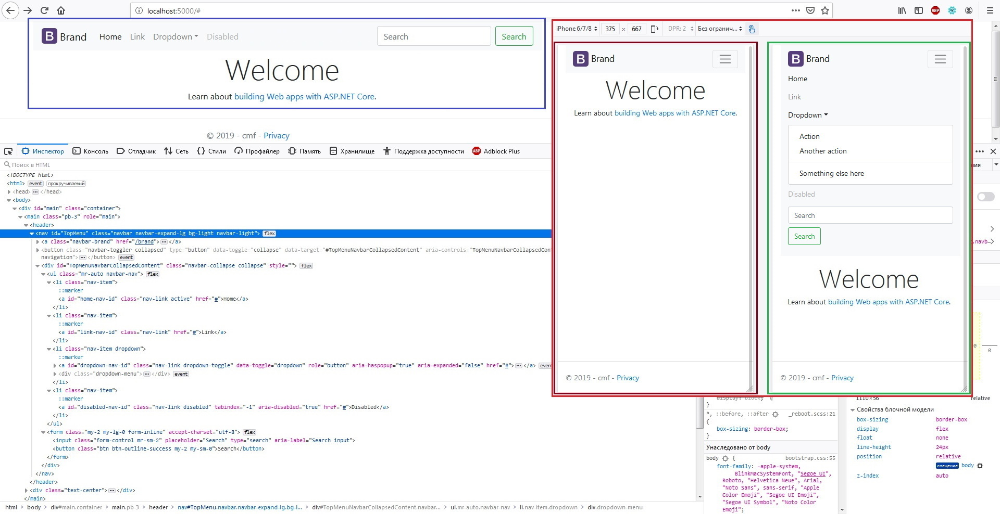
В примере выше использовались утилиты [color](https://getbootstrap.com/docs/4.3/utilities/colors/) (__bg-light__) и [spacing](https://getbootstrap.com/docs/4.3/utilities/spacing/) (__my-2, my-lg-0, mr-sm-0, my-sm-0, mr-auto__).


> Navbars поставляются со встроенной поддержкой [нескольких субкомпонентов](https://getbootstrap.com/docs/4.3/components/navbar/#supported-content):

- [**.navbar-brand**](https://github.com/badhitman/BootstrapAspDynamicRender/tree/master/Components/html/bootstrap/navbar#brand) для названия вашей компании, продукта или проекта. В том числе с аватаркой/картинкой.
- [**.navbar-nav**](https://github.com/badhitman/BootstrapAspDynamicRender/tree/master/Components/html/bootstrap/navbar#nav) для `full-height` и `lightweight` навигации (включая поддержку выпадающих меню).
- [**.navbar-toggler**](https://github.com/badhitman/BootstrapAspDynamicRender/tree/master/Components/html/bootstrap/navbar#toggler) для использования с нашим плагином _collapse_ и другими способами переключения навигации.
- [**.form-inline**](https://github.com/badhitman/BootstrapAspDynamicRender/tree/master/Components/html/bootstrap/navbar#forms) для любых элементов управления и действий формы.
- [**.navbar-text**](https://github.com/badhitman/BootstrapAspDynamicRender/tree/master/Components/html/bootstrap/navbar#text) для добавления вертикально центрированных строк текста.
- [**.collapse.navbar-collapse**](https://github.com/badhitman/BootstrapAspDynamicRender/tree/master/Components/html/bootstrap/navbar#external-content) для группировки и скрытия содержимого навигационной панели.

## Brand[¶](https://getbootstrap.com/docs/4.3/components/navbar/#brand)
> **.navbar-brand** может быть применен к большинству типов **тегов**, но `<a></a>` работает лучше всего, поскольку другие типы тегов могут потребовать дополнительных **utility classes** или пользовательских стилей.

```cshtml
<header>
@{
  bsNavbar navbar_manager = new bsNavbar() { ID = "top-menu-dom-id" };

  navbar_manager.NavbarBrand = new bsNavbarBrand()
  {
    NavbarBrandPosition = bmNavbarBrandPositionsEnum.Left,
    ID = "navbar-brand-id",
    NavbarBrandDom = new bmBrandNavItem("navbar-brand-dom-id") { Href = "#", Header = " Brand", Title = "Описание бренда" }
  };
  @await Component.InvokeAsync(navbar_manager.ViewComponentName, new { SetObjectManager = navbar_manager })
  
  <br />
  navbar_manager.NavbarBrand = new bsNavbarBrand()
  {
    NavbarBrandPosition = bmNavbarBrandPositionsEnum.Left,
    ID = "navbar-brand-id",
    NavbarBrandDom = new bmBrandNavItem("navbar-brand-dom-id") { Header = " Brand", Title = "Описание бренда" }
  };
  @await Component.InvokeAsync(navbar_manager.ViewComponentName, new { SetObjectManager = navbar_manager })
}
</header>
```
***result:***
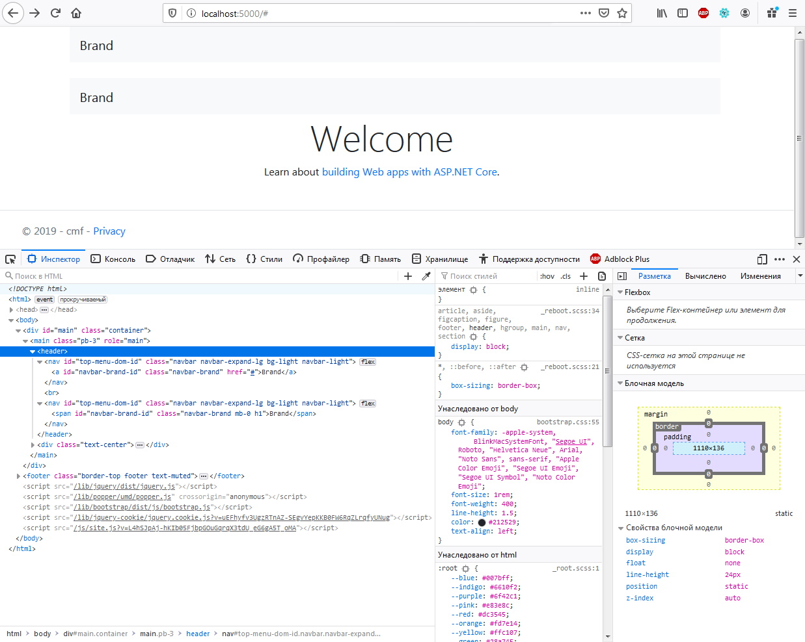

> Добавление изображений к **.navbar-brand**, скорее всего, потребует пользовательских стилей или утилит для правильного размера. Вот несколько примеров для демонстрации.

```cshtml
<header>
@{
  bsNavbar navbar_manager = new bsNavbar() { ID = "top-menu-dom-id" };
  navbar_manager.NavbarBrand = new bsNavbarBrand()
  {
    NavbarBrandPosition = bmNavbarBrandPositionsEnum.Left,
    ID = "navbar-brand-dom-id",
    NavbarBrandDom = new bmBrandNavItem("navbar-brand-dom-id")
    {
      Href = "#",
      Title = "Описание бренда",
      ImageNavbarBrandSrc = "/img/bootstrap-solid.svg"
    }
  };
  @await Component.InvokeAsync(navbar_manager.ViewComponentName, new { SetObjectManager = navbar_manager })
  <br />
  navbar_manager.ID = "top-menu-2-dom-id";
  navbar_manager.NavbarBrand = new bsNavbarBrand()
  {
    NavbarBrandPosition = bmNavbarBrandPositionsEnum.Left,
    ID = "navbar-brand-2-dom-id",
    NavbarBrandDom = new bmBrandNavItem("navbar-brand-2-dom-id")
    {
      Href = "#",
      Header = " Brand",
      Title = "Описание бренда",
      ImageNavbarBrandSrc = "/img/bootstrap-solid.svg"
    }
  };
  @await Component.InvokeAsync(navbar_manager.ViewComponentName, new { SetObjectManager = navbar_manager })
}
</header>
```
***result:***
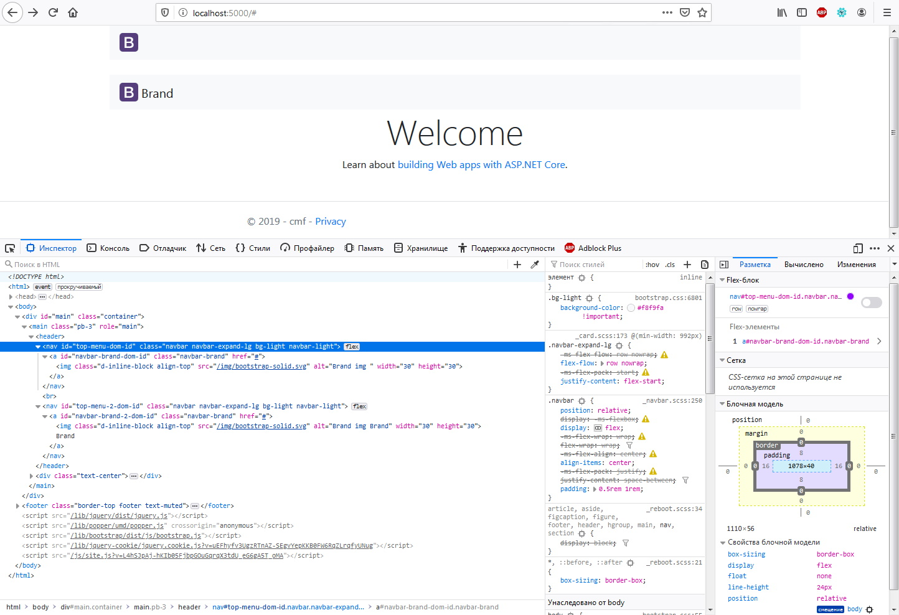

## Nav[¶](https://getbootstrap.com/docs/4.3/components/navbar/#nav)
>  Навигационные ссылки **Navbar** построены на основе **.nav** . Имеют свой собственный класс модификации и требуют использования классов `toggler` для правильного адаптивного стиля.
Навигация в **navbars** также будет растягиваться, чтобы занять как можно больше горизонтального пространства, чтобы сохранить содержимое **navbar** надежно выровнено.
```cshtml
<header>
@{
  bsNavbar navbar_manager = new bsNavbar() { ID = "top-menu-navbar-dom-id" };
  navbar_manager.NavbarBrand = new bsNavbarBrand()
  {
    NavbarBrandPosition = bmNavbarBrandPositionsEnum.Left,
    ID = "navbar-brand-id",
    NavbarBrandDom = new bmBrandNavItem("navbar-brand-nav-dom-id")
    {
      Href = "#",
      Header = " Brand",
      Title = "Описание бренда"
    }
  };

  bsNavbarNav navbar_nav_manager = new bsNavbarNav();
  navbar_nav_manager.AddNavItem(id_dom: "home-nav-dom-id", header: "Home", href: "#").IsActive = true;
  navbar_nav_manager.AddNavItem("features-nav-dom-id", "Features", "#");
  navbar_nav_manager.AddNavItem("pricing-nav-dom-id", "Pricing", "#");
  navbar_nav_manager.AddNavItem("disabled-nav-dom-id", "Disabled", "#").IsDisabled = true;
  navbar_manager.NavbarActions.AddSubNode(navbar_nav_manager);

  @await Component.InvokeAsync(navbar_manager.ViewComponentName, new { SetObjectManager = navbar_manager })
}
</header>
```
***result:***
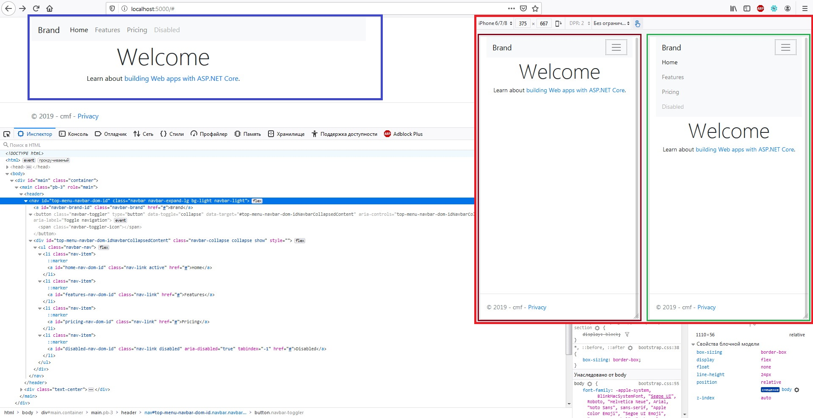

> И поскольку мы используем классы для наших навигаторов, вы можете полностью избежать подхода на основе списка, если хотите.

```cshtml
<header>
@{
  bsNavbar navbar_manager = new bsNavbar()
  {
    ID = "top-menu-navbar-dom-id"
  };

  navbar_manager.NavbarBrand = new bsNavbarBrand()
  {
    NavbarBrandPosition = bmNavbarBrandPositionsEnum.Left,
    ID = "navbar-brand-id",
    NavbarBrandDom = new bmBrandNavItem("navbar-brand-nav-dom-id")
    {
      Href = "#",
      Header = " Brand",
      Title = "Описание бренда"
    }
  };

  bsNavbarNav navbar_nav_manager = new bsNavbarNav()
  {
    NavWrapper = bmNavbarNavWrappersEnum.div
  };

  navbar_nav_manager.AddNavItem(id_dom: "home-nav-dom-id", header: "Home", href: "#").IsActive = true;
  navbar_nav_manager.AddNavItem("features-nav-dom-id", "Features", "#");
  navbar_nav_manager.AddNavItem("pricing-nav-dom-id", "Pricing", "#");
  navbar_nav_manager.AddNavItem("disabled-nav-dom-id", "Disabled", "#").IsDisabled = true;
  navbar_manager.NavbarActions.AddSubNode(navbar_nav_manager);

  @await Component.InvokeAsync(navbar_manager.ViewComponentName, new { SetObjectManager = navbar_manager })
}
</header>
```
***result:***
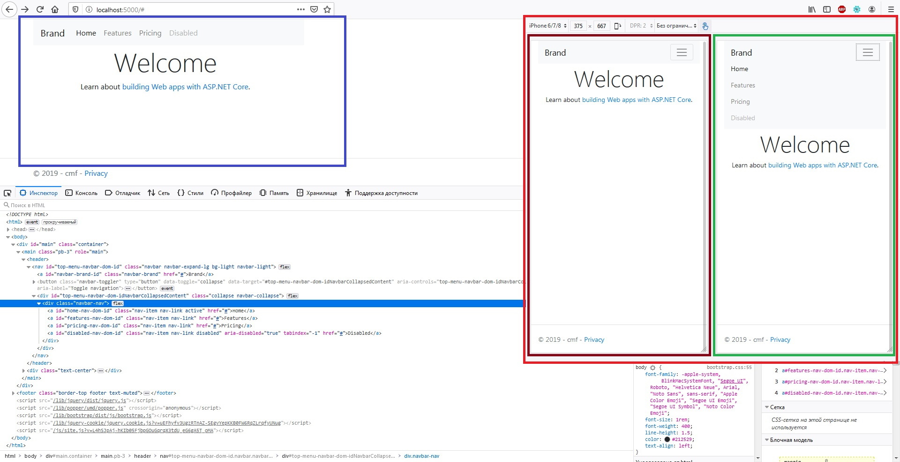

> Вы также можете использовать выпадающее меню в панели навигации.
Выпадающие меню требуют оберточного элемента для позиционирования, поэтому обязательно используйте отдельные и вложенные элементы: **.nav-item** и **.nav-link**, как показано ниже:

```cshtml
<header>
@{
  bsNavbar navbar_manager = new bsNavbar()
  {
    ID = "top-menu-navbar-dom-id"
  };

  navbar_manager.NavbarBrand = new bsNavbarBrand()
  {
    NavbarBrandPosition = bmNavbarBrandPositionsEnum.Left,
    ID = "navbar-brand-id",
    NavbarBrandDom = new bmBrandNavItem("navbar-brand-nav-dom-id")
    {
      Href = "#",
      Header = " Brand",
      Title = "Описание бренда"
    }
  };

  bsNavbarNav navbar_nav_manager = new bsNavbarNav();

  navbar_nav_manager.AddNavItem(id_dom: "home-nav-dom-id", header: "Home", href: "#").IsActive = true;
  navbar_nav_manager.AddNavItem("features-nav-dom-id", "Features", "#");
  navbar_nav_manager.AddNavItem("pricing-nav-dom-id", "Pricing", "#");

  bsNavItem navItem = navbar_nav_manager.AddNavItem("disabled-nav-dom-id", "Dropdown link", "#");
                    
  navItem.AddSubNav(header_nav: "Action", href_nav: "#", id_nav: "dropdown-action-dom-id");
  navItem.AddSubNav(header_nav: "Another action", href_nav: "#", id_nav: "dropdown-another-action-dom-id");
  navItem.AddSubNav(null);
  navItem.AddSubNav(header_nav: "Something else here", href_nav: "#", id_nav: "dropdown-something-action-dom-id");

  navbar_manager.NavbarActions.AddSubNode(navbar_nav_manager);

  @await Component.InvokeAsync(navbar_manager.ViewComponentName, new { SetObjectManager = navbar_manager })
}
</header>
```
***result:***
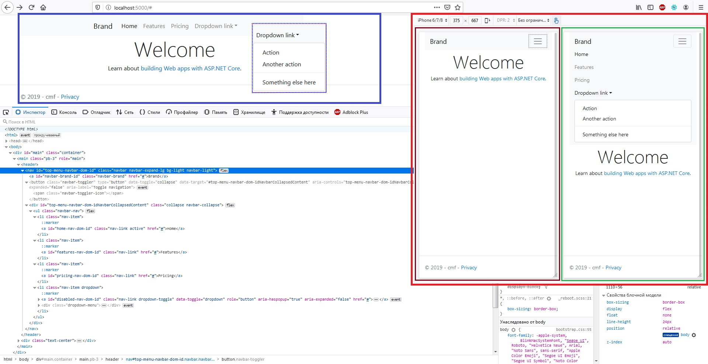

## Forms[¶](https://getbootstrap.com/docs/4.3/components/navbar/#forms)
>  Поместите различные элементы управления и компоненты формы в навигационную панель **.form-inline**.

```cshtml
<header>
@{
  bsNavbar navbar_manager = new bsNavbar()
  {
    ID = "top-menu-navbar-dom-id"
  };
  navbar_manager.NavbarActions.IsHidesCollapse = false;
  hsForm hsForm = new hsForm() { ID = "navbar-form-dom-id" };

  hsInputSearch input_manager = new hsInputSearch()
  {
    Placeholder = "Search",
    ID = "navbar-form-search-input-dom-id"
  };
  input_manager.AddCSS("form-control mr-sm-2");
  hsForm.AddChild(input_manager);

  hsButton button_manager = new hsButton("Search");
  button_manager.AddCSS("btn btn-outline-success my-2 my-sm-0");

  hsForm.AddChild(button_manager);
  navbar_manager.NavbarActions.AddSubNode(hsForm);

  @await Component.InvokeAsync(navbar_manager.ViewComponentName, new { SetObjectManager = navbar_manager })
}
</header>
```
***result:***
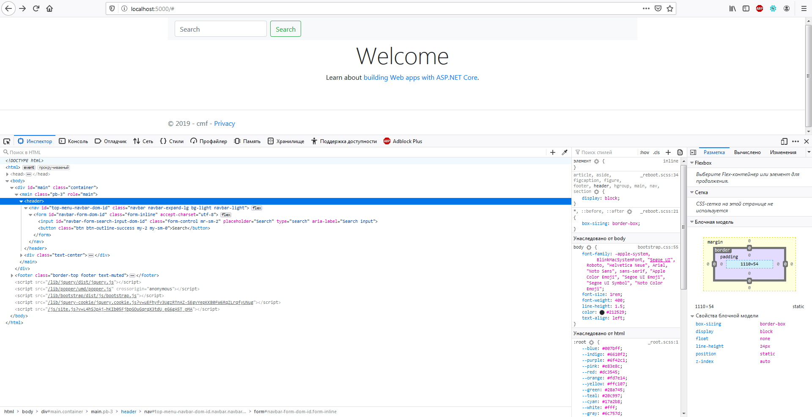

```cshtml
<header>
@{
  bsNavbar navbar_manager = new bsNavbar()
  {
    ID = "top-menu-navbar-dom-id",
    NavbarExpandSize = bmSizingsEnum.NULL
  };
  navbar_manager.NavbarActions.IsHidesCollapse = false;
  navbar_manager.NavbarBrand = new bsNavbarBrand()
  {
    NavbarBrandPosition = bmNavbarBrandPositionsEnum.Left,
    ID = "navbar-brand-id",
    NavbarBrandDom = new bmBrandNavItem("navbar-brand-nav-dom-id")
    {
      Href = "#",
      Header = " Brand",
      Title = "Описание бренда"
    }
  };

  hsForm hsForm = new hsForm();

  hsInputSearch input_manager = new hsInputSearch()
  {
    Placeholder = "Search"
  };
  input_manager.AddCSS("form-control mr-sm-2");
  hsForm.AddChild(input_manager);

  hsButton button_manager = new hsButton("Search")
  {
    ButtonType = hmButtonTypesEnum.submit
  };
  button_manager.AddCSS("btn btn-outline-success my-2 my-sm-0");

  hsForm.AddChild(button_manager);

  navbar_manager.NavbarActions.AddSubNode(hsForm);

  @await Component.InvokeAsync(navbar_manager.ViewComponentName, new { SetObjectManager = navbar_manager })
}
</header>
```
***result:***
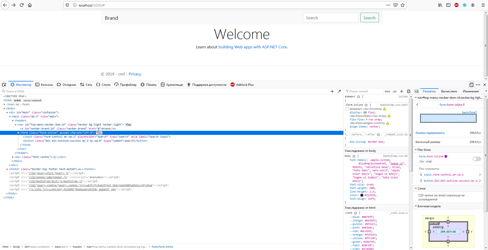

## Text[¶](https://getbootstrap.com/docs/4.3/components/navbar/#text)

>  Навигационные панели могут содержать текстовые данные с помощью **.navbar-text**.
Этот класс регулирует вертикальное выравнивание и горизонтальный интервал для строк текста.

```cshtml
<header>
@{
  bsNavbar navbar_manager = new bsNavbar()
  {
    ID = "top-menu-navbar-dom-id",
    NavbarExpandSize = bmSizingsEnum.NULL
  };
    navbar_manager.NavbarActions.IsHidesCollapse = false;
    bsNavbarText navbarText = new bsNavbarText("Navbar text with an inline element");
    navbar_manager.NavbarActions.AddSubNode(navbarText);
    @await Component.InvokeAsync(navbar_manager.ViewComponentName, new { SetObjectManager = navbar_manager })
}
</header>
```
***result:***
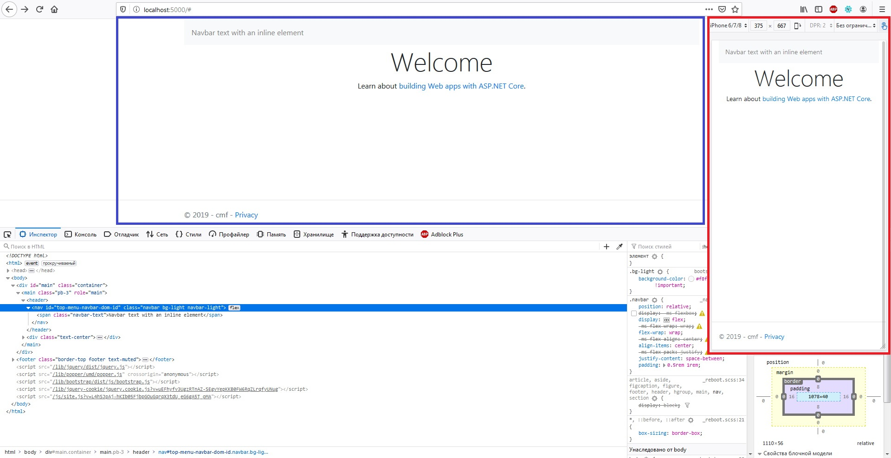

> Совмещайте с другими компонентами и утилитами по мере необходимости.

```cshtml
<header>
@{
  bsNavbar navbar_manager = new bsNavbar()
  {
    ID = "top-menu-navbar-dom-id",
    NavbarExpandSize = bmSizingsEnum.Lg
  };
  navbar_manager.NavbarBrand = new bsNavbarBrand()
  {
    NavbarBrandDom = new bmBrandNavItem("brand-dom-id")
    {
      Header = "Navbar w/ text",
      Href = "#"
    }
  };

  navbar_manager.NavbarActions.IsHidesCollapse = true;

  bsNavbarNav navbar_nav_manager = new bsNavbarNav();
  navbar_nav_manager.AddCSS("mr-auto");
  navbar_nav_manager.AddNavItem(id_dom: "home-nav-dom-id", header: "Home", href: "#").IsActive = true;
  navbar_nav_manager.AddNavItem("features-nav-dom-id", "Features", "#");
  navbar_nav_manager.AddNavItem("pricing-nav-dom-id", "Pricing", "#");
  navbar_manager.NavbarActions.AddSubNode(navbar_nav_manager);

  bsNavbarText navbarText = new bsNavbarText("Navbar text with an inline element");
  navbarText.AddCSS("navbar-text");
  navbar_manager.NavbarActions.AddSubNode(navbarText);

  @await Component.InvokeAsync(navbar_manager.ViewComponentName, new { SetObjectManager = navbar_manager })
}
</header>
```
***result:***
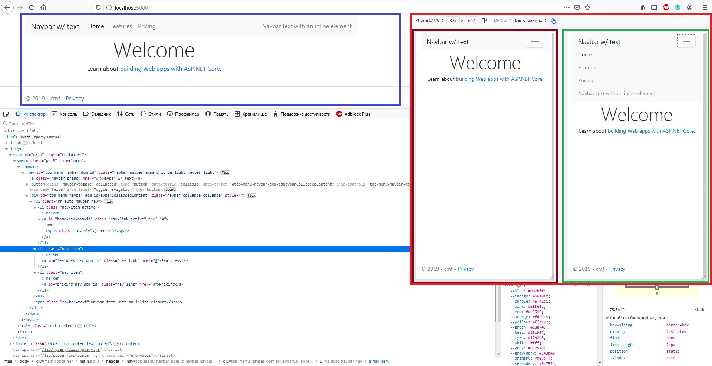

## Color schemes[¶](https://getbootstrap.com/docs/4.3/components/navbar/#color-schemes)
>  Тематизация навигационной панели никогда не была проще благодаря сочетанию классов тематизации и утилит фонового цвета.
Выбирайте между **.navbar-light** для использования со светлыми цветами фона, или **.navbar-dark** на темном фоне цвета.
Затем настройте цвет заднего фона с помощью утилит **.bg-* **

```cshtml
<header>
@{
  bsNavbar navbar_manager = new bsNavbar() { ID = "navbar-top-menu-dom-id" };
  navbar_manager.NavbarBrand = new bsNavbarBrand()
  {
    NavbarBrandPosition = bmNavbarBrandPositionsEnum.Left,
    ID = "navbar-brand-id",
    NavbarBrandDom = new bmBrandNavItem("navbar-brand-dom-id")
    {
      Href = "#",
      Header = " Brand navbar",
      Title = "Описание бренда"
    }
  };

  bsNavbarNav navbar_nav_manager = new bsNavbarNav();
  navbar_nav_manager.AddCSS("mr-auto");
  navbar_nav_manager.AddNavItem(id_dom: "home-nav-id", header: "Home", href: "#").IsActive = true;
  navbar_nav_manager.AddNavItem("features-nav-id", "Features", "#");
  navbar_nav_manager.AddNavItem("pricing-nav-id", "Pricing", "#");
  navbar_nav_manager.AddNavItem("disabled-nav-id", "About", "#");

  navbar_manager.NavbarActions.AddSubNode(navbar_nav_manager);

  hsForm hsForm = new hsForm();

  hsInputSearch input_manager = new hsInputSearch()
  {
    Placeholder = "Search"
  };
  input_manager.AddCSS("form-control mr-sm-2");
  hsForm.AddChild(input_manager);

  hsButton button_manager = new hsButton("Search");
  button_manager.AddCSS("btn btn-outline-info my-2 my-sm-0");

  hsForm.AddChild(button_manager);

  hsForm.AddCSS("my-2 my-lg-0");
  navbar_manager.NavbarActions.AddSubNode(hsForm);

  navbar_manager.NavbarColorScheme = bmMonochromeColorSchemesEnum.dark;
  navbar_manager.BackgroundColorTheme = bmBackgroundColorThemesEnum.dark;
  @await Component.InvokeAsync(navbar_manager.ViewComponentName, new { SetObjectManager = navbar_manager })
  <br />

  navbar_manager.ID = "navbar-top-menu-dom-id-2";
  navbar_manager.ClearCSS();
  button_manager.ClearCSS();
  button_manager.AddCSS("btn btn-outline-light my-2 my-sm-0");
  navbar_manager.BackgroundColorTheme = bmBackgroundColorThemesEnum.primary;
  @await Component.InvokeAsync(navbar_manager.ViewComponentName, new { SetObjectManager = navbar_manager })
  <br />

  navbar_manager.ID = "navbar-top-menu-dom-id-3";
  navbar_manager.ClearCSS();
  button_manager.ClearCSS();
  button_manager.AddCSS("btn btn-outline-primary my-2 my-sm-0");
  navbar_manager.NavbarColorScheme = bmMonochromeColorSchemesEnum.light;
  navbar_manager.BackgroundColorTheme = bmBackgroundColorThemesEnum.NULL;
  navbar_manager.SetStyle("background-color", "#e3f2fd");
  @await Component.InvokeAsync(navbar_manager.ViewComponentName, new { SetObjectManager = navbar_manager })
}
</header>
```

***result:***
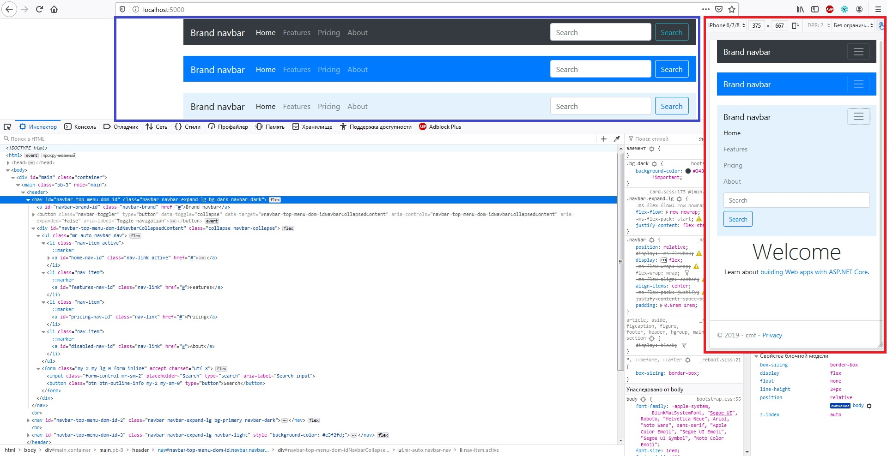

## Placement[¶](https://getbootstrap.com/docs/4.3/components/navbar/#placement)
>  Используйте утилиты позиционирования для размещения навигационных панелей в нестатических положениях.
Выберите одно из фиксированных положений `top`, `fixed to the bottom` или `stickied to the top` (прокручивает страницу до тех пор, пока она не достигнет вершины, а затем остается там).
Фиксированные навигационные панели используют `position: fixed`, что означает, что они вытягиваются из нормального потока **DOM** и могут требовать пользовательского **CSS** (например, `padding-top` на `<body>`), чтобы предотвратить перекрытие с другими элементами.

> Также обратите внимание, что `.sticky-top` использует позицию: `sticky`, которая в некоторых браузерах не имеет полной поддержки.

```cshtml
<header>
@{
  bsNavbar navbar_manager = new bsNavbar() { ID = "navbar-top-menu-dom-id" };
  navbar_manager.NavbarPlacement = bmNavbarPlacementsEnum.FixedTop;
  navbar_manager.NavbarBrand = new bsNavbarBrand()
  {
    NavbarBrandPosition = bmNavbarBrandPositionsEnum.Left,
    ID = "navbar-brand-id",
    NavbarBrandDom = new bmBrandNavItem("navbar-brand-dom-id")
    {
      Href = "#",
      Header = " Brand navbar",
      Title = "Описание бренда"
    }
  };
  @await Component.InvokeAsync(navbar_manager.ViewComponentName, new { SetObjectManager = navbar_manager })
}
</header>
```

###### Firefox 70 (x64) Win7 ***result:***
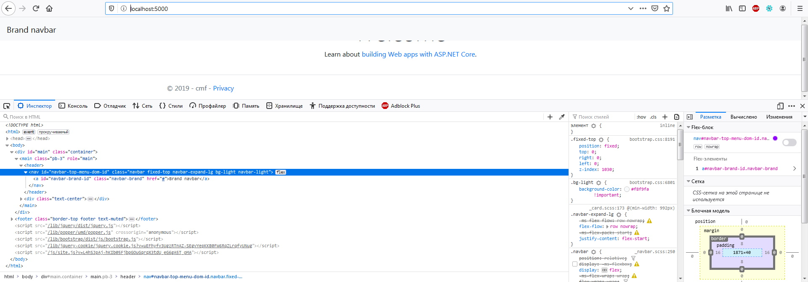

###### Google Chrome 78.0.3904.70 (x64) Win7 ***result:***
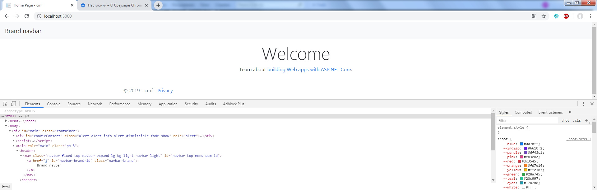

###### IE 11.0.9600.19507 (x64) Win7 ***result:***
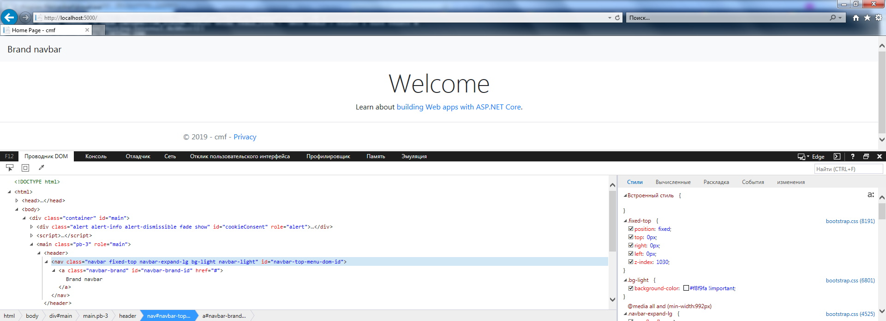

## Nav x2

При необходимости можно совмещать два Nav в одном Navbar

```cshtml
<header>
@{
  int CountUnreadedMessages = 0;
  if (ViewBag.CountUnreadedMessages is int)
  {
    CountUnreadedMessages = ViewBag.CountUnreadedMessages;
  }

  bsNavbar navbar_manager = new bsNavbar() { ID = "navbar-top-menu-dom-id" };
  navbar_manager.BackgroundColorTheme = bmBackgroundColorThemesEnum.dark;
  navbar_manager.NavbarColorScheme = bmMonochromeColorSchemesEnum.dark;
  navbar_manager.NavbarBrand = new bsNavbarBrand()
  {
    NavbarBrandPosition = bmNavbarBrandPositionsEnum.Left,
    ID = "navbar-brand-id",
    NavbarBrandDom = new bmBrandNavItem("navbar-brand-dom-id")
    {
      Href = "/",
      Header = " <span class=\"text-primary\">Shop</span><strong class=\"text-success\">ON</strong>",
      Title = "Мерчант"
    }
  };

  bsNavbarNav navbar_nav_manager = new bsNavbarNav() { ID = "navbar-nav-left-dom-id" };
  navbar_nav_manager.AddCSS("mr-auto");
  navbar_nav_manager.AddNavItem(id_dom: "about-nav-dom-id", header: "About", href: "/about");
  navbar_nav_manager.AddNavItem("other-1-link-nav-dom-id", "Other 1", "#");
  navbar_nav_manager.AddNavItem("other-2-link-nav-dom-id", "Other 2", "#");
  navbar_nav_manager.AddNavItem("other-3-link-nav-dom-id", "Other 3", "#");
  navbar_manager.NavbarActions.AddSubNode(navbar_nav_manager);

  navbar_nav_manager = new bsNavbarNav() { ID = "navbar-nav-right-dom-id" };
  navbar_nav_manager.AddCSS("ml-auto");
  @if (Model.User is null)
  {
    navbar_nav_manager.AddNavItem("navbar-login-link-nav-dom-id", "Войти", "/account/login").AddCSS("text-primary");
  }
  else
  {
    bsNavItem navbar_nav_item;
    if (Model.User.AccessLevel >= AccessLevelUserModel.Manager)
    {
      navbar_nav_item = navbar_nav_manager.AddNavItem("navbar-admin-nav-dropdown-dom-id", "Управление", "#");
      navbar_nav_item.AddCSS("bg-danger text-white");
      navbar_nav_item.AddSubNav(header_nav: "Финансы", href_nav: "/finance/", id_nav: "navbar-finance-nav-dom-id");
      navbar_nav_item.AddSubNav("Доставка", "/delivery/", "navbar-delivery-nav-dom-id");
      navbar_nav_item.AddSubNav("Пользователи", "/users/", "navbar-users-nav-dom-id");
      navbar_nav_item.AddSubNav("Справочники", "/assortment/", "navbar-assortment-nav-id");
      navbar_nav_item.AddSubNav("Файлы", "/files/", "navbar-files-nav-id");
    }
    navbar_nav_item = navbar_nav_manager.AddNavItem("navbar-unreaded-messages-nav-dom-id", "Уведомления", "/messages/");
    navbar_nav_item.Header += " <span class='badge" + (CountUnreadedMessages > 0 ? " text-danger badge-light" : "") + "'>" + CountUnreadedMessages + "</span>";
    navbar_nav_item = navbar_nav_manager.AddNavItem("navbar-profile-nav-dropdown-dom-id", "Профиль", "#");
    navbar_nav_item.AddSubNav(header_nav: "Акаунт", href_nav: "/account/", id_nav: "navbar-account-nav-dom-id");
    navbar_nav_item.AddSubNav(null);
    navbar_nav_item.AddSubNav(header_nav: "Выход", href_nav: "/account/logout", id_nav: "navbar-logout-nav-dom-id");
  }

  navbar_manager.NavbarActions.AddSubNode(navbar_nav_manager);

  @await Component.InvokeAsync(navbar_manager.ViewComponentName, new { SetObjectManager = navbar_manager })
}
</header>
```

***result:*** навигация для неавторизованого пользователя
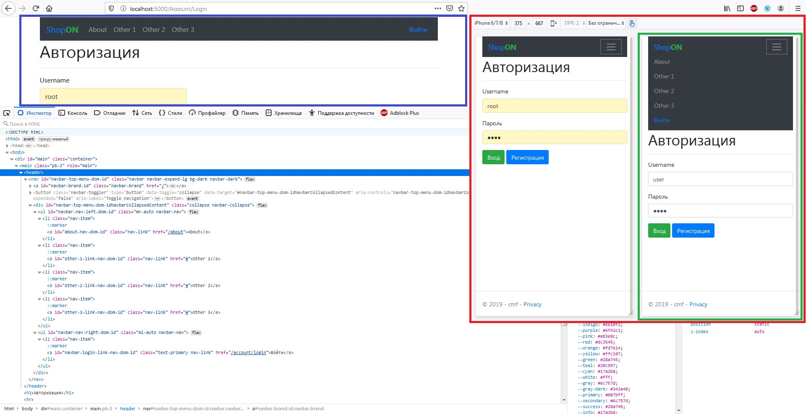

***result:*** навигация для администратора
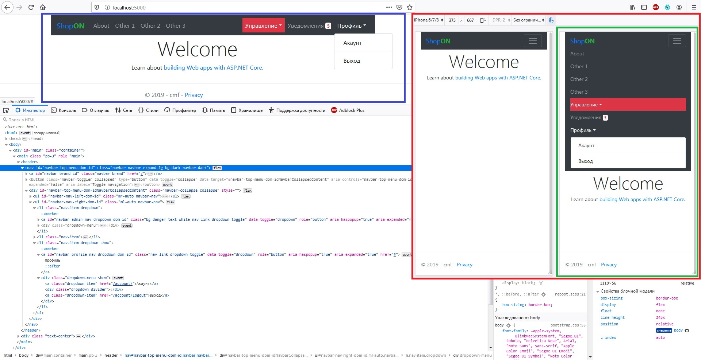

## Responsive behaviors[¶](https://getbootstrap.com/docs/4.3/components/navbar/#responsive-behaviors)
>  в процессе...

## Toggler[¶](https://getbootstrap.com/docs/4.3/components/navbar/#toggler)
>  ...

## External content[¶](https://getbootstrap.com/docs/4.3/components/navbar/#external-content)
>  ...