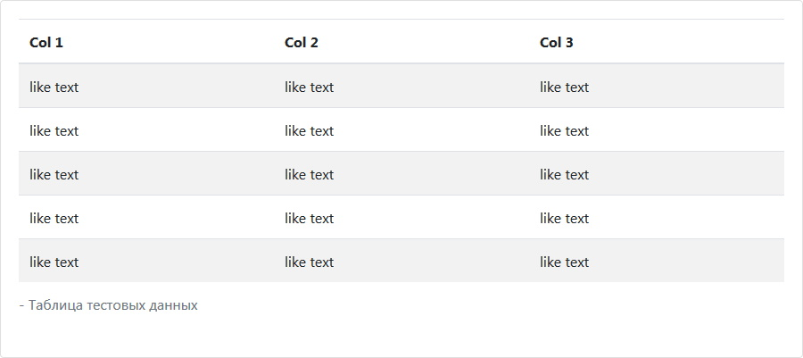

# Tables[¶](https://getbootstrap.com/docs/4.3/content/tables/)

> Просто добавьте базовый класс **.table** к любому `<table>`, а затем добавьте пользовательские стили или **Bootstrap** классы модификаторов.

```cshtml
@{
  bsTable tableBootstrap = new bsTable() { ID = "table-texted-units" };
  tableBootstrap.CaptionText = " - Таблица тестовых данных";

  tableBootstrap.TableHeader.AddColumnHeader("Col 1");
  tableBootstrap.TableHeader.AddColumnHeader("Col 2");
  tableBootstrap.TableHeader.AddColumnHeader("Col 3");
  for (int i = 0; i < 5; i++)
  {
    bsTableTr tableTr = new bsTableTr();
    tableTr.AddCell(new bsTableTd() { Header = "like text" }).AddCell(new bsTableTd() { Header = "like text" }).AddCell(new bsTableTd() { Header = "like text" });
    tableBootstrap.AddRow(tableTr);
  }

  @await Component.InvokeAsync(tableBootstrap.ViewComponentName, tableBootstrap)
}
```

***result:***



```html
<table id="table-texted-units" class="table table-striped table-hover">
  <thead>
    <tr>
      <th>Col 1</th>
      <th>Col 2</th>
      <th>Col 3</th>
    </tr>
  </thead>
  <tbody>
    <tr>
      <td>like text</td>
      <td>like text</td>
      <td>like text</td>
    </tr>
    <tr>
      <td>like text</td>
      <td>like text</td>
      <td>like text</td>
    </tr>
    <tr>
      <td>like text</td>
      <td>like text</td>
      <td>like text</td>
    </tr>
    <tr>
      <td>like text</td>
      <td>like text</td>
      <td>like text</td>
    </tr>
    <tr>
      <td>like text</td>
      <td>like text</td>
      <td>like text</td>
    </tr>
  </tbody>
  <caption> - Таблица тестовых данных</caption>
</table>
```